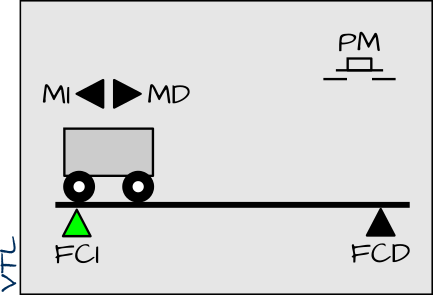
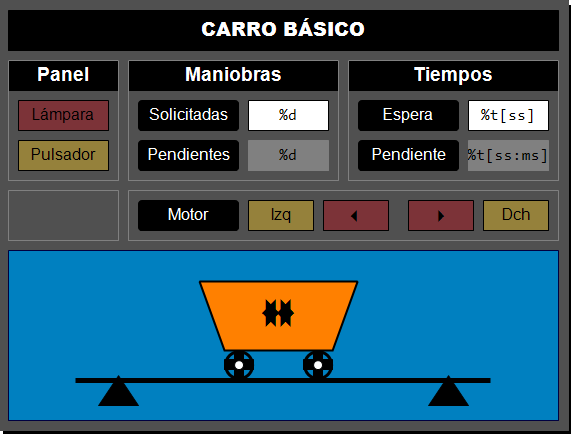

# 🚃 Carro básico (TwinCAT 3)

<!-- 
!!! info "Info"
    Enlace al repositorio en Github [{width=15px}](https://github.com/vetorres-uma/TC3_Carro_Basico)
-->

## 📝 Descripción del Proyecto

El **carro va y viene** es un móvil que se desplaza longitudinalmente entre los extremos izquierdo y derecho de un tramo de vía.

{width=300px}

### Elementos constituyentes

La **parte operativa** del carro básico está constituida por los siguiente dispositivos:

- Un **motor** con dos señales de mando (izquierda y derecha)
- Un par de **sensores finales de carrera** (izquierdo y derecho)

La **parte de relación** consiste en un panel de operador básico compuesto únicamente por:

- Un **pulsador de marcha**.
- Una **lámpara de marcha**.

### Descripción del proceso

El funcionamiento del carro básico es como sigue.

1. El carro se pone en marcha hacia la derecha cuando se acciona el pulsador de marcha. 
1. Cuando el carro alcanza el final de carrera derecha invierte el sentido de la marcha.
1. El carro se detiene al alcanzar, de nuevo,  el final de carrera izquierda (posición inicial).

- **Condición inicial**: carro detenido sobre el final de carrera izquierda.

### Modalidades

1. **Carro pulsado**. El carro inicia un viaje de ida y vuelta, únicamente, cuando estando en su posición inicial se acciona el pulsador de marcha.
1. **Carro temporizado**. El carro se detiene durante un determinado tiempo sobre el final de carrera derecha antes de iniciar el camino de regreso hacia su posición inicial.
1. **Carro limitado**. El carro realiza un determinado número de viajes de ida y vuelta (tarea) cada vez que, estando en su posición inicial, se acciona el pulsador de marcha.
1. **Carro señalizado**. La lámpara de marcha se enciende de forma permanente para indicar que el carro está en funcionamiento y parpadea para indicar que el carro está en reposo.

### Entradas y salidas

| Nombre | Tipo | Origen | Descripción |
| :--- | :--- | :--- | :--- |
| `PM` | `BOOL` | Input | Pulsador de Marcha |
| `FCI` | `BOOL` | Input | Final de Carrera Izquierda |
| `FCD` | `BOOL` | Input | Final de Carrera Derecha |
| `LM` | `BOOL` | Output | Lampara de Marcha |
| `MI` | `BOOL` | Output | Marcha Izquierda |
| `MD` | `BOOL` | Output | Marcha Derecha |

---

### Especificación funcional

Las siguientes especificaciones funcionales describen el comportamiento del carro (lógica de control) de una manera precisa utilizando los diagramas de relés y contactos y el lenguaje GRAFCET.

- [Diagrama de relés y contactos (PDF)](../../pdfs/Carro_Basico_DRC.pdf)
- [Diagrama grafcet (PDF)](../../pdfs/Carro_Basico_GRF.pdf)

---

### Código

Implementa el funcionamiento básico de este "famoso" problema de automatización del carro va y viene en sus diferentes modalidades (básico, pulsado, temporizado, limitado y señalizado).

Una de las característica más relevante de este proyecto didáctico es que se muestran diferentes formas de especificar e implementer un problema simple de automatización, empleando el lenguaje de especificación GRAFCET y usando diferentes lenguajes de programación de la norma IEC 61131-3 (`SFC` y `ST`).

- GRF → [SFC / ST]

---

## 💻 Requisitos del Sistema

### Software

- **IDE:** Microsoft Visual Studio / TwinCAT 3 XAE (Versión mínima recomendada: **3.1.4024.x**).
- **Lenguajes:** Texto Estructurado (ST) y Diagrama de Funciones Secuenciales (SFC).

## 🔨 Replicar el proyecto

### Información inicial

!!! warning "Importante"
    El proyecto completo que se explica aquí se corresponde con la versión **señalizada** del carro va y viene:
    
    - El carro inicia un viaje de ida y vuelta, únicamente, cuando estando en su posición inicial se acciona el pulsador de marcha (se utiliza la detección del flanco de subida).
    - El carro se detiene durante un determinado tiempo sobre el final de carrera derecha antes de iniciar el camino de regreso hacia su posición inicial.
    - Este proceso de ida y vuelta se realiza un determinado número de veces (configurable en la visualización) con una sola acción del pulsador de marcha.
    - La lámpara de marcha se enciende de forma permanente para indicar que el carro está en funcionamiento y parpadea para indicar que el carro está en reposo.

**Para replicar la creación de la solución completa, seguir este procedimiento:**

!!! tip "Sugerencia"
    Pulsa en ➡️ para obtener más información sobre cómo realizar el paso especificado.

1. Crear una solución de TwinCAT3 con nombre `tc3_carro_basico` [➡️](../../contenidos/01_conceptos/#crear-proyecto-tc3)
2. Crear un proyecto PLC con nombre `carro_basico_PLC` [➡️](../../contenidos/01_conceptos/#crear-proyecto-plc)
3. Escoger un lenguaje para la implementación: **ST** o **SFC**.
---

### Versión en ST

!!! info "Información"
    En esta versión conoceremos cómo implementar una máquina de estados en lenguaje **ST**. 
    
    Para ello, vamos a necesitar una variable específica que guarde el valor actual del estado: `Estado`, que
    será de tipo `ENUM` y podrá tomar los siguientes valores:
    
    `E_Reposo`, `E_MarchandoDerecha`, `E_EsperandoDerecha`, `E_MarchandoIzquierda`, `E_EvaluandoTarea`.
    
    Nótese que estos estados se corresponden con los que tenemos especificados en el GRAFCET del carro señalizado.

1. Crear un bloque funcional con nombre `FB_Carro_ST` [➡️](../../contenidos/01_conceptos/#crear-bloque-funcional)
2. Declarar las variables dentro del **FB** [➡️](../../contenidos/01_conceptos/#declaracion-de-variables)
    - **Entrada** (se puede especificar su valor en la llamada al **FB**)
    
    ```pascal
    VAR_INPUT
        ManiobrasSolicitadas     : UINT := 2;
        TiempoEspera             : TIME := T#2S;
    END_VAR
    ```

    | Variable              | Tipo | E/S | Descripción |
    |-----------------------|------|-----|-------------|
    | ManiobrasSolicitadas  | UINT | no  | Nº de ciclos "va-y-viene" solicitadas para ejecutar. |
    | TiempoEspera          | TIME | no  | Tiempo de espera en lado derecho. |
   
    - **Salida** (se puede utilizar su valor fuera del **FB**)
    
    ```pascal
    VAR_OUTPUT
        ManiobrasPendientes      : UINT;
        TiempoPendiente          : TIME;
    END_VAR
    ```

    | Variable              | Tipo | E/S | Descripción |
    |-----------------------|------|-----|-------------|
    | ManiobrasPendientes   | UINT | no  | Nº de ciclos que quedan por realizar |
    | TiempoPendiente       | TIME | no  | Tiempo restante de la espera/temporización |

    - **Locales** (de uso interno al **FB**)
    
    ```pascal
    VAR
        // Enumeracion de etiquetas para los estados
        Estado : (E_Reposo, E_MarchandoDerecha, E_EsperandoDerecha, E_MarchandoIzquierda, E_EvaluandoTarea);
        
        // Utilidades
        BLK                      : FB_Blink;
        FlancoPulsadorMarcha     : R_TRIG;
        TemporizadorEspera       : TON;
        
        // Entradas
        i_FinalDerecha    AT %I* : BOOL;
        i_FinalIzquierda  AT %I* : BOOL := TRUE;
        i_PulsadorMarcha  AT %I* : BOOL;
        
        // Salidas
        o_LamparaMarcha   AT %Q* : BOOL;
        o_MarchaDerecha   AT %Q* : BOOL;
        o_MarchaIzquierda AT %Q* : BOOL;
    END_VAR
    ``` 

    | Variable | Tipo | E/S | Descripción |
    |----------|------|-----|-------------|
    | **Estado**              | ENUM | no | Estado actual de la máquina de estados del carro |
    | BLK                     | FB_Blink | no  | Bloque auxiliar para hacer parpadear una señal (p.ej. lámpara) |
    | FlancoPulsadorMarcha    | R_TRIG | no | Detector de flanco ascendente del pulsador de marcha |
    | TemporizadorEspera      | TON  | no | Temporizador de retardo para gestionar la espera |
    | i_FinalDerecha          | BOOL | <span class="fondo-amarillo">**E**</span> | Final de carrera derecha (entrada digital) |
    | i_FinalIzquierda        | BOOL | <span class="fondo-amarillo">**E**</span> | Final de carrera izquierda (entrada digital) |
    | i_PulsadorMarcha        | BOOL | <span class="fondo-amarillo">**E**</span> | Pulsador de inicio/marcha del ciclo |
    | o_LamparaMarcha         | BOOL | <span class="fondo-rojo">**S**</span> | Lámpara indicadora de marcha/funcionamiento |
    | o_MarchaDerecha         | BOOL | <span class="fondo-rojo">**S**</span> | Orden de movimiento hacia la derecha (salida digital) |
    | o_MarchaIzquierda       | BOOL | <span class="fondo-rojo">**S**</span> | Orden de movimiento hacia la izquierda (salida digital) |

3. Escribir el código
    
    El código va a estar formado por tres regiones que se implementan todas en la caja de código: una para la llamada a las **utilidades**, otra para la **función de estado** y otra para la **función de salida**.
    
    1. Llamada a los FBs de **utilidades**:

        ```pascal
        // --- UTILIDADES ---
        BLK();
        FlancoPulsadorMarcha(CLK := i_PulsadorMarcha);
        TemporizadorEspera(IN := (Estado = E_EsperandoDerecha), PT := TiempoEspera);
        ``` 

        - Genera la señal de parpadeo con `BLK`.
        - Monitoriza el flanco de subida de `i_PulsadorMarcha`
        - Activa un temporizador de `TiempoEspera` cuando el estado `E_EsperandoDerecha` esté activo.
    

    2. Especificación de la **función de estado** que implementa la evolución de la secuencia:

        ```pascal
        // --- FUNCION DE ESTADO ---
        CASE Estado OF
            E_Reposo:
                IF i_FinalIzquierda AND FlancoPulsadorMarcha.Q THEN
                    // Accion a la salida
                    IF ManiobrasPendientes = 0 THEN
                        ManiobrasPendientes := ManiobrasSolicitadas;
                    END_IF;
                    
                    Estado := E_MarchandoDerecha;
                END_IF;
                
            E_MarchandoDerecha:
                IF i_FinalDerecha THEN
                    Estado := E_EsperandoDerecha;
                END_IF;
                
            E_EsperandoDerecha:
                // Accion principal
                TiempoPendiente := TiempoEspera - TemporizadorEspera.ET;
                
                IF TemporizadorEspera.Q THEN
                    Estado := E_MarchandoIzquierda;
                END_IF;
                
            E_MarchandoIzquierda:
                IF i_FinalIzquierda THEN
                    // Accion a la entrada (siguiente estacion)
                    IF ManiobrasPendientes > 0 THEN
                        ManiobrasPendientes := ManiobrasPendientes - 1;
                    END_IF;
                    
                    Estado := E_EvaluandoTarea;            
                END_IF;
                
            E_EvaluandoTarea:
                IF ManiobrasPendientes = 0 THEN
                    Estado := E_Reposo;
                ELSIF ManiobrasPendientes > 0 THEN
                    Estado := E_MarchandoDerecha;
                END_IF;
        END_CASE;
        ```
        
        - En **reposo**: Pasa a `E_MarchandoDerecha` si `i_FinalIzquierda` está activo y se detecta el flanco de `i_PulsadorMarcha`. Antes de salir de este estado, inicializa el contador `ManiobrasPendientes` a `ManiobrasSolicitadas`.
        - **Marchando hacia la derecha**: Pasa a `E_EsperandoDerecha` cuando se active el sensor fin de carrera a la derecha `i_FinalDerecha`.
        - **Esperando en la derecha**: Calcula el tiempo restante del temporizador y lo asigna a `TiempoRestante`. Cuando el temporizador termine, pasa a `E_MarchandoIzquierda`.
        - **Marchando hacia la izquierda**: Monitoriza el valor del sensor fin de carrera izquierdo `i_FinalIzquierda`. Cuando se active, decrementa el contador de maniobras pendientes y pasa al estado de evaluación de la tarea.
        - **Evaluando la tarea**: Determina si el contador de maniobras pendientes ha llegado a cero, en cuyo caso volvemos a reposo. En caso contrario, repite el proceso "va-y-viene" pasando a `E_MarchandoDerecha`.

    3. Especificación de la **función de salida** que activa las salidas del sistema según el estado activo:
       
        ```pascal
        // --- FUNCION DE SALIDA ---
        o_LamparaMarcha    := ((Estado = E_Reposo) AND BLK.Q) OR (Estado <> E_Reposo);
        o_MarchaDerecha    := (Estado = E_MarchandoDerecha);
        o_MarchaIzquierda  := (Estado = E_MarchandoIzquierda);
        ```

        - Enciende la lámpara (`o_LamparaMarcha`) intermitentemente en el estado de reposo y fija en cualquier otro caso.
       
            !!! info "Información"
                Nótese que `((Estado = E_Reposo) AND BLK.Q)` genera una señal que conmuta intermitentemente cuando el estado de reposo esté activo.
       
        - Activa la salida digital que propicia el movimiento del motor hacia la derecha `o_MarchaDerecha` en el estado de marcha hacia la derecha.
        - Activa la salida digital que propicia el movimiento del motor hacia la izquierda `o_MarchaIzquierda` en el estado de marcha hacia la izquierda.
        
---

### Versión en SFC

!!! info "Información"
    En esta versión conoceremos cómo implementar una máquina de estados en lenguaje gráfico **SFC**.

    Este lenguaje es muy útil para implementar máquinas de estados de manera sencilla ya que su codificación explicita directamente la secuencia de estados y sus transiciones.
    
    Nótese la gran similitud entre la especificación en GRAFCET y la implementación en **SFC**.

1. Crear un bloque funcional con nombre `FB_Carro_SFC` [➡️](../../contenidos/01_conceptos/#crear-bloque-funcional)
2. Declarar las variables dentro del **FB** [➡️](../../contenidos/01_conceptos/#declaracion-de-variables)

    !!! info "Información"
        Las variables para la versión **SFC** son las mismas que en la versión **ST** con dos excepciones:
            
        - **No necesitamos una variable de estado**, ya que viene implícito en el lenguaje. Además, TwinCAT 3 asocia una variable booleana a cada estado que indica si éste está activo: `[nombre_etapa].x`.
        - **No necesitamos el temporizador** ya que TwinCAT 3 incorpora un temporizador asociado a cada etapa, al que se puede acceder mediante el código `[nombre_etapa].t`.

3. Implementamos el código en SFC [➡️](../../contenidos/01_conceptos/#lenguaje-sfc)
    
    {width=500px}

    ---
    
    Explicación del código (revisar los tipos de acciones [➡️](../../contenidos/01_conceptos/#asociar-acciones-a-etapas)):

    - Etapa `S0`. Se realizan tres acciones asociadas:
        - Acción **continua** `a_LamparaMarcha`: Hace que parpadee cuando `S0` esté activo (`S0.x = TRUE`) y quede fija en cualquier otra etapa.
        
        ```pascal
        BLK();
        o_LamparaMarcha := (S0.x AND BLK.Q) OR NOT S0.x;
        ```
        
        - Acción **principal** `a_FlancoMarcha`: Realiza la llamada al **FB** de detección de flanco de subida del pulsador de marcha. Es en este estado donde queremos que se monitorice este flanco.
        
        ```pascal
        FlancoPulsadorMarcha(CLK := i_PulsadorMarcha);
        ```

        - Acción **memorizada a la salida** `a_ManiobrasPendientes_Iniciar`: Antes de pasar a la siguiente etapa, inicializamos el valor de la variable `ManiobrasPendientes` al valor solicitado en `ManiobrasSolicitadas`.
        
        ```pascal
        IF ManiobrasPendientes = 0 THEN
            ManiobrasPendientes := ManiobrasSolicitadas;
        END_IF
        ```
    
    ---

    - Transición `S0` → `S1`: Cuando esté activo el sensor fin de carrera izquierdo y se produzca el flanco de subida del pulsador de marcha.
    
    ---
    
    - Etapa `S1`. Se realizan dos acciones asociadas:
        - Acción **continua** que activa la salida digital correspondiente al movimiento del motor hacia la derecha: `o_MarchaDerecha`.
        - Acción **continua** `a_LamparaMarcha`.
    
    ---
    
    - Transición `S1` → `S2`: Cuando esté activo el sensor fin de carrera derecho.

    ---

    - Etapa `S2`. Se realizan dos acciones asociadas:
        - Acción **continua** `a_LamparaMarcha`.
        - Acción **principal** `a_TiempoEspera`: Calcula el tiempo que queda por esperar en la posición derecha.

        ```pascal
        TiempoPendiente := TiempoEspera - S2.t;
        ```
        
        !!! info "Información"
            Nótese el uso de la expresión `S2.t`, donde se va almacenando, de forma automática por TwinCAT 3, el tiempo que la etapa `S2` está activa.

    ---
    
    - Transición `S2` → `S3`: Cuando el tiempo que la etapa `S2` está activa iguale o supere al tiempo de espera: `S2.t >= TiempoEspera`

    ---
    
    - Etapa `S3`. Se realizan dos acciones asociadas:
        - Acción **continua** que activa la salida digital correspondiente al movimiento del motor hacia la izquierda: `o_MarchaIzquierda`.
        - Acción **continua** `a_LamparaMarcha`.

    ---
    
    - Transición `S3` → `S4`: Cuando esté activo el sensor fin de carrera izquierdo.

    ---
   
    - Etapa `S4`. Se realizan dos acciones asociadas:
        - Acción **continua** `a_LamparaMarcha`.
        - Acción **memorizada a la entrada** `a_ManiobrasPendientes_Iniciar`. Justo al entrar en esta etapa, se decrementa el valor de las `ManiobrasPendientes`.

        ```pascal
        IF ManiobrasPendientes > 0 THEN
            ManiobrasPendientes := ManiobrasPendientes - 1;
        END_IF
        ```

    ---
    
    - Bifurcación condicional
        - Transición `S4` → `S0`: Si el número de maniobras pendientes ha llegado a cero, volvemos a la etapa inicial.
        - Transición `S4` → `S1`: Si el número de maniobras pendientes aún no ha llegado a cero, repetimos el proceso.
  
    ---

4. Diseñar la visualización añadiendo: [➡️](../../contenidos/01_conceptos/#crear-visualizacion)

    {width=400px}

    1. Rectángulos (*Rectangle*) para las etiqueta **Panel**, **Maniobras**, **Tiempos**, etc.
    2. Rectángulos (*Rectangle*) **editables** para introducir el valor de `ManiobrasSolicitadas` y `TiempoEspera`.
        
        ??? info "Parámetros"
            - Texts > Text = 
                - [%d] *Formato estilo printf que indica que se va a sustituir por un número entero*
                - [%t] *Formato estilo printf que indica que se va a sustituir por una variable tipo `TIME`* 
            - Text variables > Text variable = 
                - [`MAIN.Carro.ManiobrasSolicitadas`]
                - [`MAIN.Carro.TiempoEspera`]
            - Inputconfiguration 
                - OnMouseClick > Configure > Write a Variable. 
                    - *Aceptar cuadro de diálogo por defecto. El valor introducido se escribirá en la variable especificada en Text Variable.*

    3. Rectángulos (*Rectangle*) **no editables** para mostrar el valor de `ManiobrasPendientes` y `TiempoRestante`.

        ??? info "Parámetros"
            - Texts > Text = 
                - [%d] *Formato estilo printf que indica que se va a sustituir por un número entero*
                - [%t] *Formato estilo printf que indica que se va a sustituir por una variable tipo `TIME`* 
            - Text variables > Text variable = 
                - [`MAIN.Carro.ManiobrasPendientes`]
                - [`MAIN.Carro.TiempoRestante`]

    4. Rectángulos (*Rectangle*) para las variables booleanas correspondientes a la lámpara, pulsador, sensores final de carrera y activación de motores. **Tanto para mostrar su valor como para poder modificarlo.**

        ??? info "Parámetros"
            - Texts > Text = [**Pulsador**], [**Lampara**], , etc.
            - Color variables > Toggle color = [`MAIN.i_PulsadorMarcha`], [`MAIN.o_Lampara`], etc.
            - InputConfiguration
                - Toggle > Variable: [`MAIN.i_PulsadorMarcha`], [`MAIN.o_Lampara`], etc.


6. Declarar la variable `Carro` de tipo `FB_Carro_SFC` o `FB_Carro_ST` en el programa `MAIN`, según la versión a utilizar.
    
    ```pascal
    PROGRAM MAIN
    VAR
        Carro: FB_Carro_SFC; // o Carro: FB_Carro_ST;
    END_VAR
    ```

7. Escribir, en la zona de implementación de `MAIN`, la llamada al **FB** del `Carro`.

    ```pascal
    Carro();
    ```

## 🚀 Descarga

!!! info "Lenguaje"
    Se proporciona con implementaciones equivalentes en `ST` y en `SFC`.

**Para descargar, compilar y ejecutar este proyecto en el entorno de TwinCAT 3, seguir una de estas dos opciones:**

- Mediante el Campus Virtual
- Mediante GIT
 
### Mediante el Campus Virtual

1. **Copiar** a tu equipo local el fichero `CV > Automatización > ejemplos > 2_tc3_carro_basico > tc3_carro_basico.tnzip` que hay en la carpeta del campus virtual.
2. **Seguir el procedimiento** descrito [aquí](../../contenidos/01_conceptos/#abrir-un-fichero-tnzip) para generar la **Solución** a partir del fichero.

### Mediante GIT

1. **Clonar el Repositorio:**

```bash
git clone https://github.com/vetorres-uma/TC3_Carro_Basico.git
```

2. **Abrir el Proyecto:** abra el archivo `.sln` (Solución) ubicado en la carpeta principal utilizando el entorno de ingeniería **TwinCAT XAE** (integrado en Visual Studio).
1. **Selección del Controlador:** seleccione el simulador (**UmRT_Default**) o controlador local o remoto (**Choose Runtime System**).
1. **Activación de Configuración:** en el modo **Configuración**, active la configuración (**Activate Configuration**)) y reinicie TwinCAT en modo **Ejecución (Run Mode)**.
1. **Carga del Código:** en el entorno PLC, inicie la sesión y descargue el programa al PLC (**Login**).
1. **Poner el código en ejecución:** ejecute la lógica de control en el controlador (**Start**). Puede utilizar la visualización integrada en el proyecto PLC para facilitar la prueba.

---

## 🤝 Contribuciones

Este proyecto es utilizado con fines educativos. Las contribuciones, sugerencias o correcciones de errores son bienvenidas. Por favor, abra un *Issue* o envíe un *Pull Request* si desea contribuir.

---

## 🧑 Autor

- **Autor Principal:** Victor Torres ([@vetorres-uma](https://github.com/vetorres-uma>))
- **Revisor**: Francisco Ángel Moreno ([@famoreno](https://github.com/famoreno))

---

## ⚖️ Licencia

Este proyecto es de código abierto y está disponible bajo la **Licencia Pública General GNU (GPL)**.

- Consulte el archivo `LICENSE.md` para más detalles.