# 🏗️ Proyecto TwinCAT 3 paso a paso

## Abrir TwinCAT XAE

- Buscar en el menú de inicio de Windows la aplicación `TwinCAT XAE Shell`.

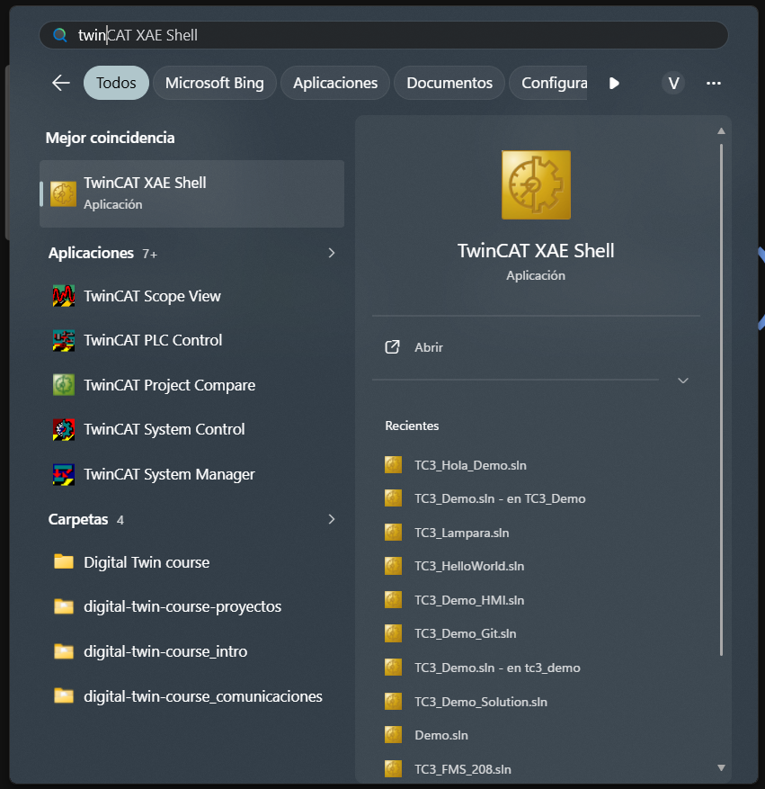{width=400px}

- También accesible desde la barra de tareas (junto al reloj de Windows).
    -  **CD** derecho sobre el icono de TwinCAT y seleccionando la opción **TwinCAT XAE (TcXAEShell)**.

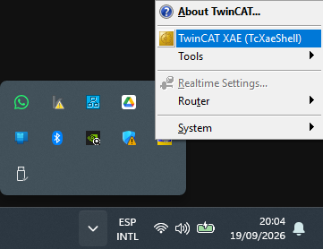{width=300px}

Tras cargar la aplicación se muestra la pantalla inicial de la aplicación.

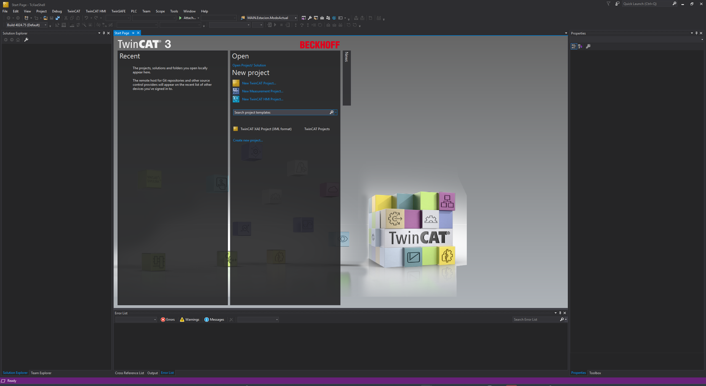{width=700px}

## Crear un [proyecto](../../contenidos/00_terminologia.md/#proyecto-twincat-3) TwinCAT 3

### Seleccionar ***TwinCAT XAE Project (XML format)***.

 - En el menú de la aplicación: File > New > Project
 - En la página de inicio de la aplicación: Open > NewProject > New TwinCAT Project...

 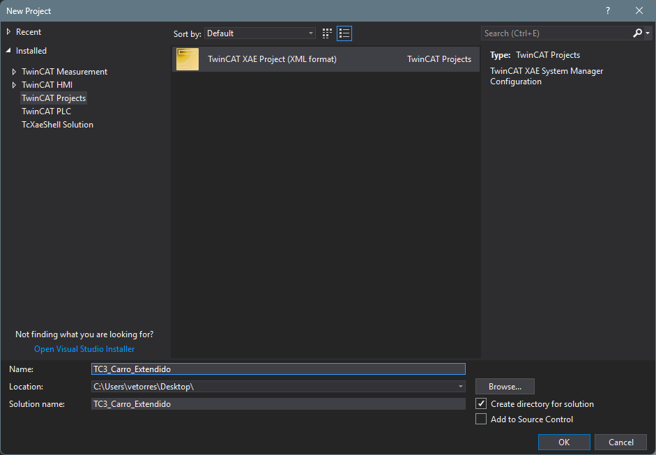{width=500px}

??? info "Parámetros"
    - Name = nombre del proyecto TwinCAT.
    - Location = carpeta dónde se alojará la solución.
    - Solution name = nombre de la solución (normalmente, el mismo que el nombre del proyecto).
    - Create directory for solution = **SI**/NO (creará la solución dentro de una carpeta con el nombre de la solución).
    - Create new Git repository = SI/NO (inicia el control de versiones con Git).

 Se mostrará la nueva solución «vacía».

 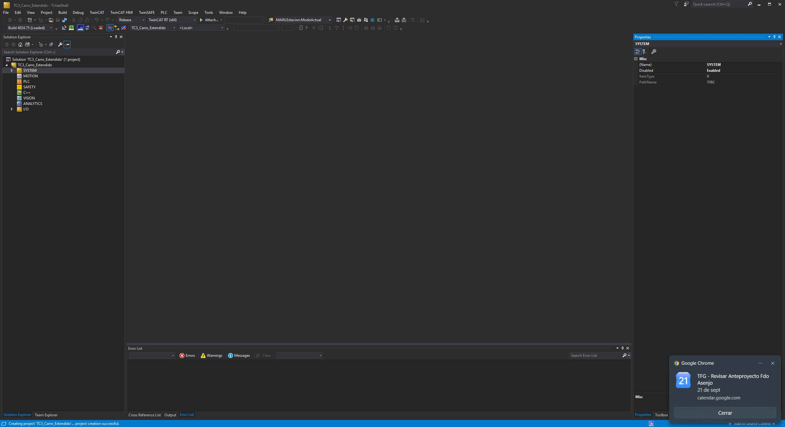{with=700px}

### Ocultar las configuraciones innecesarias 

Para despejar el panel de exploración de la solución, ocultar las configuraciones innecesarias.

- **CD** sobre la configuración seleccionada y seleccionar **Hide \*\*\* Configuration**.

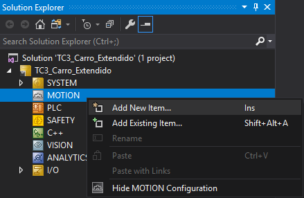{width=300px}

!!! note "Recomendación"
    - Ocultar las configuraciones que no se van a utilizar: `MOTION`, `SAFETY`, `C++`, `VISION`, `ANALYTICS`.
    - Mantener las configuraciones `SYSTEM`, `PLC` e `I/O`.

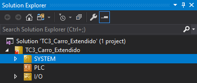{width=300px}

## Crear un proyecto PLC

1. Para crear un nuevo proyecto PLC, dentro de un proyecto TC.

    - **CD** sobre la configuración `PLC` y seleccionar ***Add New Item***.

    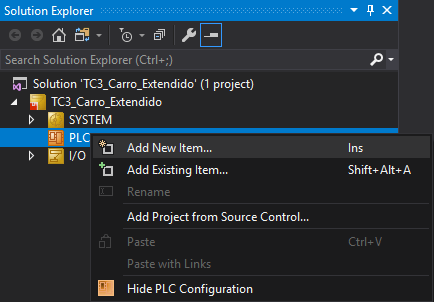{width=300px}

2. En la ventana emergente seleccionar ***Standard PLC Project***, darle un nombre al proyecto PLC y pulsar ***Add***. 

    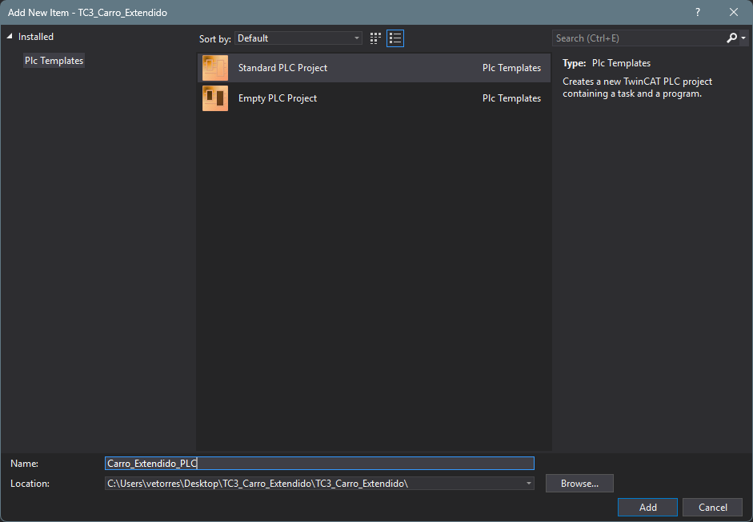{width=500px}

    Tras la creación, se muestra el nuevo proyecto PLC en el panel del explorador de la solución.

    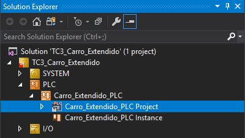{width=400px}

    ??? info "Descripción"
        - Project = código fuente estructurado bajo la norma IEC 61131-3.
        - Instance = instancias de las variables de E/S del proyecto para la vinculación con los canales de E/S del sistema.

    Y si se despliega su contendio, se muestra la estructura de carpetas y nodos que contiene.

    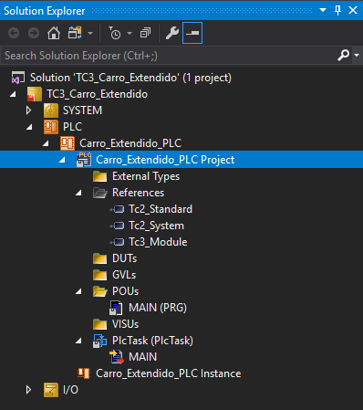{width=400px}

    ??? info "Descripción"
        - External Types = declaración de tipos de datos complejos e interfaces que provienen de bibliotecas externas.
        - References = listado de bibliotecas vinculadas al proyecto.
        - DUTs (*Data Unit Types*) = declaración de los tipos de datos de usuario.
        - GVLs (*Global Variable Lists*) = listas de variables globales.
        - POUs (*Program Organization Units*) = conjunto de módulos que componen el proyecto.
        - VISUs = visualizaciones, interfaces gráficas.
        - PlcTask (PlcTask) = llamadas a los programas de ejecución cíclica.

    ??? info "Proyecto Estándar"
        Al selecionar un proyecto PLC estándar se aplica una plantilla predeterminada que incluye:

        - Una tarea tiempo real `PlcTask` con un tiempo de ciclo de 10 ms.
        - Un programa `MAIN` vinculado a la tarea `PlcTask`.
        - Un conjunto de librerías básicas: Tc2_Starndar, Tc2_System y Tc3_Module.
        - Un conjunto estructurado de carpetas (DUTs, GVLs, POUs, VISUs).

### Crear un nuevo POU

1. Para añadir un nuevo POU.

    - `CD`sobre la carpeta `POU` y seleccionar **Add** y **POU...**.

    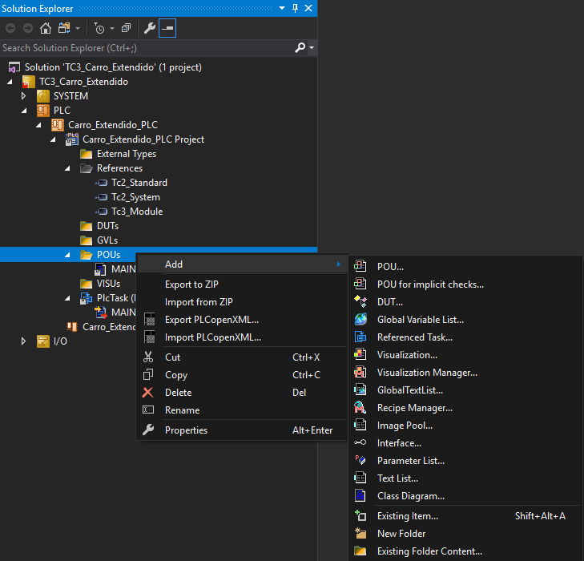{width=400px}

2. Cumplimentar los datos correspondites en la ventana emergente **Add POU**.

    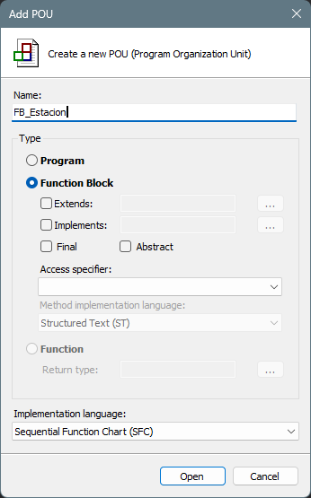{width=300px}

    ??? info "Descripción"
        - Name = nombre del POU.
        - Type = tipo de POU (programa, bloque funcional o función).
        - Implementation language = lenguaje en el que se codificará el POU (CFC, FBD, IL, LD, SFC, ST, SC)

3. Se mostrará el nuevo POU «vacío».

    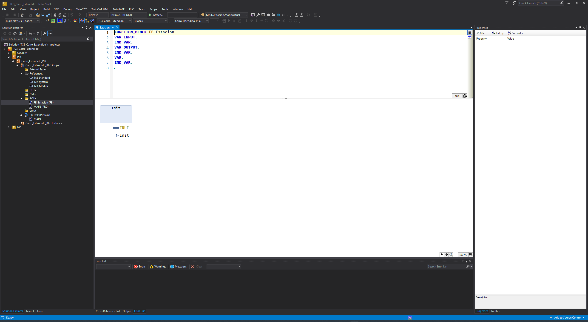{width=700px}

## Implementar un POU

Al delplegar la carpeta `POUs` se muestra la lista de todos los módulos de programación (programas, bloques funcionales y funciones) que componen el proyecto.

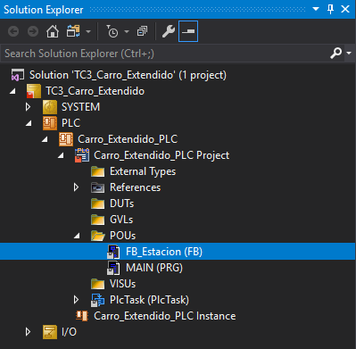{width=400px}

Pulsando sobre cualquiera de ellos podemos acceder a su contenido.

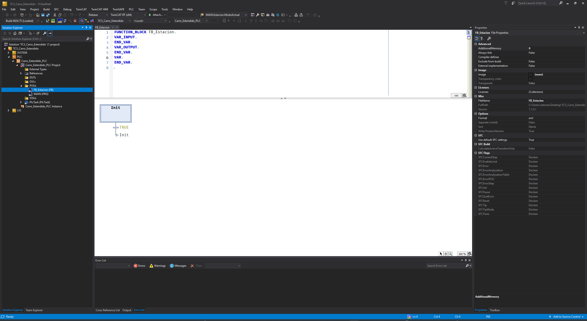{width=700px}

El contenido de un POU se muestra separado: 

- En la ventana superior denominada `Parte de Declaración` se encuentra el **Encabezado del POU** y los **Bloques de Declaración**. 
- En la ventana inferior denominada `Parte de Implemntación` se muestra el código del POU en el lenguaje seleccionado.

### Declarar una variable

Para crear una variable escribir su declaración siguiendo la siguiente sintaxis:

```text
Identificador [AT %Localización]: Type [:= ValorInicial];
```

1. **Identificador** (obligatorio). Es el nombre único de la variable dentro de su ámbito (scope).
2. **Localización** (opcional). La localización o **Ubicación Directa** establece la zona y la posición de memoria en la que se situará la variable. 
    - Modificador de localización `AT`.
    - Dirección. 
        ```text
        %[Área] [Tamaño] [Dirección]
        ``` 
        - `%`: prefijo de ubicación.
        - Área: `I` para entradas, `Q` para salidas y `M` para memoria interna (o de marcas).
        - Dirección:
            - Absoluta:

                ```text
                [Area][Tamaño][Dirección]
                ```

                - Tamaño [X/B/W/D/L]: prefijo que indica el tamaño de la variable (Bit/Byte/Palabra/Doble/Larga).
                - Dirección [palabra.bit]: posición de la variable en el área de memoria. 

                ??? info "Ejemplo"
                    ```iecst
                    Pulsador AT %IX0.0: BOOL;
                    ```

            - Inespecificada: utilizando el carácte comodión `\*`

                ??? info "Ejemplo"
                    ```iecst
                    Pulsador AT %*: BOOL;
                    ```

3. **Separador de tipo:** (obligatorio). Separa el nombre de la variable de su tipo.
4. **Tipo de dato**: Especifica principalmente el tamaño y el rango de la variable. Puede ser un tipo elementar (BOOL, INT, REAL, TIME,...), complejo (STRUCT, ENUM, ARRAY,...) o de usuario.
5. **Valor inicial**: Especifica el valor de la variable al iniciar el runtime. Si no se especifica tomará el valor en su defecto según el tipo de la variable.
6. **Delimitador ;** (obligatorio). Terminador de instrucción.  

### Ámbito de una variable

El bloque de declaración determina el ámbito y el alcance de la variable especificando quién y cómo puede acceder a la variable o parámetro.

   1. `VAR ... END_VAR`: variables locales, internas al POU. Únicamente accesibles dentro del POU en el que se declaran.
   2. `VAR_INPUT ... END_VAR`: parámetros de entrada. Pueden ser escritos desde el exterior.
   3. `VAR_OUTPUT ... END_VAR`: parámetros de salida. Pueden ser leídos desde el exterior.
   4. `VAR_IN_OUT ... END_VAR`: parámetros de entrada/salida por referencia. Punteros a variables externas que pueden leerse y escribirse dentro del POU.
   5. `VAR_GLOBAL ... END_VAR`: variables globales (GVL). Accesibles desde cualqueir POU del proyecto.
   6. `VAR_STAT ... END_VAR`: variables estáticas. Variables locales que conservan su valoer entre ciclos de ejecución.
   7. `VAR_PERSISTENT ... END_VAR`: variables persistentes. Variables que conservan su valor incluso tras la pérdida de alimentación.

## Codificar en Texto Estructurado

## Desplegar un proyecto

El proceso de despliegue abarca la secuencia desde la validación del código fuente hasta la ejecución en tiempo real sobre el runtime  del sistema destino (*Target*).

#### Seleccionar un sistema destino
- El sistema destino (**Target System**) es el *runtime* de tiempo real sobre el que se ejecuta el código máquina del programa.
- Hay tres tipos de sistemas destino seleccionables:
    * **Local Target**: presente en el mismo ordenador en el que se está desarrollando el programa.
    * **Remote Target**: equipo físico remoto conectado por EherCAT. 
    * **UmRT_Default**: *runtime* que se ejecuta en modo usuario sin capacidades de tiempo real.
- Para seleccionarlo basta con elegirlo de la lista de runtimes disponibles en la barra de herramientas de TwinCAT.

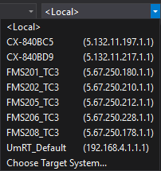{width=300px}

#### Construir el Proyecto

Construir una solución o un proyecto (**Build**):

- **Análisis Sintáctico y Estático:** El compilador analiza el código fuente (ST, SFC, etc.) verificando la sintaxis, compatibilidad de tipos de datos y reglas de la norma IEC 61131-3.
- **Generación de Código Máquina:** Traduce las POUs a instrucciones binarias optimizadas para la arquitectura del procesador del sistema destino (x86/x64).
- **Ámbito de Compilación:** Se puede construir o reconstruir la solución completa o solo uno de los proyectos de la solución.
- **Modo de Ejecución:** Desde el menú principal: `Build` > `Build Solution` (o `Build <Nombre_Proyecto>`), o mediante el atajo de teclado `Ctrl + Shift + B`.

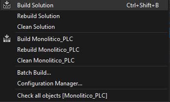{width=300px}

- El resultado (mensajes, avisos y errores) de la construcción se muestra en el panel de de errores (*Error List*). 

#### Activar la Configuración

Activar la configuración (**Activate Configuration**):

- **Carga de Hardware y Mapeo:** Transfiere al Kernel de tiempo real la configuración física de dispositivos, terminales,..., la asignación de tareas (*Tasks*) y las tablas de enrutamiento de E/S (`AT %I*`/`AT %Q*`).
- **Instanciación en el Kernel:** Reinicia el Kernel de TwinCAT en el sistema destino para aplicar los cambios de infraestructura e instanciar los servicios de memoria RAM necesarios.
- **Cambio de Estado:** Conmuta el sistema operativo de tiempo real a modo **RUN** (indicado por el icono de TwinCAT en verde en la barra de tareas).
- **Modo de Ejecución:** Desde el menú principal `TwinCAT` > `Activate Configuration`, o pulsando el icono en la barra de herramientas de TwinCAT.

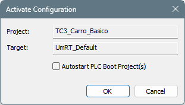{width=300px}

??? info "Boot Project"
    El **Boot Project** (Proyecto de Arranque) es la copia compilada ejecutable del proyecto que se guarda en el almacenamiento no volátil (disco/memoria flash) del sistema destino. Su función es permitir que el runtime de TwinCAT cargue y arranque el programa del PLC de forma automática al encender o reiniciar el equipo, sin necesidad de conectarse desde el entorno de desarrollo (XAE).

!!! warning "Importante"
    - **NO** activar la generación del proyecto de arranque durante la fase de desarrollo del proyecto. 
    - Si el código del proyecto de arranque contiene un fallo grave de ejecución (como un bucle infinito en ST, una división por cero o un puntero nulo/inválido) y el Boot Project está activo, el runtime intentará ejecutar ese código defectuoso inmediatamente al arrancar. Esto provocará un colapso (crash) o bloqueo en bucle del runtime de tiempo real en cada reinicio.


- Si no se dispone de una licencia permanente, cada 7 días habrá que reactivar la licencia de prueba ...

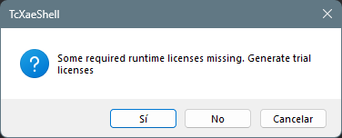{width=300px}

- ... introduciendo el código de seguridad.

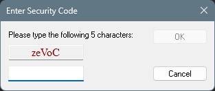{width=300px}

- Finalmente, es necesario confirmar el reinicio del sistemas destino en modo ejecución.

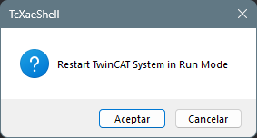{width=300px}


#### Transferir un Proyecto

Transferir un proyecto PLC (**Login**):

- **Conexión vía ADS:** Se establece la sesión de comunicación con la instancia del PLC a través del puerto de sistema ADS (por defecto, **Puerto ADS 851**).
- **Transferencia de Binarios:** Se descarga el código compilado (*Bytecode*) a la memoria RAM asignada a la instancia del PLC en el controlador.
- **Generación de Boot Project:** Eventualmente se crea el proyecto de arranque (*Create Boot Project*) en el almacenamiento no volátil del sistema destino para garantizar que el programa se cargue automáticamente tras una pérdida de alimentación.
- **Modo de Ejecución:** Pulsando el botón `Login` (`Alt + F8`) en la barra de herramientas de TwinCAT PLC. 

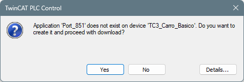{width=300px}

??? info
    Si el código presente en el sistema destino difiere significativamente del código que se pretende enviar se solicita autorización para realizar un *Online Change* (cambio en caliente) o una descarga completa (*Cold/Origin Reset Download*).

#### Arrancar un Proyecto

Arrancar o poner en ejecución un proyecto (**Start**):

- **Inicio del Bucle de Tiempo Real:** Inicia la ejecución del ciclo básico de funcionamiento (*Task Scan*) asignado en la `PlcTask`.
- **Procesamiento de Entradas/Salidas:** Se activa el ciclo determinista: lectura de la imagen de proceso de entradas (`%I*`), ejecución de las POUs (`MAIN`) y actualización de las salidas (`%Q*`).
- **Modo de Ejecución:** Pulsando el botón `Start` (`F5`) o desde el menú `PLC` > `Login` > `Start`.
- Tras pasar a modo ejecución, en el entorno de programación, el código se muestra en modo **Monitorización *Online***

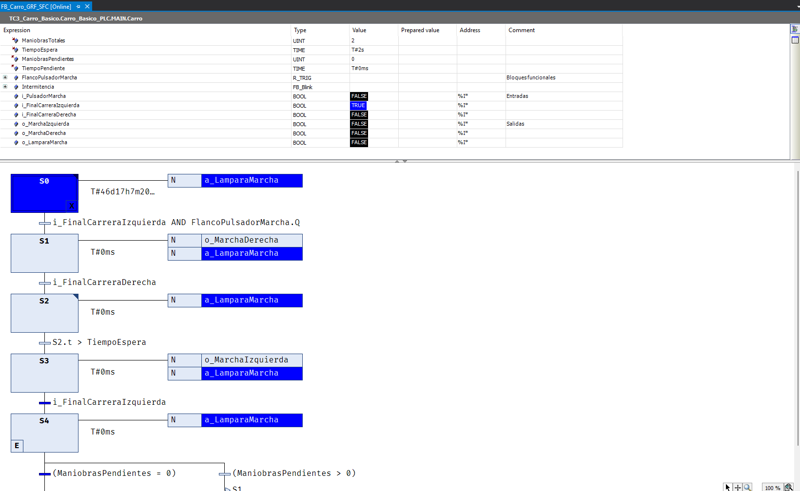{width=600px}

??? info
    El **Modo *Online*** o de **Monitorizacion *online*** es el estado de conexión directa e interactiva entre el entorno de desarrollo (**TwinCAT XAE**) y el motor de tiempo real en ejecución (**TwinCAT XAR**/*Target System*).
    Esta herramienta de supervisión y depuración en tiempo real de TwinCAT 3 permite:
        - Visualizar directamente sobre el código fuente (ST, SFC, etc.) los valores actualizados que de las variables en la memoria RAM del controlador durante cada ciclo de escaneo (Task Scan).
        - Modificar mediante el forzado las variables en tiempo de ejecución.
      
<!--
Stop ejecución, reiniciar sistema reset cold y reset origin
Forzado
Mostrar punto de declaración de una variable
Mostrar todas las apariciones de una variable
Buscar un controlador remoto
Configurar la entrada/salida
Vincular entradas/salidas
Crear una visualización paso a paso -> esto mejor en otro archivo
Depurar errores
-->