# {: style="border:none; background:transparent; box-shadow:none; vertical-align:middle; margin-right:8px; padding:0;" } ArduTC

## Introducción

**ArduTC** es una aplicación informática de software libre desarrollada por el equipo **AutoISATeam** de la **Universidad de Málaga** que permite la interacción de un **runtime** de **TwinCAT** con plataformas microcontroladoras y placas de desarrollo *hardware*.

!!! info "Plataformas compatibles"
    **ArduTC** debe funcionar con todas las plataformas compatibles con Telemetrix: Arduino con arquitectura AVR y ARM (UNO, Nano, Mega, Leonardo), Arduino Renesas (Serie UNO R4), Raspberry Pi Pico (RP2040 ), Espressif (ESP8266 y ESP32) y STM32.

**ArduTC** «convierte» una placa microcontroladora conectada a un PC con Windows mediante USB en un terminal de entradas y salidas digitales para **TwinCAT**. De forma que un programa de PLC escrito en un lenguaje de la norma IEC 61131-3, que se procese en cualquier sistema destino (runtime local/remoto o el simulador UmRT_Default), puede emitir y recibir información de entrada y salida hacia y desde una placa microcontroladora.

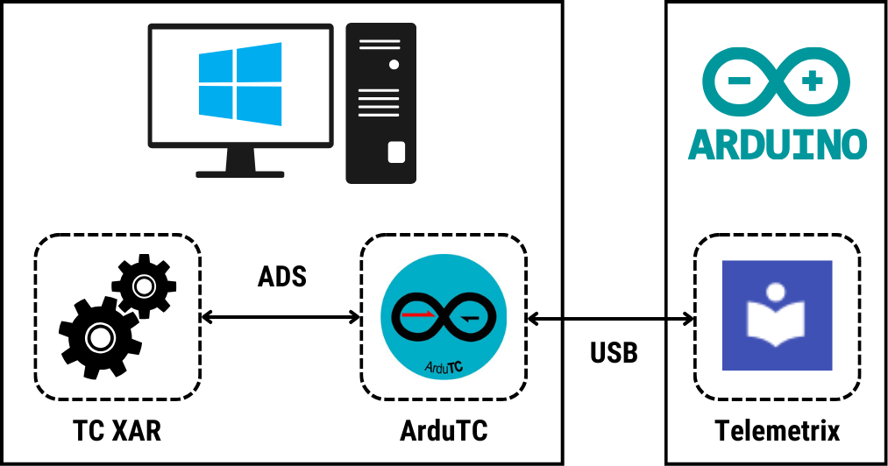{width=400px}

??? info
    **ArduTC** utiliza las siguientes librerı́as de software libre escritas en el lenguaje Python.

    - **pyADS** (Stefan Lehmann): para la comunicación con **TwinCAT**. 
    - **Telemetrix** (Alan Yorinks): para la comunicación con la placa microcontroladora.
    - **PyQT5** (Riverbank Computing Limited): para la interfaz gráfica.

Adquiriendo una placa microcontroladora compatible y algunos componentes electrónicos básicos, y gracias a la generosa política de licencias de **TwinCAT**, cualquier persona interesada en la programación de PLC, puede con **ArduTC** realizar prácticas de automatización interactuando con hardware real (pulsadores, lámparas, motores, relés, sensores de temperatura, ...) utilizando un sistema software de programación profesional (**TwinCAT**).

> **Aprender «haciendo que las cosas se muevan» con sistemas reales a muy bajo coste.**

**ArduTC** dispone de dos funcionalidades principales.

- Enlazar, de manera similar a TwinCAT, las variables de entrada y salida analógicas y digitales de una tarea TwinCAT con los pines analógicos y digitales de una placa microcontroladora.
- Servir de interfaz entre el **runtime** del sistema destino de **TwinCAT** seleccionado y la placa microcontroladora, para que una tarea IEC 61131-3 de **TwinCAT** gestione de forma efectiva y transparente sus entradas y salidas. 

!!! warning "Importante"
    Hay que destacar que aunque la transmisión de datos mediante ADS entre el **runtime** de **TwinCAT** y **ArduTC** se produce en tiempo real, la latencia que introduce la conexión USB con el sistema microcontrolador no garantiza que globalmente se cumpla tal requisito. Por tanto, este sistema de comunicación no puede sustituir, en ningún caso, a un sistema industrial basado en **EtherCAT** u otro protocolo de bus de campo compatible con los dispositivos fı́sicos de **Beckhoff**. Sin embargo, la velocidad de respuesta que ha demostrado en las pruebas realizadas es suficientemente alta como para poder ser utilizado como equipo para realizar prácticas o pruebas de concepto.

!!! success "Impacto y Contribuciones de ArduTC"
    Las principales contribuciones de **ArduTC** son:

    - Fomentar la expansión del ecosistema de automatización industrial TwinCAT en la industria.
    - Democratizar el aprendizaje práctico de la programación de PLC, reduciendo drásticamente los costes asociados al hardware.

---

## 📦 Código Fuente y Descarga

<!--
El código fuente completo de este proyecto **Hola Mundo** está disponible en GitHub:

- :material-github: **GitHub:** [`vetorres-uma/TC3_Hola_Mundo`](https://github.com/vetorres-uma/TC3_Hola_Mundo)
- :material-github: **GitHub:** [:material-download: Descarga directa `.zip`](https://github.com/vetorres-uma/TC3_Hola_Mundo/archive/refs/heads/main.zip)
-->

El instalador de la aplicación puede descargarse desde el siguiente repositorio:

- :material-google-drive: **Google Drive:** [:material-download: Descargar `ArduTC_Instalador.exe`](https://drive.google.com/file/d/18BegRgYjAHbBIg1U1vm0Bd4ghL0H9HHJ/view?usp=drive_link)

---

## 🧰 Materiales y Requisitos

### Hardware

- **PC con Windows**.
- **Placa de desarrollo compatible** y cable USB.
- **Kit de componentes electrónicos básicos:** LEDs, pulsadores, potenciómetros, servomotores, ... para realizar el montaje deseado.

### Software

- **TwinCAT**:
    - Entorno de desarrollo **TwinCAT XAE**
    - Sistema destino **TwinCAT XAR** (runtime local/remoto o simulador UmRT_Default).
- **Drivers** necesarios para la placa microcontroladora.
- **ArduTC**.

---

## 📐 Interfaz de ArduTC

La interfaz de usuario de ArduTC se divide en cinco áreas/paneles funcionales.

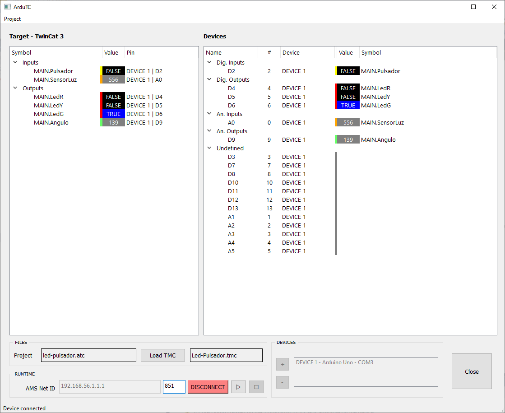{width=600px}

1.  **Target:** lista de variables (símbolos) exportadas desde el proyecto TwinCAT. Las entradas digitales se resaltan en amarillo y las salidas digitales en rojo.
2.  **Devices:** lista de pines de conexión disponibles en la placa microcontroladora seleccionada.
3.  **FILES:** para la gestión de ficheros de símbolos (`.tmc`).
4.  **RUNTIME:** parámetros de la comunicación con el sistemas destino (dirección **AMS NetID**) y el proyecto PLC (puerto de comunicaciones) junto al botón de conexión.
5.  **DEVICES:** detección y selección de placas microcontroladoras conectadas al ordenador.

---

## 🛠️ Guía de uso

#### Proyecto TwinCAT

Crear un proyecto TwinCAT con variables de entrada y salida y desplegarlo sobre un sistema destino. [➡️](../../contenidos/01_conceptos/01_tc3_proyecto_paso_a_paso.md)

??? Info
    - Tras la construcción del proyecto se crear el archivo Archivo de Descripción de Módulo `.tmc` (***TwinCAT Module Class***) que describe la interfáz pública y la estructura interna del proyecto PLC y la lista de símbolos (que incluye variables de entrada y salida).
    - Este archivo se encuentra dentro de la carpeta del proyecto PLC.

#### Cargar Símbolos

1. Abrir la aplicación **ArduTC**.

    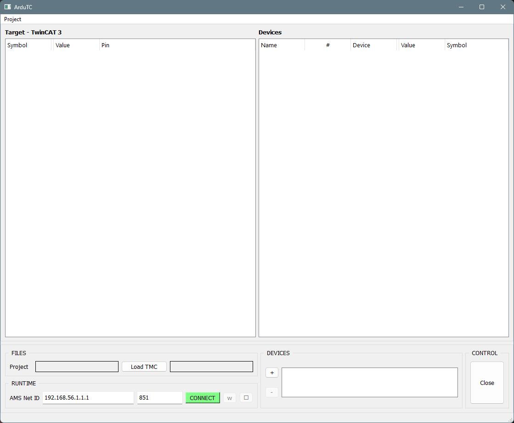{width=600px}

2. En **FILES**, :material-mouse-left-click: **clic izquierdo** sobre el botón `Load TMC` y seleccione el archivo `.tmc` generado durante la construcción del proyecto PLC en TwinCAT.

    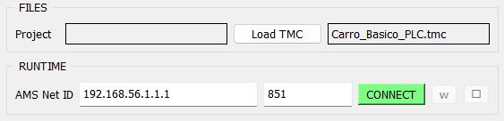{width=400px}

    !!! success "Resultado de la operación"
        Todas las variables de entrada y salida del proyecto PLC aparecerán automáticamente en el panel **Target**.

    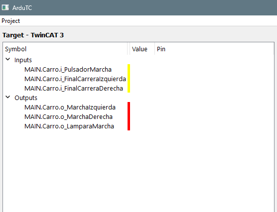{width=400px}

#### Seleccionar Placa Microcontroladora

1. Conectar una placa **microcontroladora** mediante el cable USB al ordenador.
2. En **DEVICES**, hacer :material-mouse-left-click: **clic izquierdo** sobre el botón `+` para buscar las placas conectadas.

    !!! success "Resultado de la operación"
        Se mostrarán, en una ventana emergente, todas las placas microcontroladoras conectadas a los puertos de comunicaciones `COM` correspondientes.

    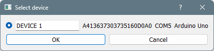{width=400px}

3. Seleccionar la placa microcontroladora deseada.

    !!! success "Resultado de la operación"
        Se mostrará en la **Devices** la lista de pines digitales y analógicos disponibles de la nueva placa añadida.

    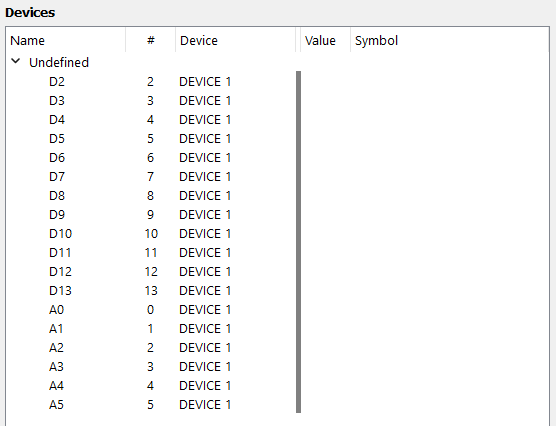{width=400px}

#### Vincular variables

1. En **Target**, hacer **doble clic** sobre la variable que desea enlazar.

2. En el cuadro desplegable ***Link variables***, seleccionar el pin de la placa microcontroladora en el que está conectado físicamente el componente correspondiente que se desea enlazar con la variable.

    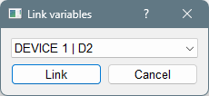{width=200px}
  
3. Confirmar el vínculo entre variable y pin pulsando :material-mouse-left-click: **clic izquierdo** sobre el botón **`Link`**.

    !!! success "Resultado de la operación"
        - Se mostrará en **Target** el nombre del *pin* asignado a la variable.
        - Se mostrará en **Devices** el nombre de la variable asignada al *pin*.

    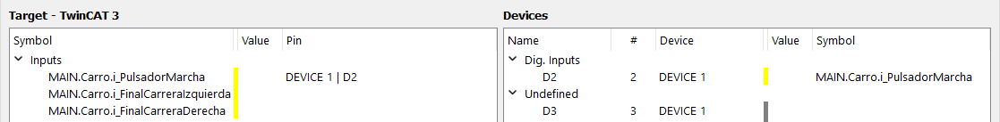{width=600px}

4. Repetir esta operación hasta vincular todas las variables necesarias.

    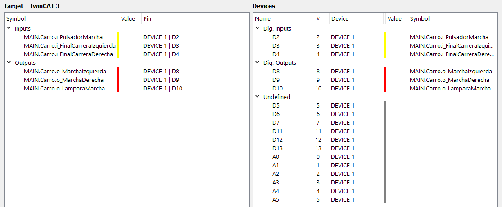{width=600px}

#### Configurar comunicaciones

1. En **RUNTIME** introducir la dirección **AMS Net ID** del sistema destino y el puerto de comunicaciones del proyecto PLC.

    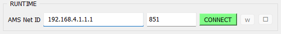{width=600px}

    ???info
        - La dirección **AMS Net ID** del sistema destino puede encontrase en el panel de explorador de la solución en `SYSTEM > Routes > NetId Management > Target NetId` (ejemplo de AmsNetId `192.168.4.1.1.1`).

        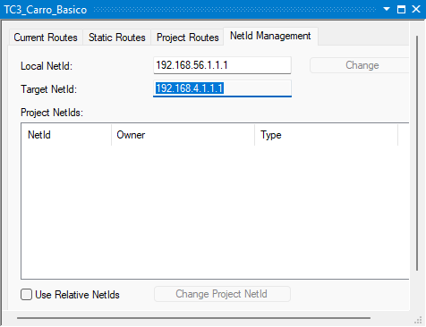{width=300px}

        - El puerto de comunicaciones del proyecto PLC puede encontrase haciendo ***doble-clic*** sobre el nombre del proyecto PLC en `Project > Port` (Normalmente `851`).

        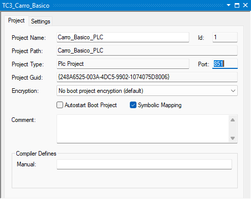{width=300px}

#### Conectar

1. Conectar haciendo :material-mouse-left-click: **clic izquierdo** sobre el botón `CONNECT`.

    !!! success "Resultado de la operación"
        Si la vinculación es exitosa, la barra de estado inferior mostrará el mensaje `Device connected` y el botón cambiará a color rojo indicando `DISCONNECT`.

    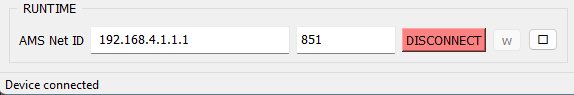{width=600px}

2. Con los botones run/stop del panel **RUNTIME** se puede controlar el estado de ejecución/parada del proyecto PLC en TwinCAT.
3. Se puede obervar que el estado de las variables y los pines en **TwinCAT** y la placa **microcontroladora** cambian sincronizadamente cuando ambos están conectados mediante ArduTC.

    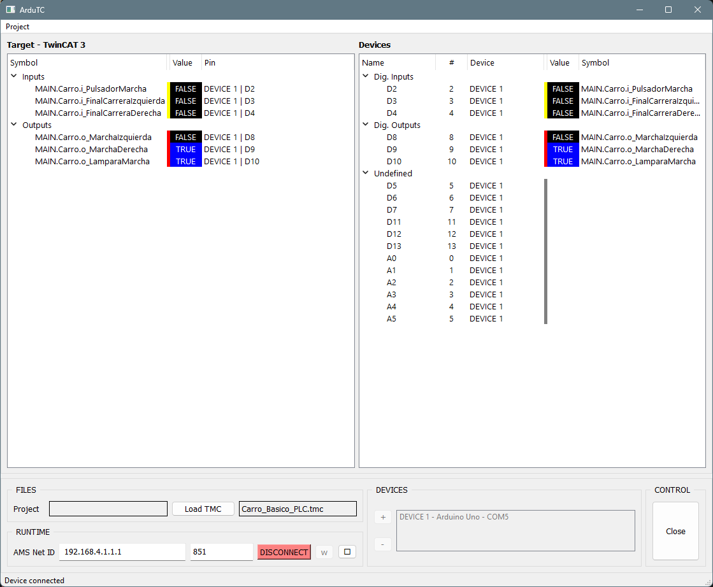{width=600px}

---
