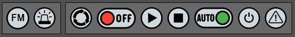
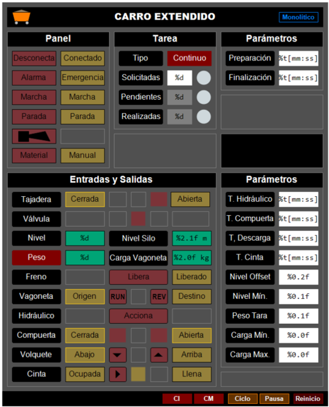
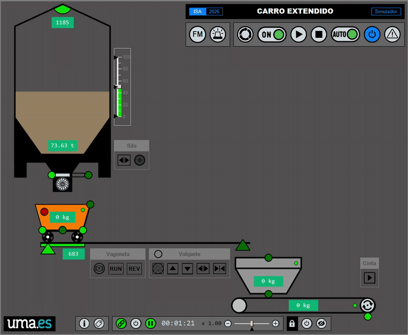
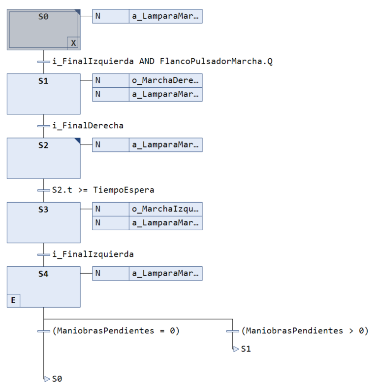

# 🚟 Carro Extendido (TwinCAT 3)

<!-- 
!!! info "Info"
    Enlace al repositorio en Github [{width=15px}](https://github.com/vetorres-uma/TC3_Carro_Basico)
-->

!!! danger "Importante"
    ==**Esta documentación está aún en proceso de ser terminada y revisada.**==

## 📝 Descripción Funcional

El **carro extendido** pretende ser una modesta ampliación con fines docentes del famosísimo problema del carro va y viene.

{width=300px}

El carro extendido es un sistema de transporte de material granulado entre los dos puntos extremos de una vía. Esta ampliación, de espíritu realista, pretende ser una propuesta equilibrada que, con fines didácticos, omite los detalles auxiliares de una instalación real, para centrarse en los elementos esenciales que permiten ilustrar claramente el potencial de los paradigmas de programación de la lógica de control monolítico, estructurado y funcional.

{width=600px}

### Elementos constituyentes

#### Parte operativa
La parte operativa del carro extendido está constituida por los siguientes dispositivos:

- Un **silo** cilíndrico de 10 m de altura por 5 m de diámetro con capacidad para contener unos 1500 m3 de material. El silo consta de un **sensor de nivel** por ultrasonidos, una **compuerta de tajadera** (válvula de guillotina) de seguridad de accionamiento neumático y una **válvula rotativa** (alimentador) de accionamiento eléctrico, para la dosificación precisa del material expendido.

- Una **vagoneta con volquete** (carro) que se desplaza por unas vías transportando el material entre el punto origen situado bajo la tolva, hasta el punto destino situado sobre un sistema de evacuación separado unos 100 m. La vagoneta es impulsada por un **motor** de corriente alterna accionado por un variador de frecuencia, para controlar su movimiento hacia adelante y hacia atrás. La vagoneta dispone de un **freno eléctrico** de seguridad para impedir movimientos accidentales. En el punto origen, bajo el boquerel de descarga del silo, se sitúa una **báscula de pesaje**, que permite conocer la cantidad de material cargada en la caja de la vagoneta. La vagoneta dispone de un **volquete** dotado de **compuerta**, ambos accionados hidráulicamente, para la descarga del material transportado.

- Un sistema de evacuación que conduce el material hacia su destino final. Este sistema consta de una **tolva** de recepción, sobre la que la vagoneta vierte el material, y una **cinta transportadora** accionada por un motor de corriente alterna de arranque directo que dirige el material hasta su destino final. El rodillo de retorno incorpora un detector de rotación (sensor inductivo y pletina) para verificar el movimiento real de la banda y prevenir daños por deslizamiento o rotura.

#### Parte de relación

La parte de relación consiste en un panel de operador básico compuesto por:

{width=400px}

- Una **lámpara de material**, para indicar la falta de material en el silo.
- Un **avisador acústico**, para reclamar la atención de los operarios.
- Una **seta de emergencia**, para desactivar el circuito de seguridad.
- Un **selector de encendido** (0/I), para encender el sistema de transporte.
- Un **pulsador de marcha** con piloto de señalización (**lámpara de marcha**), para iniciar el sistema y señalizar su estado de funcionamiento.
- Un **pulsador de parada** para solicitar la parada a final del ciclo.
- Un **selector de modo**, para establecer el modo principal de funcionamiento (automático/manual).
- Un **pulsador de conexión** con piloto de señalización (**lámpara de conexión**), para activar (armar) el circuito de seguridad e indicar su estado de activación (armado).
- Una **lámpara de alarma**, para señalizar los avisos y fallos.

El sistema de control también dispone de una visualización (panel de operador virtual) que permite la completa explotación del sistema.

{width=450px}

---

### Descripción del proceso

#### Condición inicial

<!-- - Pulsador de emergencia liberado. -->
- Parte operativa energizada (armada).
- Silo por encima del nivel mínimo.
- Tajadera cerrada.
- Vagoneta en el punto origen (bajo el boquerel de descarga del silo).
- Volquete abajo y con la compuerta cerrada.

#### Secuencia normal de funcionamiento

{width=800px}

1. Se carga la vagoneta hasta un determinado peso mínimo accionando la válvula rotativa con la tajadera abierta.
2. Una vez cargada, la vagoneta transporta el material hasta su punto destino al final de la vía.
3. Se descarga, durante el tiempo necesario, la vagoneta sobre la tolva de la cinta transportadora, abriendo la compuerta y elevando el volquete. 
4. Se evacúa la tolva accionando la cinta transportadora durante el tiempo necesario.
5. La vagoneta, ya descargada, regresa al punto de partida.

!!! info "Notas"
    - Si en algún momento del funcionamiento, el nivel del silo desciende por debajo de su mínimo, la secuencia normal debe detenerse a la espera de que se reabastezca con el material necesario.
    - Para permitir el desplazamiento de la vagoneta, es condición indispensable que el freno electromecánico se encuentre accionado (motor desbloqueado).
    - El grupo hidráulico debe activarse previamente y debe mantenerse activo de forma ininterrumpida durante toda la operación de descarga de la vagoneta.
    - Cuando la cinta está en movimiento debe activarse, cada cierto tiempo, el detector de rotación del rodillo de retorno.

---

### Funcionalidades

#### Lógica de control

1. Evaluación de las condiciones iniciales.
1. Evaluación de las condiciones de marcha.
1. Secuencia automática de restauración de las condiciones iniciales.
1. Secuencias de funcionamiento normal.
1. Tratamiento de la falta de material.
1. Normalización y escalado de las señales de entrada analógicas.
1. Modo manual (mandos directos) y automático.
1. Modo de procesamiento continuo o por lotes (tarea).
1. Modo ininterrumpido y modo ciclo a ciclo.
1. Gestión de la tarea (maniobras solicitadas, pendientes y realizadas).
1. Parametrización de todas las variables (tiempos y cantidades).
1. Reinicio y pausa del estado.
<!-- 
1. Detección, identificación y tratamiento de los errores (avisos y fallos).
1. Habilitación y desabilitación de los fallos.
1. Parada inmediata y parada solicitada a final del ciclo.
-->

#### Visualización

1. Panel de operador.
1. Monitorización y mando de todas las señales de entrada y salida.
1. Gestión de la tarea (maniobras solicitadas, pendientes y realizadas).
1. Gestión de los parámetros del sistema (tiempos, distancias y cantidades).
1. Botón de verificación de los elementos de señalización.
1. Botón de reinicio y pausa del estado.
1. Indicador de las condiciones iniciales y de marcha.
<!-- 
3. Gestión de los fallos.
    1. Tiempos de respuesta.
    2. Habilitación/deshabilitación.
    3. Visualización del código y descripción del evento actual (aviso o fallo).
    4. Gestión de los modos de funcionamiento (continuo, lotes, ciclo-a-ciclo).
    5. Gestión de los modos de parada (inmediata y a final de ciclo).
    6. Botón de reconocimiento del fallo actual.
-->

---

### Entradas y salidas (I/O)

!!! info "Leyenda"
    <span class="fondo-amarillo">**E**</span> Entrada / <span class="fondo-rojo">**S**</span> Salida

| <div style="width: 150px;">Nombre</div> | Tipo | Origen | Descripción |
| :--- | :--- | :--- | :--- |
| `SistemaConectado` | `BOOL` | <span class="fondo-amarillo">**E**</span> | Parte operativa conectada |
| `PulsadorEmergencia` | `BOOL` | <span class="fondo-amarillo">**E**</span> | Desconecta el circuito de seguridad |
| `PulsadorMarcha` | `BOOL` | <span class="fondo-amarillo">**E**</span> | Solicita la puesta en marcha |
| `PulsadorParada` | `BOOL` | <span class="fondo-amarillo">**E**</span> | Solicita la parada a final de ciclo|
| `SelectorManual` | `BOOL` | <span class="fondo-amarillo">**E**</span> | Selecciona el modo automático/manual |
| `TajaderaAbierta` | `BOOL` | <span class="fondo-amarillo">**E**</span> | Sensor magnético de posición, válvula de guillotina abierta |
| `TajaderaCerrada` | `BOOL` | <span class="fondo-amarillo">**E**</span> | Sensor magnético de posición, válvula de guillotina cerrada |
| `SiloNivel` | `INT` | <span class="fondo-amarillo">**E**</span> | Valor del sensor de nivel de ultrasonidos del silo |
| `BasculaPeso` | `INT` | <span class="fondo-amarillo">**E**</span> | Valor del sensor de peso (báscula) de la vagoneta |
| `VagonetaDesbloqueda` | `BOOL` | <span class="fondo-amarillo">**E**</span> | Microinterruptor, freno eléctrico de la vagoneta activado (liberado) |
| `VagonetaOrigen` | `BOOL` | <span class="fondo-amarillo">**E**</span> | Sensor fotoeléctrico de barrera, vagoneta en el inicio del recorrido |
| `VagonetaDestino` | `BOOL` | <span class="fondo-amarillo">**E**</span> | Sensor fotoeléctrico de barrera, vagoneta en el final del recorrido |
| `CompuertaAbierta` | `BOOL` | <span class="fondo-amarillo">**E**</span> | Sensor magnético de posición, compuerta del volquete abierta |
| `CompuertaCerrada` | `BOOL` | <span class="fondo-amarillo">**E**</span> | Sensor magnético de posición, compuerta del volquete cerrada |
| `VolqueteArriba` | `BOOL` | <span class="fondo-amarillo">**E**</span> | Sensor magnético de posición, volquete arriba |
| `VolqueteAbajo` | `BOOL` | <span class="fondo-amarillo">**E**</span> | Sensor magnético de posición, volquete abajo |
| `TolvaOcupada` | `BOOL` | <span class="fondo-amarillo">**E**</span> | Sensor capacitivo, detecta la presencia de material en la tolva |
| `TolvaLlena` | `BOOL` | <span class="fondo-amarillo">**E**</span> | Sensor capacitivo, detecta que la tolva está completamente llena |
| `CintaRotacion` | `BOOL` | <span class="fondo-amarillo">**E**</span> | Sensor inductivo, detecta que el motor de la cinta está en movimiento (un pulso por vuelta) |
| `SistemaDesconecta` | `BOOL` | <span class="fondo-rojo">**S**</span> | Desconecta el circuito de seguridad |
| `AvisadorSonoro` | `BOOL` | <span class="fondo-rojo">**S**</span> | Peligro, fin de tarea o la necesidad de intervención del operario |
| `LamparaAlarma` | `BOOL` | <span class="fondo-rojo">**S**</span> | Indica avisos o fallos |
| `LamparaMarcha` | `BOOL` | <span class="fondo-rojo">**S**</span> | Indica el estado de funcionamiento de la tarea |
| `LamparaMaterial` | `BOOL` | <span class="fondo-rojo">**S**</span> | Indica el nivel bajo de material en el silo |
| `TajaderaAbre` | `BOOL` | <span class="fondo-rojo">**S**</span> | Abre la válvula de guillotina de seguridad |
| `ValvulaAcciona` | `BOOL` | <span class="fondo-rojo">**S**</span> | Marcha/para la válvula rotativa de alimentación |
| `VagonetaDesbloquea` | `BOOL` | <span class="fondo-rojo">**S**</span> | Activa freno eléctrico de la vagoneta (libera) |
| `VagonetaMarcha` | `BOOL` | <span class="fondo-rojo">**S**</span> | Marcha/para el motor de la vagoneta (hacia adelante) |
| `VagonetaInvierte` | `BOOL` | <span class="fondo-rojo">**S**</span> | Invierte el sentido del motor de la vagoneta (hacia atrás) |
| `Hidraulico` | `BOOL` | <span class="fondo-rojo">**S**</span> | Marcha/para el motor del grupo hidráulico del volquete |
| `CompuertaAbre` | `BOOL` | <span class="fondo-rojo">**S**</span> | Abre la compuerta del volquete |
| `CompuertaCierra` | `BOOL` | <span class="fondo-rojo">**S**</span> | Cierra la compuerta del volquete |
| `VolqueteSube` | `BOOL` | <span class="fondo-rojo">**S**</span> | Sube la caja del volquete |
| `VolqueteBaja` | `BOOL` | <span class="fondo-rojo">**S**</span> | Baja la caja del volquete |
| `CintaMarcha` | `BOOL` | <span class="fondo-rojo">**S**</span> | Marcha/para el motor de la cinta transportadora |

---

### Especificación funcional

Las siguientes especificaciones funcionales describen el comportamiento del carro extendido (lógica de control) de una manera precisa utilizando lenguaje GRAFCET.

- 🧱 [Monolítico (PDF)](docs/carro_extendido_monolitico_grf.pdf) <span class="fondo-naranja">**Próximamente!**</span>
- 🗂️ [Estructurado (PDF)](docs/carro_extendido_estructurado_grf.pdf) <span class="fondo-naranja">**Próximamente!**</span>
- 🧩 [Estructurado con GEMMA (PDF)](docs/carro_extendido_estructurado_gemma_grf.pdf) <span class="fondo-naranja">**Próximamente!**</span>
<!-- - 🧩 [Funcional (PDF)](docs/carro_extendido_funcional_grf.pdf) <span class="fondo-naranja">**Próximamente!**</span>
-->

### Implementación

Implementa el funcionamiento del sistema de transporte de material que representa el carro extendido utilizando tres paradigmas de programación (monolítico, estructurado y estructurado con guía GEMMA) para ilustrar, con fines didácticos, las posibilidades y el alcance que cada uno de ellos.

1. 🧱 <span class="fondo-verde">**MONO**</span> **Monolítico** (orientada al sistema). Implementación directa. Toda la secuencia de control se encuentra recogida en un único elemento de programación.
2. 🗂️ **Estructurado** (orientado a la tarea). La secuencia de funcionamiento se organiza y distribuye en sub-secuencias denominadas tareas (acciones complejas). Hay dos versiones: 
      1. 🗂️ <span class="fondo-amarillo">**EST**</span> **Estructurado**
      2. 🧩 <span class="fondo-rojo">**EST+GEMMA**</span> **Estructurado con GEMMA** (incluye guía GEMMA).
<!-- 3. 🧩 **Funcional** (orientado a la unidad funcional). La lógica de control del sistema se organiza en términos de unidades funcionales, entidades formadas por un subconjunto de dispositivos (sensores y actuadores), capaces de llevar a cabo una o más tareas. <span class="fondo-naranja">**Próximamente!**</span>
-->
---

## 💻 Requisitos del Sistema

### Software

- **IDE:** Microsoft Visual Studio / TwinCAT 3 XAE (Versión mínima recomendada: **3.1.4024.x**).
- **Lenguajes:** Texto Estructurado (`ST`) y Diagrama de Funciones Secuenciales (`SFC`).

## 🚀 Descarga

**Para descargar, compilar y ejecutar este proyecto en el entorno de TwinCAT 3, seguir el siguiente procedimiento**.

### Mediante el Campus Virtual

1. **Copiar** a tu equipo local el fichero 
    
    !!! info "🧱 **Monolítico**" 
        `CV → Automatización → ejemplos → 3_tc3_carro_monolitico → tc3_carro_extendido_monolitico_lite.tnzip`

    !!! info "**Estructurado**" 
        - 🗂️ <span class="fondo-amarillo">**EST**</span> `CV → Automatización → ejemplos → 4_tc3_carro_estructurado → tc3_carro_extendido_estructurado_lite.tnzip`
        - 🧩 <span class="fondo-rojo">**EST+GEMMA**</span> `CV → Automatización → ejemplos → 4_tc3_carro_estructurado → tc3_carro_extendido_estructurado_basic.tnzip`

    <!-- !!! info "🧩 **Funcional**" 
        <span class="fondo-naranja">**Próximamente!**</span> -->
    
    que hay en la carpeta del campus virtual.

2. **Seguir el procedimiento** descrito [aquí](../../contenidos/01_conceptos/#abrir-un-fichero-tnzip) para generar la **Solución** a partir del fichero.

<!-- 1. **Clonar el Repositorio:**

```bash
git clone https://github.com/vetorres-uma/TC3_Carro_Extendido.git
```

1. **Abrir el Proyecto:** abra el archivo `.sln` (Solución) ubicado en la carpeta principal utilizando el entorno de ingeniería **TwinCAT XAE** (integrado en Visual Studio).
1. **Selección del Controlador:** seleccione el simulador (**UmRT_Default**) o controlador local o remoto (**Choose Runtime System**).
1. **Activación de Configuración:** en el modo **Configuración**, active la configuración (**Activate Configuration**)) y reinicie TwinCAT en modo **Ejecución (Run Mode)**.
1. **Carga del Código:** en el entorno PLC, inicie la sesión y descargue el programa al PLC (**Login**).
1. **Poner el código en ejecución:** ejecute la lógica de control en el controlador (**Start**). Puede utilizar la visualización integrada en el proyecto PLC para facilitar la prueba.
-->

---

## 🔨 Explicación

🧱 <span class="fondo-verde">**MONO**</span> [➡️](./04_tc3_carro_extendido/04_tc3_carro_extendido_mono.md)

🗂️ <span class="fondo-amarillo">**EST**</span> [➡️](./04_tc3_carro_extendido/04_tc3_carro_extendido_estructurado.md)

🧩 <span class="fondo-rojo">**EST+GEMMA**</span> [➡️](./04_tc3_carro_extendido/04_tc3_carro_extendido_estructurado_gemma.md)

<!-- 🧩 **Funcional** <span class="fondo-naranja">**Próximamente!**</span> -->

<!-- 

!!! warning "Importante"
    El proyecto completo que se explica aquí se corresponde con la versión **señalizada** del carro va y viene.
    
    **Descarga el ejemplo para inspeccionar el código**.

**Para replicar la creación de la solución completa, seguir este procedimiento:**

!!! tip "Sugerencia"
    Pulsa en ➡️ para obtener más información sobre cómo realizar el paso especificado.

1. Crear una solución de TwinCAT3 con nombre `tc3_carro_basico` [➡️](../../contenidos/01_conceptos/#crear-proyecto-tc3)
2. Crear un proyecto PLC con nombre `carro_basico_PLC` [➡️](../../contenidos/01_conceptos/#crear-proyecto-plc)
3. **Escoger un lenguaje** para la implementación: `ST` o `SFC`. ==Aunque aquí expliquemos ambas versiones, en el curso habrá que replicar el correspondiente al lenguaje `SFC`==.
4. Crear un bloque funcional con ese lenguaje llamado `FB_Carro_basico_ST` o `FB_Carro_basico_SFC` [➡️](../../contenidos/01_conceptos/#crear-bloque-funcional)
5. Declarar las variables:
    
    ??? info "Comunes"
        - Control de maniobras: `ManiobrasSolicitadas` (total a realizar) y `ManiobrasPendientes` (contador).
        - Control de tiempo de espera: `TiempoEspera` (total a esperar) y `TiempoPendiente` (tiempo que queda).
        - Utilidades: `FlancoPulsadorMarcha (R_TRIG)` (detector de flanco de subida) y `BLK (F_Blink)` (señal booleana que conmuta de valor cada cierto tiempo).
        - Relativas al *hardware*: 
            - <span class="fondo-amarillo">**E**</span>: `i_FinalDerecha`, `i_FinalIzquierda`, `i_PulsadorMarcha` 
            - <span class="fondo-rojo">**S**</span>: `o_LamparaMarcha`, `o_MarchaDerecha`, `o_MarchaIzquierda`
    
    ??? info "Específicas para `ST`"
        - Control del estado: `Estado`: Variable de tipo `ENUM` que puede tomar los valores que identifican los estados posibles mostrados en el GRAFCET.
        - Temporizador: `TemporizadorEspera (TON)`

    ??? info "Específicas para `SFC`"
        - Ninguna. 
            - **No necesitamos una variable de estado**, porque viene implícito en el lenguaje. Además, TwinCAT 3 asocia una variable booleana a cada estado que indica si éste está activo: `[nombre_etapa].x` (ejemplo `S2.x`).
            - **Tampoco necesitamos el temporizador** ya que TwinCAT 3 incorpora un temporizador asociado a cada etapa, al que se puede acceder mediante el código `[nombre_etapa].t` (ejemplo `S2.t`).
---

1. Escribir el código del **FB**:
    
    ??? info "`ST`"
        1. Se llama a los FBs de **utilidades**: `BLK`, `FlancoPulsadorMarcha` y `TemporizadorEspera`.
        2. Se implementa la **función de estado** usando esta estructura:
            ```pascal
            CASE Estado OF:
                <nombre_estado_1>:
                    IF <condicion_transicion> THEN
                        // accion a la salida
                        // cambio de estado
                    END_IF

                <nombre_estado_1>:
                    [...]
            END_CASE
            ```

            Ejemplo:
            ```pascal
            E_Reposo:
                IF i_FinalIzquierda AND FlancoPulsadorMarcha.Q THEN
                    IF ManiobrasPendientes = 0 THEN
                        ManiobrasPendientes := ManiobrasSolicitadas;
                    END_IF;
                    
                    Estado := E_MarchandoDerecha;
                END_IF;
            ```
            Nótese la relación entre los estados implementados y los presentes en el GRAFCET.
        
        3. Se implementa la **función de salida** que activa las salidas del sistema según el estado activo:
            ```pascal
            <salida> := <estado_correspondiente>
            ```
            
            Ejemplo:
            ```pascal
            o_LamparaMarcha := ((Estado = E_Reposo) AND BLK.Q) OR (Estado <> E_Reposo);
            ```

            Nótese aquí el uso de la salida de `BLK` para conseguir que `o_LamparaMarcha` alterne de valor en el estado de reposo (la lámpara parpadeará), y quede fija en cualquier otro estado.

    ??? info "`SFC`"
        4. La conversión de GRAFCET a lenguaje `SFC` es más directa que con `ST`, al ser un lenguaje gráfico que representa muy claramente la secuencia de estados por la que pasa el sistema.
            
            {width=500px}
        
        5. El código incluye cinco tipos de acciones ([➡️](../../contenidos/01_conceptos/#asociar-acciones-a-etapas)):
              1. No memorizadas para activar salidas binarias (equivalencia directa con GRAFCET). **Ejemplo**: `o_MarchaDerecha`
              
              2. No memorizadas con llamada a acciones en `ST` (para acciones continuas condicionadas). **Ejemplo**: `a_LamparaMarcha`.
              3. Activas a la entrada (para acciones memorizadas a la entrada de la etapa). **Ejemplo**: `a_ManiobrasPendientes_calcular`.
              4. Activas a la salida (para acciones memorizadas a la salida de la etapa). **Ejemplo**: `a_ManiobrasPendientes_iniciar`.
              5. Acciones principales (para acciones continuas durante la activación de la etapa). **Ejemplo**: `a_FlancoMarcha`.
        6. Nótese el uso de la salida del **detector de flanco** en la primera transición. El código que llama al **FB** de `FlancoPulsadorMarcha` está incluido dentro de la acción principal del estado `S0`.
        7. Nótese el uso del **temporizador** implícito a la etapa `S2` (`S2.t`) para controlar la transición hacia la etapa `S3`.
        8. Nótese la **bifurcación** tras la etapa `S4` que dirige el flujo a `S0` o `S1` en función del valor de `ManiobrasPendientes`.
        9.  Nótese el uso de la **variable** `S0.x` en la acción `a_LamparaMarcha` para identificar si el estado `S0` está activo (`S0.x=TRUE`) o inactivo (`S0.x=FALSE`).
---

1. Diseñar la visualización añadiendo: [➡️](../../contenidos/01_conceptos/#crear-visualizacion)

    {width=400px}

    1. Rectángulos (*Rectangle*) para las etiqueta **Panel**, **Maniobras**, **Tiempos**, etc.
    2. Rectángulos (*Rectangle*) **no editables** para mostrar el valor de `ManiobrasPendientes` y `TiempoRestante`.

        ??? info "Parámetros"
            - Texts > Text = 
                - [%d] *Formato estilo printf que indica que se va a sustituir por un número entero*
                - [%t] *Formato estilo printf que indica que se va a sustituir por una variable tipo `TIME`* 
            - Text variables > Text variable = 
                - [`MAIN.Carro.ManiobrasPendientes`]
                - [`MAIN.Carro.TiempoRestante`]

    3. Rectángulos (*Rectangle*) **editables** para introducir el valor de `ManiobrasSolicitadas` y `TiempoEspera`.
        
        ??? info "Parámetros"
            - Añadir el siguiente a los correspondientes a los rectángulos **no editables**:
            - Inputconfiguration 
                - OnMouseClick > Configure > Write a Variable. 
                    - *Aceptar cuadro de diálogo por defecto. El valor introducido se escribirá en la variable especificada en Text Variable.*
        
     4. Rectángulos (*Rectangle*) para las variables booleanas correspondientes a la lámpara, pulsador, sensores final de carrera y activación de motores. **Tanto para mostrar su valor como para poder modificarlo.**

        ??? info "Parámetros"
            - Texts > Text = [**Pulsador**], [**Lampara**], , etc.
            - Color variables > Toggle color = [`MAIN.i_PulsadorMarcha`], [`MAIN.o_Lampara`], etc.
            - InputConfiguration
                - Toggle > Variable: [`MAIN.i_PulsadorMarcha`], [`MAIN.o_Lampara`], etc.
---

1. Declarar la variable `Carro` de tipo `FB_Carro_SFC` o `FB_Carro_ST` en el programa `MAIN`, según la versión a utilizar y llamar al código del FB.
    
    !!! info "Declaración"
        ```pascal
        PROGRAM MAIN
        VAR
            Carro: FB_Carro_SFC; // o Carro: FB_Carro_ST;
        END_VAR
        ```
    
    !!! info "Código"
        ```pascal
        Carro();
        ```

2.  Compilar y poner el programa en funcionamiento [➡️](../contenidos/01b_ejecucion.md).
-->

---

## 🤝 Contribuciones

Este proyecto es utilizado con fines educativos. Las contribuciones, sugerencias o correcciones de errores son bienvenidas. Por favor, abra un *Issue* o envíe un *Pull Request* si desea contribuir.

---

## 🧑 Autor

- **Autor Principal:** Víctor Torres ([@vetorres-uma](https://github.com/vetorres-uma>))
- **Revisor**: Francisco Ángel Moreno ([@famoreno](https://github.com/famoreno))

---

## 🎖️ Créditos y Atribuciones

- **Iconografía:** Los iconos de los botones de la interfaz HMI se han obtenido de [Flaticon](https://www.flaticon.es).

---

## ⚖️ Licencia

Este proyecto es de código abierto y está disponible bajo la **Licencia Pública General GNU (GPL)**.

- Consulte el archivo `LICENSE.md` para más detalles.