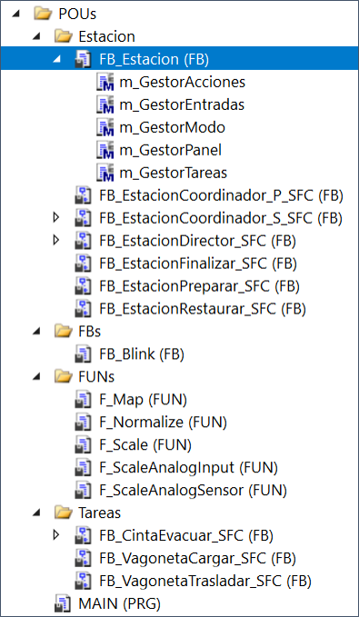
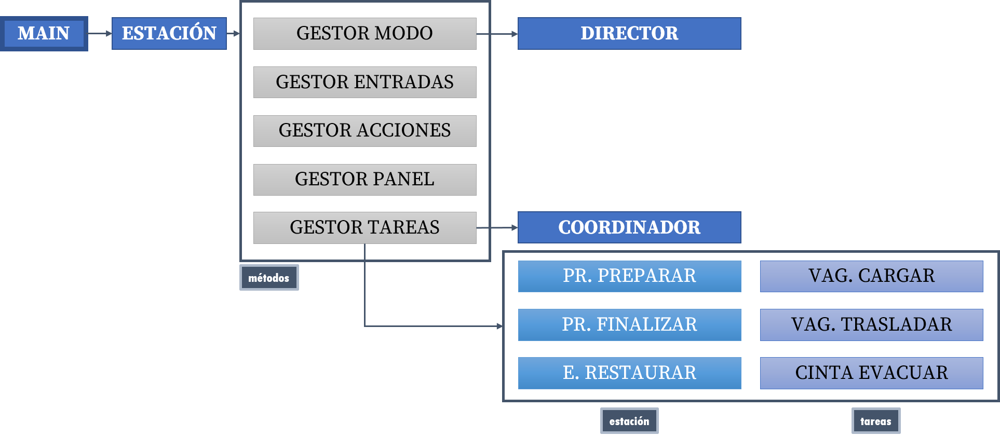
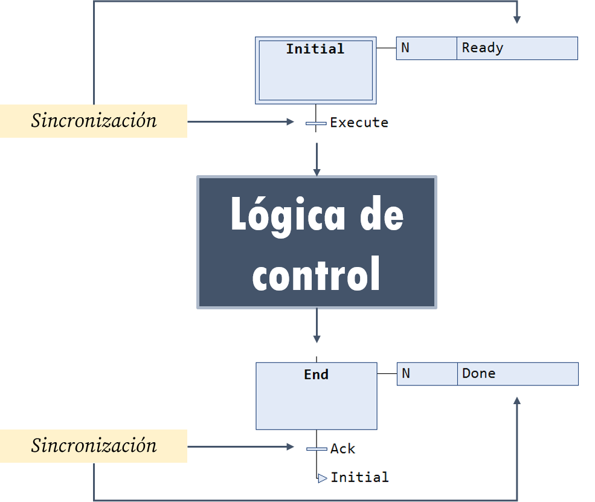
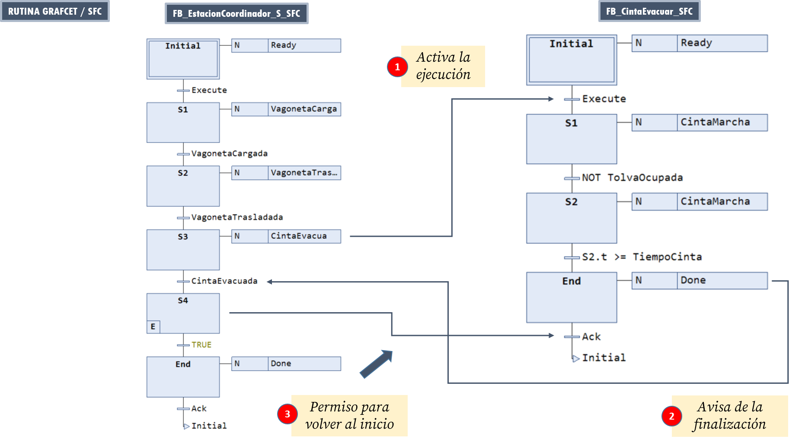
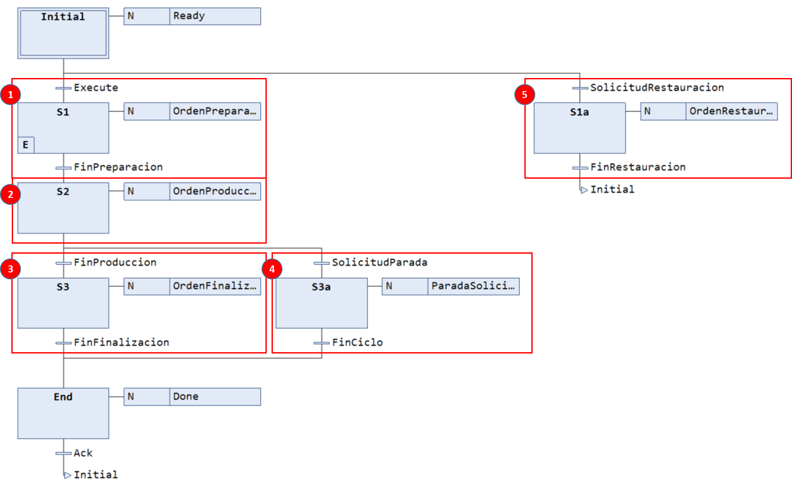
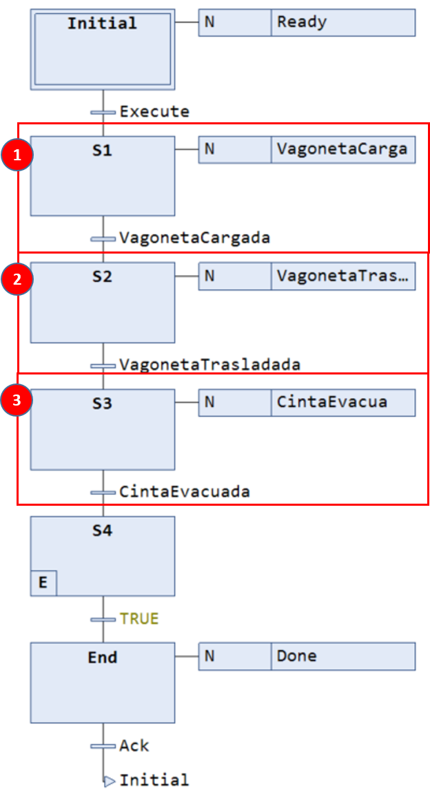
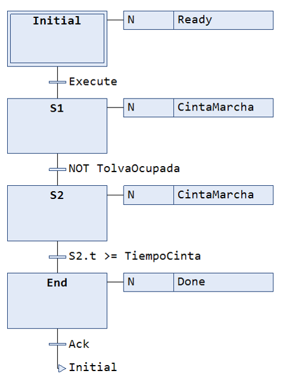
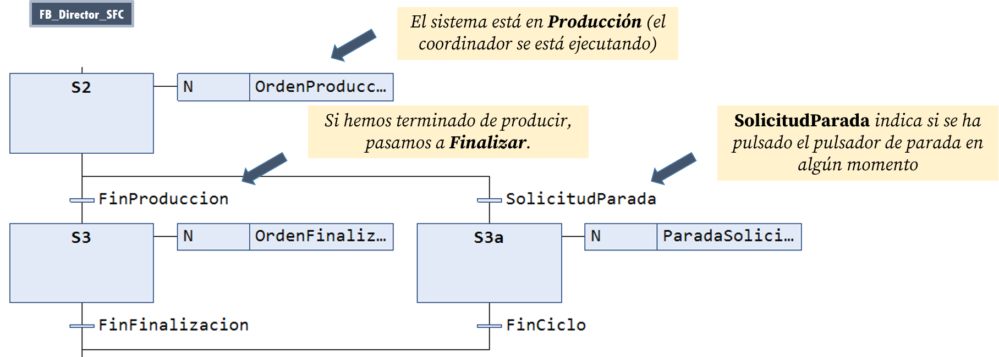

# Carro Extendido Estructurado

!!! warning "NOTAS"
    - La descripción general sobre este ejemplo puede encontrarse [aquí](../../contenidos/04_tc3_carro_extendido.md).
    - Descargue y abra el proyecto en una ventana de TwinCAT3 para seguir la explicación.
    
En esta implementación estructurada del carro extendido, presentamos una primera automatización real organizada en tareas, es decir, la lógica de control está distribuida en lugar de concentrada en un solo bloque funcional.

## Arquitectura
En esta implementación, la arquitectura se divide en el siguiente conjunto de bloques funcionales:

- `Estación` (`ST`): contenedor principal
- `Director` (`SFC`): gestión del modo de funcionamiento (**Reposo**, **Preparación**, **Producción**, **Finalización**, **Parada Solicitada**, **Restauración**) 
- `Coordinador` (`SFC`): coordinación de tareas para la producción normal 
- `Tareas` (`SFC`): sub-secuencias que implementan las distintas funcionalidades (conjunto de etapas/transiciones con sentido propio)

{width=250px}

La implementación se estructura de la siguiente manera:

`MAIN` → `Estación` → `Director` → `Coordinador` + `Tareas` (funcionalidades)

{width=600px}

Como se observa en la figura, la `Estación` es un contenedor de datos y **métodos** desde donde se llama al resto de bloques funcionales. Cada bloque funcional distinto de la `Estación` se implementa como una **rutina GRAFCET** que permite su sincronización con el resto de **FBs**, tal y como se verá más adelante.

## Funcionalidades
La lista de funcionalidades es prácticamente la misma que en el caso monolítico aunque en esta implementación se incorporan nuevos conceptos como los métodos o la funciones y se añade una serie de mejoras y extensiones.

??? info "Tabla de contenidos"
    [Uso de rutinas GRAFCET/SFC](#uso-de-rutinas-grafcetsfc)
    
    [Uso de métodos](#uso-de-metodos)
    
    [Uso de secuencias de preparación, finalización y restauración](#uso-de-secuencias-de-preparacion-finalizacion-y-restauracion)
    
    [Uso de funciones](#uso-de-funciones)
    
    [Uso de estructuras](#uso-de-estructuras)
    
    [Mejoras y extensiones](#mejoras-y-extensiones)

!!! info "Consejo"
    Utiliza el menú de la derecha para ir directamente a la explicación de cada funcionalidad.

### Uso de rutinas GRAFCET/SFC
Una **rutina GRAFCET/SFC** consiste en un conjunto de etapas con una estructura definida que implementan la lógica de control de una funcionalidad concreta. Aunque en este proyecto se distinguirán entre rutinas de coordinación/dirección y rutinas de tareas, estructuralmente son idénticas.

Las rutinas GRAFCET/SFC tienen la siguiente estructura:

{width=400px}

La lógica de control se encapsula entre dos etapas `Initial` y `End`, que podemos entender como **etapas de espera** que permiten sincronizar la ejecución de la rutina con otras rutinas.

Las señales `Ready`, `Done`, `Execute` y `Ack` sirven para sincronizar la ejecución de la secuencia de la rutina con el resto de rutinas. Las dos primeras permiten comunicar que la rutina está en su estado inicial o que ya ha terminado su secuencia, mientras que las dos últimas permiten iniciar la secuencia y volver al inicio.

!!! info "Consejo"
    Analice el código de los **FBs** del proyecto para ver ejemplos de esta estructura.

A modo de ejemplo, considere el siguiente esquema donde la rutina `FB_EstacionCoordinador_S_SFC` se sincroniza con la rutina `F_CintaEvacuar_SFC`. Cuando la primera activa la señal `CintaEvacua`, la transición regida por `Execute` en la segunda rutina se dispara, ejecutándose su lógica de control hasta alcanzar la etapa `End`. En ese momento, activa la señal `Done` que dispara la transición regida por la señal `CintaEvacuada` en la primera rutina (que estaba detenida) y hace que continúe su ejecución. Al pasar a la siguiente etapa, se activa la señal `Ack` en la segunda rutina para que esta vuelva al inicio.

{width=700px}

Esta sincronización (o la *conexión* entre las distintas señales) se realiza en el **FB** que llama a ambas rutinas, en este caso, el **FB** `FB_Estacion`. En concreto, si miramos dentro del método `m_GestorTareas`, podemos ver el siguiente código:

!!! info "Declaración en `FB_Estacion`"
    ```pascal
    VAR
        [...]
        Coordinador: FB_EstacionCoordinador_S_SFC;
        CintaEvacuar: FB_CintaEvacuar_SFC;
        [...]
    END_VAR
    ```

!!! info "Implementación dentro de `m_GestorTareas`"
    ```pascal
    [...]
    Coordinador(
        ManiobrasPendientes := ManiobrasPendientes,
        ManiobrasRealizadas := ManiobrasRealizadas,
        SFCReset := ReiniciaEstado,
        SFCPause := OrdenPausa,
        Execute := Director.OrdenProduccion,
        Ack := ContinuacionAutorizada,
        VagonetaCargada := VagonetaCargar.Done,
        VagonetaTrasladada := VagonetaTrasladar.Done,
        CintaEvacuada := CintaEvacuar.Done, // 2
    );
    [...]
    CintaEvacuar(
        SFCReset := ReiniciaEstado,
        SFCPause := OrdenPausa,
        Execute := Coordinador.CintaEvacua, // 1
        Ack := NOT Coordinador.CintaEvacua,
        TolvaOcupada := i_TolvaOcupada,
        TiempoCinta := TiempoCinta
    );
    [...]
    ```

Nótese como se asigna la señal `Coordinador.CintaEvacua` a la señal `Execute` de `CintaEvacuar` (línea `1`), y la señal `CintaEvacuar.Done` a la señal `CintaEvacuada` de `Coordinador` (línea `2`).

!!! info "Consejo"
    Inspeccione el código del **FB** del `Coordinador` y el de las tareas relacionadas con la cinta y la vagoneta para ver más ejemplos de esta sincronización.

#### Rutina de dirección
Esta rutina está implementada en un **FB** en `SFC` y encapsula la secuencia completa (no solo producción) de la estación a alto nivel.

{width=700px}

Nótese cómo la secuencia incluye etapas de:

1. Preparación
2. Producción
3. Finalización
4. Solicitud de parada
5. Restauración

Cada etapa activará una señal que *disparará* la ejecución de otro **FB** y se parará hasta que este indique que ha terminado. Por ejemplo, la señal `OrdenPreparacion` activará la señal `Execute` del `FB_EstacionPreparar` y la señal `FinPreparacion` se activará cuando este active su señal `Done`.

#### Rutina de coordinación
En un nivel de abstracción inferior al `Director`, encontramos al `Coordinador`, que se encargará de gestionar la secuencia de producción mediante la llamada a las distintas rutinas de tareas.

{width=300px}

En las etapas marcadas como `1`, `2` y `3`, el `Coordinador` activa señales que dispararán la ejecución de las secuencias de las tareas: **cargar vagoneta**, **trasladar vagoneta** y **gestionar la cinta transportadora**.

!!! info "Nota"
    Nótese cómo la señal `Execute` del `Coordinador` (que dispara su funcionamiento) se activará cuando el `Coordinador` active su señal `OrdenProducción` (etapa `2` en la imagen anterior).

Una vez terminadas las activaciones de las rutinas de las tareas de producción, el `Coordinador` decrementará la variable contadora de maniobras (a la entrada de `S4`) y terminará en la etapa `End` donde se activará la señal `Done`. En este punto, habrá terminado un ciclo y quedará a la espera de que la señal `Ack` se active antes de volver al inicio.

Una vez se vuelva al inicio, si su señal `Execute` sigue activa, se volverá a realizar un nuevo ciclo de producción.

#### Rutinas de tareas
Finalmente, tendremos **FBs** dedicados a cada una de las tareas de la estación. Cada una de ellas se puede entender como una subrutina que realiza una tarea específica. En este ejemplo, tendremos rutinas que podemos agrupar conceptualmente en dos grupos:

- Tareas de producción: cargar vagoneta, trasladar vagoneta, gestionar cinta.
- Tareas de gestión de la estación: preparar, finalizar y restaurar.

A modo de ejemplo, en la figura se puede observar el código de la rutina que se encarga de evacuar el material por la cinta transportadora

{width=300px}

### Uso de métodos
En TwinCAT 3, un **método** es una función que pertenece a un bloque funcional y que opera sobre sus variables, teniendo acceso a las variables internas del bloque, puede recibir parámetros de entrada y salida e incluso devolver un valor (opcional). Conceptualmente, es similar a una función, pero ligada al contexto del **FB**.

Un método sirve principalmente para organizar el código en partes reutilizables y claras dentro del **FB**, encapsulando la lógica específica del bloque. Así, se evita repetir código y mejorar la modularidad y su mantenimiento.

Para crear un método asociado a un **FB**, en el árbol del proyecto, haga **CD** sobre el **FB** y pulse `Add → Method`. En el menú contextual, hay que definir:

- El nombre del método 
- Tipo del valor devuelto (opcional).
- El lenguaje que vamos a utilizar en la implementación (nosotros usaremos `ST`).

!!! warning "Importante"
    Por claridad, tomaremos la convención de añadir un prefijo `m_` al nombre de los métodos.

Una vez creado, deberemos declarar variables de entrada/salida (si queremos usarlas, recuerda que el método ya tiene acceso a **todas** las variables del bloque funcional) e implementar el código.

Para usarlos, basta con llamar a su código desde una instancia del bloque funcional. Por ejemplo:

```pascal
m_GestorEntradas();
```

Nótese cómo, en este ejemplo, hemos encapsulado las funcionalidades de la estación dentro de distintos métodos:

- `m_GestorEntradas`. Tareas de acondicionamiento de señales de entrada.
- `m_GestorAcciones`. Procesamiento de las acciones (solo en modo automático).
- `m_GestorPanel`. Gestión de la señalización en el panel del operador (solo en modo automático).
- `m_GestorModo`. Toma de decisiones de nivel superior
- `m_GestorTareas`. Procesamiento del estado (solo en modo automático).

#### Gestor de Entradas
Este método se ejecuta tanto en modo manual como en automático y se encarga de realizar el acondicionamiento de las entradas al PLC. Esto incluye:

- Ejecución de los detectores de flanco para los pulsadores.
- Conversión de las unidades y rangos de las medidas analógicas: sensor de distancia en el silo y peso de la vagoneta.
- Cálculo de variables de estado del sistema como: `CondicionInicial`, `OrdenPausa`, `ModoAutomatico`, `SolicitudMarcha`, etc.

#### Gestor de Acciones
Este método solo se ejecuta en **modo automático** y encapsula las activaciones de las salidas del sistema relacionadas con:

- La **vagoneta** (marcha)
- El **silo** (tajadera y válvula)
- El **sistema hidráulico** (activación, compuerta y volquete)
- La **cinta transportadora** (marcha)

Estas salidas se activarán cuando los distintos **FBs** de las tareas lo demanden. Por ejemplo, el código:

```pascal
o_VolqueteBaja := NOT OrdenPausa 
    AND (VagonetaTrasladar.VolqueteBaja OR EstacionRestaurar.VolqueteBaja);
```

realizará la bajada del volquete cuando el **FB** `VagonetaTrasladar` active su variable `VolqueteBaja` **o** cuando el **FB** `EstacionRestaurar` active su variable `VolqueteBaja` (siempre que no esté activa la señal `OrdenPausa`).

!!! info "Nota"
    Al ejecutarse solo en modo automático, este método dejará *libres* las salidas **en modo manual** para que puedan ser accionadas desde la visualización.

#### Gestor de Panel
En este método se activarán los avisadores que tienen que ver con el panel del operador: 

- Avisador sonoro
- Lámpara de alarma
- Lámpara de marcha
- Lámpara de parada
- Lámpara de material

Además, se calcularán algunas variables de estado que se utilizarán en este método como `MarchaAutorizada`, `SistemaEnEspera`, etc.

Estas salidas se comportarán de manera diferente en distintas situaciones. Por ejemplo, la lámpara de parada se iluminará **de forma fija** cuando el sistema está en espera y **parpadeará** cuando se haya solicitado la parada:

```pascal
o_LamparaParada := SistemaEnEspera 
    OR (Director.ParadaSolicitada AND Intermitencia.Q);
```

Nótese que, para permitir que estas salidas se activen intermitentemente, en este método se llamará al **FB** que permite la intermitencia: `Intermitencia`.

#### Gestor de Modo
Este método se encarga de determinar en qué modo está la estación: **Reposo**, **Preparación**, **Producción**, **Finalización**, **Parada Solicitada** y **Restauración**, y pasar esta información al `FB_Director`, el cual se encargará de hacer evolucionar el sistema de un modo a otro.

!!! info "NOTA"
    El gestor de modo debe ejecutarse tanto en modo automático como manual.

#### Gestor de Tareas
En este último método, encapsulamos la llamada a las rutinas relacionadas con las tareas, **incluyendo al `Coordinador`**.

Como se puede observar en el código, este método se limita a llamar a los **FBs** correspondientes, enlazando las entradas y salidas para conseguir la sincronización entre las rutinas.

Nótese, por ejemplo, el siguiente trozo de código:

```pascal
ProduccionPreparar(
    SFCReset := ReiniciaEstado,
    SFCPause := OrdenPausa,
    Execute := Director.OrdenPreparacion,
    Ack := NOT Director.OrdenPreparacion,
    TiempoPreparacion := TiempoPreparacion
);
```

donde se observa que la rutina correspondiente a la preparación de la estación se ejecutará cuando el `Director` lo ordene activando `OrdenPreparacion`.

De manera similar, en este trozo de código:

```pascal
Coordinador(
    ManiobrasPendientes := ManiobrasPendientes,
    ManiobrasRealizadas := ManiobrasRealizadas,
    SFCReset := ReiniciaEstado,
    SFCPause := OrdenPausa,
    Execute := Director.OrdenProduccion,
    Ack := ContinuacionAutorizada,
    VagonetaCargada := VagonetaCargar.Done,
    VagonetaTrasladada := VagonetaTrasladar.Done,
    CintaEvacuada := CintaEvacuar.Done,
);
```

puede observarse cómo las señales `Done` de los distintos **FBs** de tareas se asocian a las variables de entrada del `Coordinador` que le permitirán evolucionar en su secuencia. 

!!! info "Consejo"
    Inspecciona cuidadosamente el código de este método para entender las asociaciones entre las señales de sincronización.

### Uso de secuencias de preparación, finalización y restauración
En esta versión, usaremos rutinas GRAFCET para implementar algunas secuencias relacionadas con la estación que **no tienen que ver directamente con la producción**, sino que solucionan situaciones especiales de la estación. En concreto, definiremos secuencias de:

- **Preparación**, que se encarga de realizar todas aquellas acciones necesarias para preparar la estación para empezar a producir.
- **Finalización**, que implementa la secuencia de pasos a realizar tras terminar la producción, para dejar la estación en reposo.
- **Restauración**, que se encarga de tratar de recuperar las condiciones iniciales.

!!! info "Consejo"
    Inspeccione el código de los **FBs** de preparación, finalización y restauración en el ejemplo para ver la secuencia de pasos en cada caso. Nótese que, en los dos primeros, lo único que se hace en este ejemplo es activar el avisador sonoro durante un tiempo. En el de restauración, por el contrario, sí se realiza una secuencia de pasos para recuperar las condiciones iniciales.

### Uso de funciones
En TwinCAT 3, una función (*Function*, **FUN**) es un bloque de código independiente que realiza un cálculo y devuelve un valor **sin tener un estado interno persistente**, es decir, no mantiene memoria entre ejecuciones.

Así, una función recibe datos de entrada, ejecuta una operación y devuelve un único valor de forma obligatoria. Su uso se circunscribe, normalmente, para realizar cálculos concretos y reutilizables (por ejemplo, acondicionamiento de señales), simplificar expresiones complejas, evitar duplicar lógica matemática o de procesamiento y hacer el código más claro y modular

En nuestro ejemplo del carro extendido las usaremos para realizar el acondicionamiento de las señales analógicas.

Las funciones no están asociadas a un **FB** concreto, sino que forman parte de las utilidades que podemos crear en nuestro proyecto. Para crear una función, en el árbol del proyecto, hay que hacer **CD** sobre la carpeta `POUs` y pulsar `Add → POU`. En el menú contextual, hay que cambiar el lenguaje de programación a alguno **distinto** a `SFC` (al no tener estado interno, las funciones no pueden ser implementadas en `SFC`). En nuestro caso usaremos `ST`, como habitualmente. Posteriormente, habrá que seleccionar `Function` y definir:

- El nombre de la función
- Tipo del valor devuelto (obligatorio).

!!! warning "Importante"
    Por claridad, tomaremos la convención de añadir un prefijo `F_` al nombre de las funciones.

Una vez creada, deberemos declarar las variables de entrada e implementar el código. Hay que tener en cuenta que el valor de salida se asigna **utilizando el nombre de la propia función**. Por ejemplo, para una función `F_Map`, el valor que devuelve se asigna como:

```pascal
F_Map := OutMin + (Value - InMin) * OutRange / InRange;
```

Para usarlas, basta con llamar a su código **utilizando el nombre de la función**, asignando su salida a alguna variable. Por ejemplo:

```pascal
SiloDistanciaMedida := F_ScaleAnalogSensor(
    RawInput := i_SensorNivel,
    Parameters := SensorNivelParams
);
```

donde `F_ScaleAnalogSensor` es el nombre de la función y `RawInput` y `Parameters` son sus variables de entrada. La salida se le asignará a la variable `SiloDistanciaMedida`.

### Uso de estructuras
En TwinCAT 3, una estructura (**STRUCT**) es un tipo de dato compuesto que agrupa varias variables (que pueden ser de distinto tipo) bajo un mismo nombre.

En este ejemplo se utilizan para guardar los parámetros que pasan a la función de acondicionamiento de señales analógicas: `F_ScaleAnalogSensor`. Nótese como en su sección de variables de entrada se incluyen:

```pascal
FUNCTION F_ScaleAnalogSensor : REAL
VAR_INPUT
    RawInput : INT; 
    Parameters : ST_SensorAnalogicoParams; // Estructura
END_VAR
```

El tipo `ST_SensorAnalogicoParams` es una estructura que incluye:

```pascal
TYPE ST_SensorAnalogicoParams :
STRUCT
    RawMin    : INT;
    RawMax    : INT;
    ValueMin  : REAL;
    ValueMax  : REAL;
    Offset    : REAL;
END_STRUCT
END_TYPE
```

!!! warning "Importante"
    Por claridad, tomaremos la convención de añadir un prefijo `ST_` al nombre de las estructuras.

Puede encontrar más información sobre las estructuras, su uso y declaración [aquí](../../01_conceptos/#estructuras).

### Mejoras y extensiones
Finalmente, en esta implementación del carro extendido estructurado se han realizado una serie de **mejoras y extensiones** respecto a la versión monolítica, que se explican a continuación.

#### Implementación del modo manual correcta y adecuada
A diferencia de como se hacía en la versión monolítica, se ha implementado la identificación del modo manual/automático **sin acceder de manera directa**, en el programa principal `MAIN`, a la variable asociada al conmutador de selección de modo del panel del operador. Esta gestión se realiza ahora dentro del **FB** de la propia estación, encapsulando esta funcionalidad dentro del mismo y evitando el *artificio* anterior. 

En este **FB** dispondremos de una variable de estado llamada `ModoAutomatico` que tomará el valor `TRUE` cuando el selector de modo así lo indique. Esta variable toma su valor **dentro del método de gestor de entradas**:

```pascal
// en m_GestorEntradas
ModoAutomatico := NOT i_SelectorManual;
```

y se utiliza en el código principal de la estación de esta manera:

```pascal
m_GestorEntradas(); // Acondicionamiento de señales
m_GestorModo(); // Toma de decisiones de nivel superior

// Ejecución de la lógica de control en modo automático
IF ModoAutomatico THEN
    m_GestorTareas(); // Procesamiento del estado
    m_GestorPanel(); // Gestión de la señalización
    m_GestorAcciones(); // Procesamiento de las acciones
END_IF;
```

De esta manera, dejamos de exponer, de forma directa, la variable asociada al *hardware* (`i_SelectorManual`) a los **FBs** distintos al de la estación.

#### Implementación sencilla de la pausa a final de ciclo
Para implementar la **pausa** (que no parada) al final de ciclo, hemos utilizado la señal `Ack` de la rutina GRAFCET del `Coordinador`. Como se explicó en [su sección correspondiente](#rutina-de-coordinacion), el `Coordinador` implementa un ciclo de producción completo del sistema, finalizando en la etapa `End` donde quedará a la espera de que la señal `Ack` se active antes de volver al inicio.

En la llamada al **FB** del `Coordinador`, esta señal `Ack` está asignada a la variable `ContinuacionAutorizada`:

```pascal
// en el método m_GestorTareas
Coordinador(
    ManiobrasPendientes := ManiobrasPendientes,
    ManiobrasRealizadas := ManiobrasRealizadas,
    SFCReset := ReiniciaEstado,
    SFCPause := OrdenPausa,
    Execute := Director.OrdenProduccion,
    Ack := ContinuacionAutorizada, // <---
    VagonetaCargada := VagonetaCargar.Done,
    VagonetaTrasladada := VagonetaTrasladar.Done,
    CintaEvacuada := CintaEvacuar.Done,
);
```

la cual toma su valor de esta forma:

```pascal
ContinuacionAutorizada := NOT PausaTrasCiclo OR SolicitudMarcha;
```

De esta forma, el `Coordinador` volverá a su etapa inicial si no está activa la señal `PausaTrasCiclo` (controlada en la visualización) o, si está activa, cuando `SolicitudMarcha` esté activa. Si observa el método `m_GestorEntradas`, `SolicitudMarcha` está asignada a la detección del flanco positivo del pulsador de marcha.

```pascal
SolicitudMarcha := FlancoPulsadorMarcha.Q;
```

Así, cuando la pausa a final de ciclo esté activa, pasaremos al siguiente ciclo cuando se pulse el pulsador de marcha.

#### Implementación sencilla de la parada pedida
En esta versión, hemos utilizado la captura del flanco del pulsador de parada para **solicitar la parada de la producción al final del ciclo actual**. De esta manera, cuando se pulse el pulsador de parada durante la ejecución de alguno de los ciclos, el sistema capturará este suceso y, cuando se alcance el final de ciclo, el sistema dejará de producir inmediatamente. 

Esto se realiza en el método de gestión de entradas:

```pascal
// en m_GestionEntradas
SolicitudParada := FlancoPulsadorParada.Q;
```

que, recuerde, se ejecuta en cada ciclo del PLC.

Posteriormente, este valor se le pasa como entrada al `Director` para que evolucione por su rama derecha una vez haya terminado un ciclo.

{width=700px}

Fíjese en este trozo de código del `FB_Director`. En él se puede observar que, una vez dada la orden de producir (`OrdenProducción = TRUE`, lo que *dispara* la ejecución del `Coordinador`), el `Director` queda a la espera de que ocurra alguna de estas dos situaciones:

1. Se acaba la producción (`FinProducción = TRUE`). En este caso, hemos alcanzado el final de la producción, lo cual ocurre cuando el número de maniobras pendientes ha llegado a `0` en producción por lotes. Entonces se pasa a **finalizar la producción** y termina el programa.
2. Se ha solicitado la parada a final de ciclo (`SolicitudParada = TRUE`). En este caso, esta variable se ha activado porque **en algún momento** durante la producción se pulsó el pulsador de parada. Entonces, se activa una señal de `ParadaSolicitada`, que se usará para indicar la solicitud en el panel del operador, y se espera a que alcancemos el final de ciclo. Esto se producirá cuando el `Coordinador` termine uno de sus ciclos.

!!! info "Consejo"
    Inspeccione el código del **FB** del `Director` y el `Coordinador` para entender la interacción entre ellos en este caso. Preste especial atención al valor que toman las variables utilizadas en las condiciones de transición entre etapas, ya que se ha utilizado una semántica reforzada para clarificar el proceso.