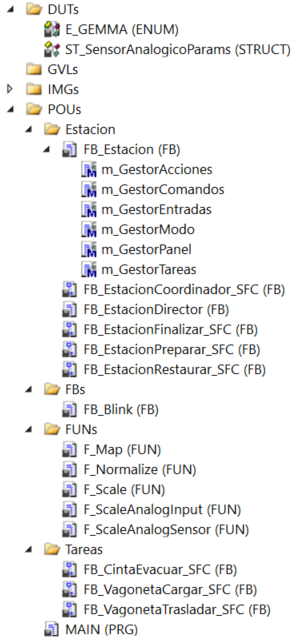
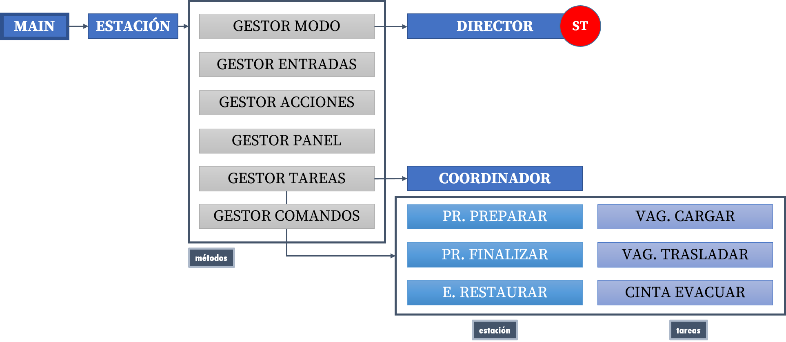
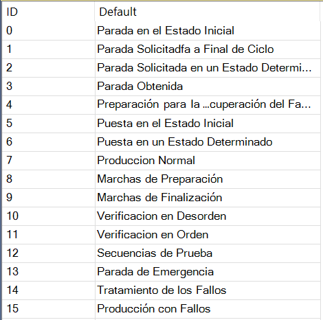
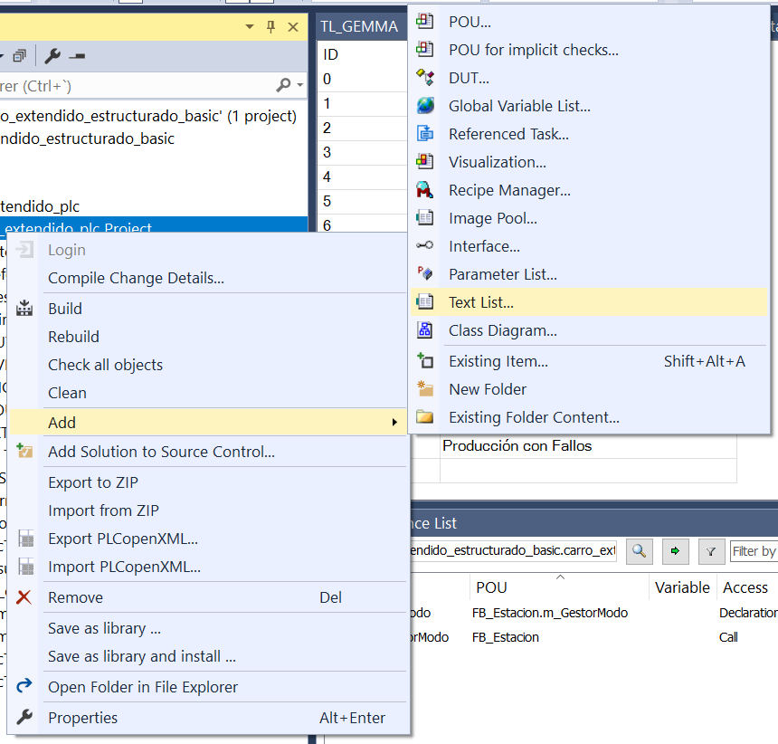
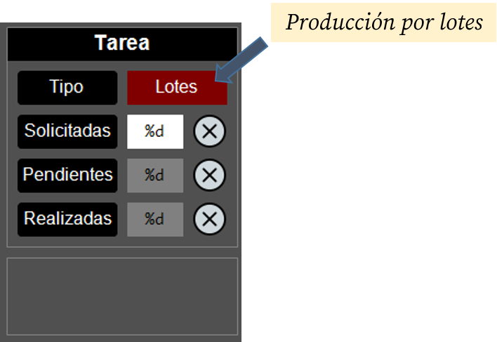

# Carro Extendido Estructurado con GEMMA (Basic)

!!! warning "NOTAS"
    - La descripción general sobre este ejemplo puede encontrarse [**aquí**](../../contenidos/04_tc3_carro_extendido.md).
    - Descargue y abra el proyecto en una ventana de TwinCAT3 para seguir la explicación.
    
En esta implementación estructurada del carro extendido, presentamos una primera automatización estructurada con aplicación de la guía GEMMA. Aquí, el `Director` implementa un gráfico **GDMMA**.

## Arquitectura
En esta implementación, la arquitectura es idéntica a la del caso <span class="fondo-amarillo">**EST**</span>.

{width=250px}

La implementación se estructura de la siguiente manera:

`MAIN` → `Estación` → `Director` → `Coordinador` + `Tareas` (funcionalidades)

En este caso, la funcionalidad (secuencia) está distribuida en:

- `Estación` (`ST`): contenedor principal
- `Director` (`ST`): **implementación completa del gráfico GDMMA**
- `Coordinador` (`SFC`): coordinación de tareas para la producción normal 
- `Tareas` (`SFC`): sub-secuencias que implementan las distintas funcionalidades (conjunto de etapas/transiciones con sentido propio)

{width=600px}

## Funcionalidades
La lista de funcionalidades es idéntica a la de la versión <span class="fondo-amarillo">**EST**</span>, pero se le añade el uso de la guía GEMMA.

??? info "Tabla de contenidos"
    [Incorporación de la guía GEMMA en el `Director`](#incorporacion-de-la-guia-gemma-en-el-director)
    
    [Codificación de una máquina de estados (GDMMA) en `ST`](#codificacion-de-una-maquina-de-estados-gdmma-en-st)
    
    [Temporizador de reinicio manual](#temporizador-de-reinicio-manual)
    
    [Reinicio del sistema tras emergencia](#reinicio-del-sistema-tras-emergencia)
    
    [Temporizador para la desconexión automática por falta de actividad](#temporizador-para-la-desconexion-automatica-por-falta-de-actividad)
    
    [Uso de una lista de texto](#uso-de-una-lista-de-texto)

!!! info "Consejo"
    Utiliza el menú de la derecha para ir directamente a la explicación de cada funcionalidad.

### Incorporación de la guía GEMMA en el `Director`
En la implementación <span class="fondo-amarillo">**EST**</span>, el `Director` estaba implementado en `SFC` y encapsulaba la secuencia simplificada de la estación a alto nivel, incluyendo la producción. En esta nueva implementación, el `Director` abarca un ámbito mucho mayor, incorporando la **guía GEMMA** (*Guide d'Etude des Modes de Marche et d'Arrêt*) al sistema. 

Esta guía es una herramienta metodológica que permite analizar los modos de funcionamiento de un sistema de automatización. Al aplicar la guía GEMMA a un sistema concreto, se obtiene el **GDMMA** (*Gráfico Descriptivo de los Modos de Marcha y Parada*), una máquina de estados que describe el funcionamiento general de un sistema de automatización concreto.

#### **Beneficios del uso de la guía GEMMA:**

- **Estandarización y Lenguaje Común**: La guía GEMMA proporciona un marco estandarizado y reconocido para los modos de marcha y paro. Esto significa que diferentes ingenieros, técnicos de mantenimiento y operadores pueden entender rápidamente el comportamiento de la máquina, incluso si no participaron en su diseño original.
- **Claridad en la Operación y Mantenimiento**: Define explícitamente estados como "Parada en estado inicial" (`A1`), "Producción normal" (`F1`), "Parada de emergencia" (`D1`), etc. Estos estados son intuitivos para los operadores y facilitan la capacitación. Para mantenimiento, saber que la máquina está en un modo específico (ej. "Verificación sin orden" - `F4`) ayuda a diagnosticar problemas.
- **Integración de la Seguridad desde el Diseño:** Los modos de defecto (`D`) y parada (`A`) están intrínsecamente ligados a la seguridad. El modo `D1` (Emergencia) es un pilar. La guía fuerza a pensar en cómo la máquina debe comportarse en situaciones anómalas y cómo volver a un estado seguro (`A6` - Puesta en estado inicial).
- **Gestión Completa del Ciclo de Vida de la Operación:** La guía GEMMA no solo define los estados de producción, sino también los de preparación (`F2`), finalización (`F3`), y los diferentes tipos de paradas (`A1`, `A2`, `A4`). Esto cubre todo el espectro de cómo una máquina opera, desde el arranque hasta la parada completa.
- **Facilita el Diseño de la Interfaz Hombre-Máquina (HMI):** Los modos GEMMA pueden mapearse directamente a la HMI, proporcionando al operador una visión clara y coherente del estado de la máquina y de las acciones permitidas en cada modo.
- **Mejora la Modularidad y Reutilización del Código:** Al definir claramente las responsabilidades de cada modo, se fomenta un diseño de *software* más modular. Las lógicas específicas de cada modo (ej. la secuencia de producción en `F1`, la secuencia de reinicio en `A6`) pueden encapsularse en bloques funcionales separados.
- **Análisis y Especificación Funcional más Rigurosos:** El uso del diagrama GEMMA en la fase de diseño obliga a un análisis exhaustivo de todos los posibles modos de operación y las transiciones entre ellos. Esto ayuda a identificar omisiones o comportamientos no deseados antes de la implementación.

#### Uso del tipo `ENUM` para el modo
Para implementar el GDMMA en nuestra estación, definiremos un tipo de dato `ENUM` que encapsule los modos de la guía GEMMA:

```pascal
{attribute 'qualified_only'}
{attribute 'strict'}
TYPE E_GEMMA :
(
    // PROCEDIMIENTOS DE PARADA
    A1_ParadaEstadoInicial,
    A2_ParadaSolicitadaFinalCiclo,
    A3_ParadaSolicitadaEstadoDeterminado,
    A4_ParadaObtenida,
    A5_PreparacionRecuperacionFallo,
    A6_PuestaEstadoInicial,
    A7_PuestaEstadoDeterminado,
    
    // PROCEDIMIENTOS DE FUNCIONAMIENTO
    F1_ProduccionNormal,
    F2_SecuenciaPreparacion,
    F3_SecuenciaFinalizacion,
    F4_VerificacionSinOrden,
    F5_VerificacionEnOrden,
    F6_SecuenciaPrueba,
    
    // PROCEDIMIENTOS DE FALLO
    D1_ParadaEmergencia,
    D2_TratamientoFallos,
    D3_ProduccionConFallo
);
END_TYPE
```

Recuerde que un tipo `ENUM` no es más que un tipo entero al que se le **da un nombre** a cada valor que pueda tomar la variable, dotándolo de significado. Si no se especifica lo contrario, el primer nombre del enumerado equivale al valor `0` y los siguientes se asignan en orden creciente. Así, en este caso, cuando la variable tome el valor `0`, nos podremos referir a dicho valor con el nombre `A1_ParadaEstadoInicial`, cuando tome el valor `1` con el nombre `A2_ParadaSolicitadaFinalCiclo`, etc.

En nuestro sistema definiremos dos variables de este tipo: `ModoActual` y `ModoAnterior`, para especificar el modo en el ciclo actual y en el ciclo anterior, respectivamente. De esta manera también podremos detectar los cambios de modo.

### Codificación de una máquina de estados (GDMMA) en `ST`
Realizaremos la implementación del GDMMA en el lenguaje `ST`, ya que, a pesar de que podría parecer más sencillo implementarlo en `SFC` (el diagrama GDMMA no deja de ser una máquina de estados), existen un par de particularidades que son más sencillas de implementar en `ST`: 

- Paso **inmediato** al modo de parada de emergencia: El sistema debe evolucionar al modo `D1` (**parada de emergencia**) desde cualquier modo del diagrama de manera inmediata tras pulsar la seta de emergencia.
- Reinicio **inmediato** desde cualquier modo.

La manera de implementar esta máquina de estados es similar a la utilizada en el ejemplo del carro básico (en `ST`) [todo_link](todo).

### Temporizador de reinicio manual
En esta implementación, añadiremos una nueva opción de forzar un reinicio del sistema, adicional al uso del botón de la visualización asociado a `SFCReset`. El sistema se reiniciará tras pulsar el **pulsador de marcha y el de parada de manera simultánea** durante un tiempo determinado (3s por defecto)

```pascal
// en m_GestorComandos
TemporizadorReinicio(
    IN := i_PulsadorMarcha AND NOT i_PulsadorParada,
    PT := TiempoReinicio,
);

// ReiniciaEstado <-- desde la visualización
// DesactivarAlarma <-- tras desenclavar la seta de emergencia
// TemporizadorReinicio.Q <-- tras final del temporizador de los pulsadores
OrdenReinicio := ReiniciaEstado OR DesactivarAlarma OR TemporizadorReinicio.Q;
OrdenPausa := NOT OrdenReinicio AND PausaEstado;
```

La señal `OrdenReinicio` la recogerá el **FB** del `Director` como entrada y cambiará el modo del sistema al `A6` (**puesta en estado inicial**).

```pascal
// en m_GestorModo
Director(
	CondicionInicial := CondicionInicial, 
	CondicionMarcha := CondicionMarcha, 
	OrdenReinicio := OrdenReinicio, // <-- Reiniciamos
	OrdenEmergencia := NOT i_PulsadorEmergencia, 
	OrdenMarcha := SolicitudProduccion, 
	OrdenParada := SolicitudParada, 
	PreparacionConcluida := ProduccionPreparar.Done, 
	FinalizacionConcluida := ProduccionFinalizar.Done, 
	TareaFinalizada := TareaFinalizada, 
	CicloFinalizado := Coordinador.Done,
	ModoManual := i_SelectorManual, 
	Modo => ModoActual, 
);

```

Además, la señal `OrdenReinicio` se asignará a la variable `SFCReset` de todos los **FBs** que la vayan a utilizar, como por ejemplo:
```pascal
// en m_GestorTareas
[...]

Coordinador(
    SFCReset := OrdenReinicio, // <-- Reiniciamos
    SFCPause := OrdenPausa,
    Execute := (ModoActual = E_GEMMA.F1_ProduccionNormal),
    Ack := ContinuacionAutorizada,
    VagonetaCargada := VagonetaCargar.Done,
    VagonetaTrasladada := VagonetaTrasladar.Done,
    CintaEvacuada := CintaEvacuar.Done,
    TolvaLlena := i_TolvaLlena
);

[...]
```

### Reinicio del sistema tras emergencia
Otra de las condiciones que van a provocar que el sistema vuelva a su estado inicial es la **detección de salida del estado de emergencia**. En nuestro sistema, cuando se detecte la pulsación del botón de emergencia, el `Director` pasará al modo `D1` (**para de emergencia**) y, cuando se desenclave la seta de emergencia, pasará al estado `A6` (**puesta en estado inicial**).

La detección del desenclavamiento de la seta de emergencia se realiza usando el flanco:
```pascal
// en m_GestorEntradas
FlancoPulsadorEmergencia(CLK := i_PulsadorEmergencia, Q => DesactivarAlarma);
```

Esto activará la señal `DesactivarAlarma` cuando se produzca el **flanco positivo** del `i_PulsadorEmergencia` (recuerde que el pulsador de emergencia tiene **lógica inversa**), la cual la introduciremos en la orden de reinicio:


```pascal
// en m_GestorComandos
[...]

// ReiniciaEstado <-- desde la visualización
// DesactivarAlarma <-- tras desenclavar la seta de emergencia
// TemporizadorReinicio.Q <-- tras final del temporizador de los pulsadores
OrdenReinicio := ReiniciaEstado OR DesactivarAlarma OR TemporizadorReinicio.Q;
OrdenPausa := NOT OrdenReinicio AND PausaEstado;
```

Nótese como la señal `DesactivarAlarma` es una de las condiciones que pueden activar la `OrdenReinicio`.

### Temporizador para la desconexión automática por falta de actividad
Para evitar mantener la parte operativa conectada de manera indefinida, hemos añadido al programa un temporizador de desconexión que monitoriza el tiempo que el sistema está **conectado y en reposo**. Tras un determinado tiempo en esta situación, el sistema se desconectará automáticamente.

Esto se implementa de la siguiente manera:

```pascal
// en m_GestionAcciones
TemporizadorDesconexion(
    IN  := i_SistemaConectado AND SistemaEnReposo,
    PT  := TiempoDesconexion,
);

[...]

o_SistemaDesconecta := TemporizadorDesconexion.Q; // Desconexión de la parte operativa
```

En nuestro programa, el valor por defecto de `TiempoDesconexion` será de **5 minutos**.

El sistema se considera en reposo cuando todos los **FBs** están en su etapa inicial esperando a que se les *active*.

```pascal
SistemaEnReposo := Coordinador.Ready
    AND EstacionRestaurar.Ready
    AND ProduccionPreparar.Ready
    AND ProduccionFinalizar.Ready
    AND VagonetaCargar.Ready
    AND VagonetaTrasladar.Ready
    AND CintaEvacuar.Ready;
```

Recuerde que, en las rutinas GRAFCET, los **FBs** activan una señal llamada `Ready` en su etapa inicial, lo que utilizaremos para identificar el reposo del sistema.

### Uso de una lista de texto
Para poder tener una descripción textual asociada a los modos de la guía GEMMA, vamos a utilizar una lista de texto (*Text List*) asociada a los valores numéricos del `Modo`. Conceptualmente, esta lista puede entenderse como un *array* de cadenas de texto al que se puede acceder mediante un índice numérico:

{width=300px}

Para crear una lista de texto, basta con hacer **CD** sobre el proyecto y seleccionar `Add > Text List...`:

{width=400px}

Posteriormente, se le da un nombre (`TL_GEMMA` en nuestro proyecto) y se procede a introducir las descripciones de los modos.

En nuestro proyecto, usaremos esta lista de texto para poder mostrar en la visualización la descripción textual del modo actual. Para ello, insertaremos un rectángulo en la visualización con estos parámetros:

{width=600px}

??? info "Parámetros"
    - Text > Text = [%s]
    - Dynamic texts
        - Text List > [`TL_GEMMA`]
        - Text index > [`MAIN.Estacion.ModoActual`]

Nótese como ahora tenemos el *placeholder* de `%s` (*string*) y cómo se especifica la lista de texto y el índice a utilizar para determinar la descripción a mostrar.

## Mejoras y extensiones
Además de las funcionalidades anteriores, se ha introducido una serie de mejoras a la implementación estructurada.

### Gestor de comandos
Se ha añadido un nuevo método `m_GestorComandos` para la gestión de los comandos de **Reinicio** y **Pausa**.

Para el primero, se utiliza para ejecutar el código del temporizador de reinicio manual [link](todo) y definir la orden de reinicio completa incluyendo los tres casos contemplados:

- Reinicio manual
- Salida de parada de emergencia
- Botón de reinicio en la visualización

Esta gestión se realiza de esta manera:

```pascal
// en m_GestorComandos
TemporizadorReinicio(
    IN := i_PulsadorMarcha AND NOT i_PulsadorParada,
    PT := TiempoReinicio,
);

// ReiniciaEstado <-- desde la visualización
// DesactivarAlarma <-- tras desenclavar la seta de emergencia
// TemporizadorReinicio.Q <-- tras final del temporizador de los pulsadores
OrdenReinicio := ReiniciaEstado OR DesactivarAlarma OR TemporizadorReinicio.Q;
OrdenPausa := NOT OrdenReinicio AND PausaEstado;
```

Como se puede observar, la orden de **pausa** se aplica cuando se pulse el botón correspondiente en la visualización y **no estemos en situación de reinicio**.

### Gestión del modo
El método `m_GestorModo` ha sido modificado para contemplar dos mejoras adicionales.

#### Centralización de la información del modo
En la llamada al `Director`, se copia la variable de salida `Modo` del bloque funcional en la variable `ModoActual`, que es la que se usa en todos los métodos de la estación, así como en la visualización.

```pascal
Director(
	CondicionInicial := CondicionInicial, 
	CondicionMarcha := CondicionMarcha, 
	OrdenReinicio := ReiniciaEstado, 
	OrdenEmergencia := NOT i_PulsadorEmergencia, 
	OrdenMarcha := SolicitudProduccion, 
	OrdenParada := SolicitudParada, 
	PreparacionConcluida := ProduccionPreparar.Done, 
	FinalizacionConcluida := ProduccionFinalizar.Done, 
	TareaFinalizada := TareaFinalizada, 
	CicloFinalizado := Coordinador.Done,
	ModoManual := i_SelectorManual, 
	Modo => ModoActual, // <-- Copia de Modo a ModoActual
);
``` 

Nótese el uso del operador `=>` para realizar esta asignación.

#### Inicialización de `ManiobrasPendientes`
En esta versión vamos a inicializar el valor de `ManiobrasPendientes` cuando se produzca la transición de entrada al modo `F2` (**Secuencia de Preparación**). Para ello utilizaremos los valores de `ModoActual` y `ModoAnterior` para detectar esta transición.

```pascal
IF (ModoActual = E_GEMMA.F2_SecuenciaPreparacion) AND (ModoAnterior <> E_GEMMA.F2_SecuenciaPreparacion) THEN
    IF ProduccionPorLotes AND (ManiobrasPendientes = 0) THEN
        ManiobrasPendientes := ManiobrasSolicitadas;
    END_IF;
END_IF;
```

Para poder detectar esta transición de modo es necesario guardar el valor del modo actual en la variable `ModoAnterior` al final de cada ciclo.

```pascal
// Se guarda el estado actual para la comparativa del próximo ciclo
ModoAnterior := Director.Modo;
```

Finalmente, tenga en cuenta que esta inicialización la realizaremos cuando estemos produciendo por lotes (se controla con un botón en la visualización) y el número de maniobras pendientes valga `0` (es decir, hemos terminado el lote anterior, si lo hubiera habido).

{width=300px}

### Gestión del panel
En el método `m_GestorPanel` se ha introducido el uso de `ModoActual` para actuar sobre los elementos del panel:

```pascal
Intermitencia(Enable := TRUE);

MarchaAutorizada := CondicionInicial AND CondicionMarcha;

SistemaEnEspera := SistemaEnReposo 
    OR Coordinador.Done 
    OR VagonetaCargar.FaltaMaterial;
    
SistemaEnMarcha := Director.EnProduccion 
    AND NOT SistemaEnEspera;

o_AvisadorSonoro := ProduccionFinalizar.AvisadorAcustico 
    OR ((ProduccionPreparar.AvisadorAcustico OR VagonetaCargar.AvisoMaterial) 
        AND Intermitencia.Q);

// la lámpara de alarma tiene ahora en cuenta el estado de emergencia
o_LamparaAlarma := (ModoActual = E_GEMMA.D1_ParadaEmergencia) 
    OR (SistemaEnReposo AND NOT MarchaAutorizada AND Intermitencia.Q)
    OR (VagonetaCargar.FaltaMaterial AND Intermitencia.Q);

o_LamparaMarcha := i_SistemaConectado 
    AND (SistemaEnMarcha OR (SistemaEnEspera AND Intermitencia.Q));

// usamos ahora el modo para identificar la parada a final de ciclo
o_LamparaParada := SistemaEnEspera 
    OR ((ModoActual = E_GEMMA.A2_ParadaSolicitadaFinalCiclo) AND Intermitencia.Q); 
    
o_LamparaMaterial := SiloNivelBajo AND Intermitencia.Q;
```