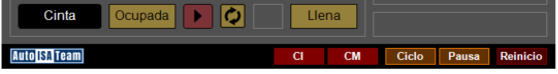
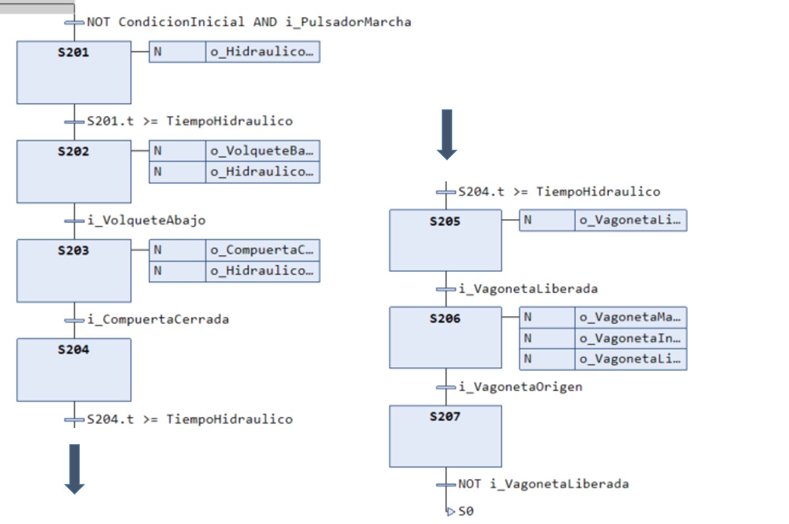
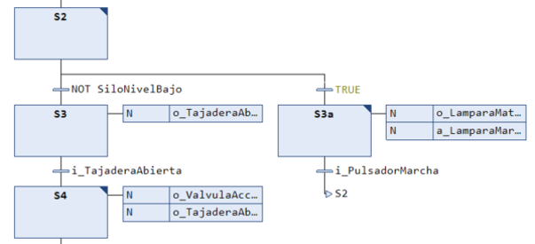
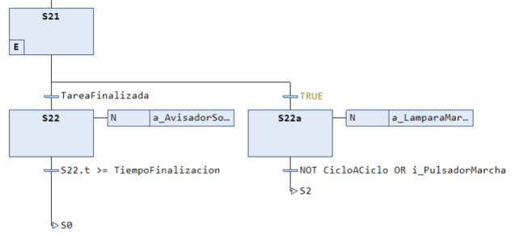
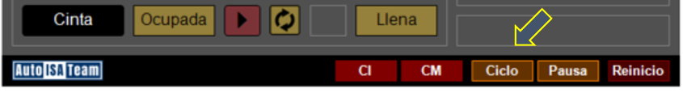
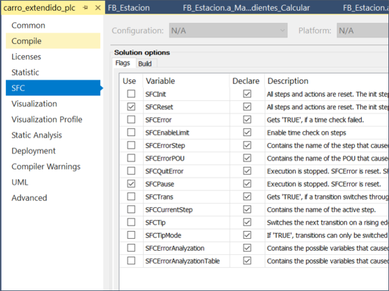
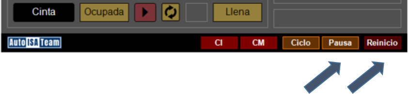

# Carro Extendido Monolítico

!!! warning "NOTA"
    La descripción general sobre este ejemplo puede encontrarse [aquí](../../contenidos/04_tc3_carro_extendido.md).
    
En esta implementación monolítica del carro extendido, toda la operación del sistema está concentrada en un solo bloque funcional, implementado en el lenguaje `SFC`.


## Funcionalidades
A continuación se explican las funcionalidades implementadas.

??? info "Tabla de contenidos"
    <!-- -->
    [Evaluación de las condiciones iniciales y de marcha](#evaluacion-de-las-condiciones-iniciales-y-de-marcha)
    
    [Secuencia automática de restauración de las condiciones iniciales](#secuencia-automatica-de-restauracion-de-las-condiciones-iniciales)
    
    [Tratamiento de la falta de material](#tratamiento-de-la-falta-de-material)
    
    [Modo manual (mandos directos) y automático.](#modo-manual-mandos-directos-y-automatico)
    
    [Modo de procesamiento continuo o por lotes (tarea).](#modo-de-procesamiento-continuo-o-por-lotes-tarea)
    
    [Modo ininterrumpido y modo ciclo a ciclo.](#modo-ininterrumpido-y-modo-ciclo-a-ciclo)
    
    [Reinicio y pausa del estado.](#reinicio-y-pausa-del-estado)
    
    [Normalización y escalado de las señales de entrada analógicas.](#normalizacion-y-escalado-de-las-senales-de-entrada-analogicas)
    
    [Uso de constantes, variables `REAL` y *arrays*](#uso-de-constantes-variables-real-y-arrays)
<!-- -->

!!! info "Consejo"
    Utiliza el menú de la derecha para ir directamente a la explicación de cada funcionalidad.

### Evaluación de las condiciones iniciales y de marcha
En la primera transición se observa la siguiente condición:

`MarchaAutorizada AND i_PulsadorMarcha`

El segundo elemento es la variable de entrada asociada al pulsador y el primer elemento es una variable `BOOL` que aglutina varias condiciones. En la acción principal de la etapa `S0` se observa el siguiente código:

```pascal
a_SiloNivel_Calcular();
a_VagonetaCarga_Calcular();

DemandaProduccion :=  ModoContinuo OR (ManiobrasSolicitadas > 0);
CondicionMarcha := DemandaProduccion AND NOT SiloNivelBajo;
    
CondicionInicial := i_SistemaConectado
    AND NOT i_VagonetaLiberada
    AND i_TajaderaCerrada
    AND i_VagonetaOrigen
    AND i_CompuertaCerrada
    AND i_VolqueteAbajo;

MarchaAutorizada := CondicionInicial AND CondicionMarcha;
```

Aquí se observa cómo `MarchaAutorizada` aglutina la **condición inicial** y la **condición de marcha**. La primera condición engloba a todas las condiciones iniciales especificadas en la descripción funcional (todo aquello que se necesita que sea verdadero para asegurarse de que la estación podrá empezar a funcionar).

La segunda variable, en este caso, engloba la **demanda de producción** y la condición de que el nivel del silo no sea excesivamente bajo (especificado por la variable binaria `SiloNivelBajo`). La demanda de producción, a su vez, indica si se le ha pedido funcionar a la estación, bien porque esté trabajando en modo continuo o bien porque se haya solicitado un número de maniobras.

!!! info "Información"
    En este ejemplo, la variable `SiloNivelBajo` toma su valor en la acción `a_SiloNivel_Calcular()`, la cual también se llama dentro de esta acción principal en `S0`.

El uso de estas variables intermedias (`MarchaAutorizada`, `CondicionInicial`, etc.) se denomina **semántica reforzada**, y ayuda a clarificar el código asignando nombres explicativos a las variables utilizadas.

Finalmente, nótese que el valor de la variable `CondicionInicial` y `CondicionMarcha` se muestran con indicadores `CI` y `CM` en la visualización.

{width=500px}

### Secuencia automática de restauración de las condiciones iniciales
Si **no** se cumplen las condiciones iniciales en la etapa `S0` al pulsar el pulsador de `i_PulsadorMarcha`, el programa evolucionará por una rama que implementa la secuencia de restauración.

{width=750px}

Esta secuencia se encarga de **intentar recuperar esas condiciones iniciales automáticamente**, accionando los actuadores necesarios para asegurar que se activan los sensores incluidos en las condiciones iniciales. Dicho de otro modo, va a intentar colocar la estación en la situación adecuada para que se cumplan las condiciones iniciales.

!!! info "Información"
    Nótese que hay elementos que no se pueden recuperar automáticamente, como, por ejemplo, el armado de la estación, por lo que no aparece en la secuencia. Esta condición inicial depende de que el operador haya armado la estación mediante el panel del operador (situación indicada por un nivel alto en la señal `i_SistemaConectado`).

!!! info "Información"
    Normalmente, no tendremos que comprobar el estado de todas las señales de entrada en las condiciones adicionales, sino aquellas que sean susceptibles de no estar activadas al inicio del sistema. Estas se corresponden con las asociadas a los pre-actuadores **biestables**.

Una vez recuperadas las condiciones iniciales, el programa volverá al estado inicial.

### Tratamiento de la falta de material
Si durante el proceso de producción se detecta que no hay material, se deberá entrar en una rama que notifique al operador de la situación (acústica y/o luminosamente) y **se esperará hasta que el operador pulse el pulsador de marcha**.

{width=550px} 

!!! warning "Peligro"
    No se debe poner, como condición de salida de este estado de espera, un sensor que detecte la presencia del material, ya que ello llevará a la estación a moverse inmediatamente **sin tener seguridad** de que el operador no está aún en contacto la estación.

Una vez pulsado, se volverá a la etapa de comprobación de falta material (**no a la etapa siguiente a esta**).

### Modo manual (mandos directos) y automático
Para poder conmutar entre el modo manual y el automático, utilizaremos el valor del selector manual (`i_SelectorManual`).

En TwinCAT3, cuando instanciamos un bloque funcional, estamos ejecutando su código. Si este código accede a las señales de E/S (por ejemplo, activa actuadores), no podremos hacer uso de la visualización para modificar su valor. Es decir, no podremos activar aquellos actuadores que estén controlados por el programa de manera manual. Para poder hacer esto, tendremos que quitar la llamada al código del bloque funcional. 

Para ello, usaremos el siguiente código en el `MAIN`:
!!! info "Declaración"
    ```pascal
    VAR
        Estacion : FB_Estacion;
    END_VAR
    ```

!!! info "Código"
    ```pascal
    IF NOT Estacion.i_SelectorManual THEN
        Estacion();
    END_IF
    ```

Nótese que lo único que hace este código es: 
- Si el selector manual no está activo (estamos, por tanto, en **modo automático**), hacemos la llamada al código del bloque funcional. 
- En caso contrario (**modo manual**), no hacemos esa llamada y tendremos acceso al *hardware* mediante el panel de visualización, ya que no hay ningún código operando sobre las mismas variables.

### Modo de procesamiento continuo o por lotes (tarea)
Además del modo de procesamiento por lotes (ya explicado en el carro básico), en este nivel podremos usar un **modo continuo**, donde no se indica un número específico de maniobras a realizar sino que se opera de manera indefinida.

{width=550px} 

Ahora, el fin de la tarea no solo depende de si el número de maniobras pendientes ha llegado a cero, sino que también comprobaremos que no estamos en modo continuo. Así, el valor de `TareaFinalizada` se calcula de la siguiente manera en la acción memorizada a la entrada de la etapa `S21`:

```pascal
TareaFinalizada := NOT ModoContinuo AND (ManiobrasPendientes = 0);
```

donde `ModoContinuo` es una variable `BOOL` activable en el panel de visualización.

{width=150px} 

### Modo ininterrumpido y modo ciclo a ciclo
Además, tanto en modo continuo o por lotes, podremos indicar al sistema si queremos que pare o no después de cada ciclo hasta que el operador vuelva a pulsar el pulsador de marcha para continuar la producción. Esto lo denominaremos modo **ciclo-a-ciclo**.

{width=550px} 

En la imagen se observa que, si no se ha terminado la tarea, se evoluciona por la rama de la derecha donde se enciende la lámpara de marcha (siguiendo la lógica implementada en `a_LamparaMarcha`) y se identifica si estamos en modo ciclo-a-ciclo. En caso afirmativo (`CicloACiclo == TRUE`), el programa se detiene hasta que se pulsa el pulsador de marcha mientras que, en caso negativo, el programa evoluciona inmediatamente hacia `S2`.

El modo ciclo-a-ciclo es activable mediante un botón en el panel de visualización.

{width=500px} 

### Reinicio y pausa del estado
Observe que en el `FB_Estacion` se han declarado dos variables especiales:

```pascal
VAR_INPUT
    // Variables implícitas de etapa
    SFCPause: BOOL;
    SFCReset: BOOL;
END_VAR
```

Estas variables se denominan **implícitas de etapa** y son señales internas del sistema que permiten controlar la ejecución global del programa secuencial **sin necesidad de programarlas explícitamente** dentro de las etapas. 

En concreto, `SFCPause` se utiliza para **detener temporalmente** la evolución del SFC, congelando la activación de transiciones y manteniendo el estado actual de las etapas activas. Una vez desactivada, se continúa la evolución del programa.

Por su parte, `SFCReset` fuerza la reinicialización del programa, desactivando todas las etapas activas y **volviendo a la etapa inicial** definida.

Estas dos variables forman parte del control estándar del `XAR` y son muy útiles para implementar funciones de parada, reinicio o gestión externa del flujo secuencial.

!!! warning "Importante"
    Para poder usar estas variables es necesario permitir su uso en las propiedades del proyecto PLC haciendo **CD** sobre el nombre de proyecto, seleccionando `Properties` y, posteriormente, `SFC`. Del listado de variables implícitas que aparecen, hay que marcar la columna `Use` correspondiente a las que se quieran usar.

    {width=500px} 

Ambas variables serán activables desde la visualización.

{width=400px} 

### Normalización y escalado de las señales de entrada analógicas
La mayoría de las entradas del sistema son binarias, por lo que las variables asociadas solo podrán tomar valores `0` o `1` (son variables *booleanas*). Sin embargo, también hay **entradas analógicas** que están asociadas a variables de tipo entero sin signo (`UINT`). Estas variables toman el valor numérico que devuelven los sensores utilizados: en este caso, un **sensor de distancia** para conocer el nivel del silo y un **sensor de carga** para determinar el peso de la vagoneta cargada.

Para darle significado a esos valores numéricos *adimensionales*, es conveniente realizar una conversión a la unidad que están midiendo, es decir, **metros** y **kilogramos**, respectivamente.

Conociendo los valores mínimo y máximo del sensor y sus equivalentes en las unidades físicas que miden podemos ajustar una recta que nos permita determinar el valor real correspondiente a una medida del sensor.

En el ejemplo, hacemos uso de dos acciones para implementar esta normalización y escalado:

1. `a_SiloNivel_Calcular` que implementa el cálculo de `SiloDistanciaMedida` (en metros) en función de `i_SensorNivel`.
2. `a_VagonetaCarga_Calcular` que implementa el cálculo de `VagonetaPesoBruto` (en Kg) en función de `i_SensorPeso`.

Además, dentro de estas acciones se da valor a variables de estado que indican, por ejemplo, si el nivel del silo está excesivamente bajo o la vagoneta está sobrecargada.

!!! tip "Consejo"   
    Inspecciona el código de estas acciones para identificar el ajuste de rectas.

### Uso de constantes, variables `REAL` y *arrays*
Finalmente, este ejemplo incorpora el uso de nuevos conceptos de programación en TwinCAT3:

- **Uso de constantes**. Dentro de un entorno `VAR_CONSTANT` podemos declarar constantes con un valor específico que podremos usar a lo largo de nuestro código. Por convenio, se utilizan mayúsculas en su nombre.
    ```pascal
    VAR CONSTANT
        HISTORICO_TOTAL_LEN : UINT := 9;
    END_VAR
    ```

- **Uso de variables** `REAL`. Para almacenar valores numéricos no enteros, se utilizan variables de tipo `REAL`, que permite el uso de decimales.

- **Uso de *arrays***. Los *arrays* son colecciones de variables del mismo tipo agrupadas bajo un mismo nombre. 
    
    !!! info "Declaración"
        La sintaxis de declaración es:
        
        ```pascal
        <Nombre>: ARRAY[índice_menor..índice_mayor] OF <tipo>;
        ```
        
        Como por ejemplo:
        
        ```pascal
        VAR
            HistoricoCargas: ARRAY[0..HISTORICO_TOTAL_LEN-1] OF REAL;
        END_VAR
        ```
    
    !!! info "Código"
        Para acceder a los valores dentro de *array* se utiliza el índice al que se desea acceder entre corchetes, como por ejemplo:
        
        ```pascal
        FOR Indice := HISTORICO_TOTAL_LEN-1 TO 1 BY -1 DO
            HistoricoCargas[Indice] := HistoricoCargas[Indice-1];
        END_FOR
        HistoricoCargas[0] := VagonetaCargaActual;
        ```
