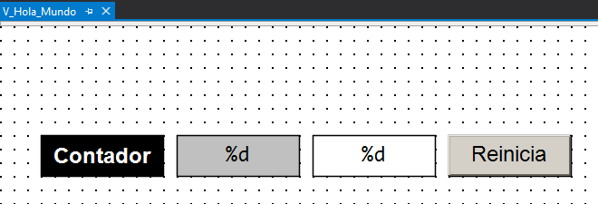
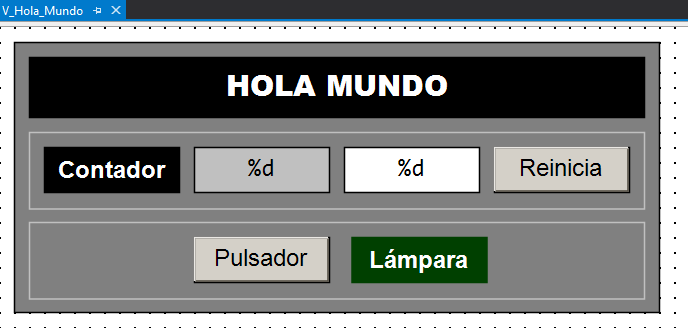

# 👋 Práctica «Hola Mundo»

## Tarea
Replicar el ejemplo [**«Hola Mundo»**](../02_tc3_hola_mundo.md) para implementar nuestro primer programa de PLC con TwinCAT 3 desde cero.

---

## Objetivos
- Familiarizarse con el entorno de desarrollo **TwinCAT XAE** de TwinCAT 3.
- Declarar variables de **memoria interna** (marcas).
- Declarar **variables de entrada y salida**, **localizadas** y con **mapeo dinámico**.
- Implementar un fragmento de código sencillo en el lenguaje **Texto Estructurado (ST)** de la norma IEC 61131-3.
- Crear una **visualización** sencilla para mostrar y modificar valores booleanos y numéricos.
- Construir un proyecto PLC para obtener un **archivo ejecutable**.
- Vincular las instancias de las variables de entrada/salida a canales de entrada/salida.
- Desplegar (poner en marcha) un proyecto PLC.
- Validar un proyecto PLC.

---

## 🔨 Guía de implementación
A continuación se detallan los pasos necesarios para replicar completamente este proyecto.

!!! tip "Sugerencia"
    Pulsa en ➡️ para obtener más información sobre cómo realizar el paso especificado.

---

### Sobre el simulador

En primer lugar vamos a implementar el proyecto (código y visualización) y ejecutarlo en nuestro ordenador usando el simulador de TwinCAT 3 (`UmRT_Default`).

1. Abrir la aplicación TwinCAT XAE. [➡️](../../contenidos/01_conceptos/01_tc3_proyecto_paso_a_paso.md#abrir-twincat-xae)
2. Crear una solución de TwinCAT 3 con nombre `TC3_Hola_Mundo`. [➡️](../../contenidos/01_conceptos/01_tc3_proyecto_paso_a_paso.md#crear-un-proyecto-twincat-3)
3. Ocultar las configuraciones innecesarias para dejar el explorador de la solución lo más despejado posible.
4. Crear un proyecto PLC estándar con el nombre `Hola_Mundo_PLC`. [➡️](../../contenidos/01_conceptos/01_tc3_proyecto_paso_a_paso.md#crear-un-proyecto-plc)

    !!! warning "Importante"
        **Nota didáctica:** para facilitar la comprensión, en este primer ejemplo todo el código se implementa directamente dentro del **programa** principal (`MAIN`). Téngase en cuenta que esto se hace exclusivamente con fines pedagógicos. La buena práctica en programación industrial dicta que el MAIN debe actuar únicamente como punto de entrada y organizador del proyecto, mientras que la lógica de control debe residir en otras **Unidades de Organización del Programa** (`POUs`) —fundamentalmente **Bloques de Función** (`FB`)— que permiten modularizar, escalar y replicar fácilmente los comportamientos y funcionalidades del sistema.

5. Localizar en el panel de **Explorador de la Solución** el programa `MAIN` bajo la carpeta `POUs` e incluir la línea de comentario inicial sobre el **Encabezado del POU**.

    ```iecst
    // Hola Mundo de la Programación de PLC
    ```

6. Declarar la variable entera `ContadorCiclos` como `UINT` en el bloque `VAR` de la parte de declaración del programa `MAIN`. [➡️](../../contenidos/01_conceptos/01_tc3_proyecto_paso_a_paso.md#declarar-una-variable)

    ```iecst
    PROGRAM MAIN
    VAR
        ContadorCiclos: UINT;
    END_VAR
    ```
    ??? info
        Según el estándar `IEC 61131-3` tipo de dato `UINT` representa un entero sin signo de 16 bits (0 a 65535). 

7. Escribir en `ST`, utilizando el `Operador de asignación`, el código correspondiente a la gestión del contador de ciclos en la parte de implementación del programa `MAIN`.

    ```iecst
    ContadorCiclos := ContadorCiclos + 1;
    ```

8. Construir el proyecto (**Build**) para generar un archivo ejecutable. [➡️](../../contenidos/01_conceptos/01_tc3_proyecto_paso_a_paso.md#construir-el-proyecto)

    !!! warning "Importante"
        Asegurarse antes de continuar de que el resultado de la construcción del proyecto mostrado en la ventana de mensajes no arroja errores.

9. Activar el simulador **UmRT_Default** para disponer de un `runtime` sobre el que ejecutar el código del proyecto

    ??? info
        Para activar el simulador ejecute el *script* de inicio que se encuentra habitualmente en la siguiente ruta:
        
           - `C:\TwinCAT\3.1\Runtimes\UmRT_Default\Start.bat`.

10. Seleccionar UmRT_Default como sistema destino (**Target System**). [➡️](../../contenidos/01_conceptos/01_tc3_proyecto_paso_a_paso.md#seleccionar-un-sistema-destino)
11. Activar la licencia temporal del `runtime` del sistema destino si es necesario.
12. Reiniciar el sistema destino en **RUN Mode**.
13. Activar la configuración en el sistema destino.
14. Conectarse (**Login**) al sistema destino para transferir el proyecto. [➡️](../../contenidos/01_conceptos/01_tc3_proyecto_paso_a_paso.md#transferir-un-proyecto)
   
    ??? info
        - Conectarse al sistema destino implica transferir el proyecto al runtime e iniciar la monitorización (sesión de depuración en tiempo real). 
        - La comuniciación para el intercambio de información entre el entorno de programación y el `runtime` tiene lugar, normalmente, a través del puerto `851 .

15. Poner el programa de PLC en ejecución (**Run**). [➡️](../../contenidos/01_conceptos/01_tc3_proyecto_paso_a_paso.md#arrancar-un-proyecto)
   
16. Observar cómo el valor de la variable `ContadorCiclos` se incrementa continuamente al ritmo de ejecución del ciclo básico del PLC (típicamente 10 ms), lo que prueba que el programa se está ejecutando. 
17. Modificar el valor del contador de ciclos mediante forzado de variables (**Force values**, **Unforce values**, **Write values**).
18. Desconectarse del sistema destino (**Logout**) para continuar con la edición del programa.

    ??? info
        Cuando nos desconectamos de un sistema destino abandonamos la monitorización, pero el programa sigue ejecutándose en el runtime del sistemas destino. Como prueba podremos observar que, cuando nos volvamos a conectar, el contador de ciclos tendrá un valor diferente.

19. Crear una visualización para monitorizar y actualizar el contador de ciclos. [➡️](../../contenidos/01_conceptos/07_tc3_crear_visualizacion.md)

    {width=660px}

    1. Rectángulo (*Rectangle*) para la etiqueta **Contador**.
   
        ??? info "Parámetros"
            - Texts > Text = Contador

    2. Rectángulo (*Rectangle*) para mostrar el valor de `ContadorCiclos`.

        ??? info "Parámetros"
            - Color > Normal state > Frame color = [0, 0, 0]
            - Color > Normal state > Fill color = [192, 192, 192]
            - Texts > Text = [%d]
                - *Formato estilo printf que indica que se va a sustituir por un número entero.*
            - Text variables > Text variable = [`MAIN.ContadorCiclos`]

    3. Rectángulo (*Rectangle*) para modificar el valor de `ContadorCiclos`.

        ??? info "Parámetros"
            - Color > Normal state > Frame color = [0, 0, 0]
            - Color > Normal state > Fill color = [255, 255, 255]
            - Texts > Text = [%d]
                - *Formato estilo printf que indica que se va a sustituir por un número entero.*
            - Text variables > Text variable = [`MAIN.ContadorCiclos`]
            - Inputconfiguration > OnMouseClick

    4. Botón (*Button*) para reiniciar el valor de la variable `ContadorCiclos`.

        ??? info "Parámetros"
            - Texts > Text = [**Reinicia**]
            - Inputconfiguration
                - OnMouseClick > Configure > Execute ST-Code = [`MAIN.ContadorCiclos := 0;`]

    !!! tip "Sugerencia"
        Los colores especificados para los elementos son simplemente un ejemplo, pueden ser escogidos libremente.

20. Volver a conectarse y comprobar que todos los elementos de la visualización funcionan correctamente.
21. Volver a desconectarse e incluir en la parte de declaración del programa `MAIN` las variables `i_Pulsador` e `o_Lampara`.

    ```iecst
    PROGRAM MAIN
    VAR
        i_Pulsador: BOOL;
        o_Lampara: BOOL;
    END_VAR
    ```

    ??? info "Explicación"

        | Elemento | Tipo de componente | Descripción |
        | :---: | :---: | :--- |
        | `i_Pulsador` | **Identificador** | Identificador/Nombre de la variable |
        | `:` | **Separador** | Operador/Separador |
        | `BOOL` | **Tipo de dato** | Tipo de dato elemental (booleano) |
        | `;` | **Terminador** | Delimitador/Terminador de instrucción |


22. Incluir el código correspondiente a la activación de la lámpara en parte de implementación del programa `MAIN`.

    ```iecst
    PROGRAM MAIN
         o_Lampara := i_Pulsador;
    ```

23. Construir nuevamente el proyecto para comprobar su corrección y generar las instancias de E/S.

    !!! warning "Importante"
        Observa que si la compilación es correcta aparecen bajo el apartado `Hola_Mundo_PLC Instance` las instancias de las dos nuevas variables. 

24. Incluir en la visualización los elementos correspondientes al pulsador y la lámpara.

    {width=688px}

    1.  Botón (*Button*) para modificar el valor de `i_Pulsador`.

        ??? info "Parámetros"
            - Texts > Text = [**Pulsador**]
            - Inputconfiguration 
                - Tap > Variable = [`MAIN.i_Pulsador`]

    2.  Rectángulo (*Rectangle*) para mostrar el valor de la variable `o_Lampara`.

        ??? info "Parámetros"
            - Colors > Normal state > Frame color = [0, 64, 0]
            - Colors > Normal state > Fill color = [0, 64, 0]
            - Colors > Alarm state > Frame color = [0, 128, 0]
            - Colors > Alarm state > Fill color = [0, 128, 0]
            - Texts > Text = [**Lámpara**]
            - Color variables > Toggle color = [`MAIN.o_Lampara`]

    !!! tip "Sugerencia"
        Complete la visualización con los elementos que considere oportuno para mejorar su apariencia.


15. Conectarse nuevamente 
    - Modificar el valor de las varaibles forzándolas (Force values, Unforce values, Write values).
    - Comprobar que los nuevos elementos de la visualización funcionan correctamente.

!!! success "¡Enhorabuena! 🎉"
    Has completado con éxito la primera parte de la práctica y has puesto en marcha tu primer proyecto completo de PLC en Texto Estructurado con TwinCAT 3 sobre el simulador UmRT_Default.

---

### Sobre un controlador

Ahora vamos a configurar el proyecto para ejecutarlo sobre un controlador Beckhoff real. 

1. Estando desconectado, seleccionar como nuevo sistema destino un **controlador remoto** de Beckhoff presente en la actual red local. [➡️](../../contenidos/01b_ejecucion.md/#busqueda-de-controladores-remotos)
2. Activar la configuración en el nuevo sistema destino.
3. Transferir el programa.
4. Poner el programa en ejecución.
5. Probar el programa forzando las variables.
6. Probar el programa desde la visualización.

    !!! warning "Importante"
        Para probar el programa con un pulsador y una lámpara real es necesario:

        - Modificar y construir el programa.
        - Configurar la E/S: escanear, identificar y vincular canales de E/S.

7.  Volver a desconectarse y modificar, en la parte de declaración del programa `MAIN`, la declaración de las variables `i_Pulsador` y `o_Lampara`.

    ```iecst
    PROGRAM MAIN
    VAR
        i_Pulsador AT %I*: BOOL;
        o_Lampara AT %Q*: BOOL;
    END_VAR
    ```
    ??? "Explicación"
        - Para situar las instancias de estas variables en las correspondientes imágenes de E/S (*Process Image*) es necesario especificar sus direcciones usando el modificador `AT`. 
        - Si no se hiciera, el compilador situaría estas variables en el **espacio de memoria interna** (marcas) y no se gernerarían las correspondientes instancias de E/S y no podrían vincularse (*mapping*) a canales físicos de E/S del controlador.
        - El símbolo `%` es el prefijo de ubicación directa.
        - Las letras `I` y `Q` indican el área de memoria (entrada/salida).
        - El símbolo `*` es un comodín que indica asignación dinámica. 

8. Construir (**Build**) y verificar la ausencia de errores. 

    !!! tip "Sugerencia"
        Verificar que las `i_Pulsador` y `o_Lampara` aparecen instanciadas.

            Hola_Mundo_PLC Instance/
            ├── PLCTask Inputs
            |   └── MAIN.i_Pulsador
            └── PLCTask Outputs
                └── MAIN.o_Lampara

9.  Conectarse (**Login**) nuevamente al controlador remoto.
10. Reiniciar el sistema TwinCAT del controlador remoto en modo Configuración (**Restart TwinCAT (Config Mode)**).
11. Escanear (**Scan**) la entrada/salida (**I/O**) en busca de dispositivos y terminales.
12. Localizar, identificar, nominar (`Pulsador`) y probrar una canal de entrada digital para `i_Pulsador`.
13. Localizar, identificar, nominar (`Lampara`) y probrar una canal de entrada salida para `i_Lampara`.

    !!! tip "Sugerencias"
        - Buscar en la lista de entradas y salidas de la **descripción funcional** del sistema una señal de entrada (preferiblemente un **pulsador**) y otra de salida (preferiblemente una **lámpara**).
        - **Desactivar** los dispositivos de entrada y salida que no se van a utilizar (todos menos el dispositivo denominado `EtherCAT`).

14. Vincular (**Link**) las instancias de las variables de entrada y salida con los canales correspondientes. [➡️](../../contenidos/01b_ejecucion.md/#vinculacion-de-variables-y-es)
    -  Variable de entrada `i_Pulsador` con un canal de entrada digital `Pulsador`.
    -  Variable de salida `o_Lampara` con un canal de salida digital `Lampara`.

15. Activar la configuración (**Activate la configuration**) y reiniciar TwinCAT 3 (**Restart TwinCAT System**).
16. Volver a transferir el programa al controlador (**Login**).
17. Poner el programa en **ejecución** (**Start**).
18. Comprobar que:
    - El contador de ciclos sigue incrementándose de forma continua.
    - Al accionar el pulsador físico se enciende la lámpara física.

19. Utilizar la visualización integrada en el proyecto PLC para facilitar la prueba:
    - Comprobar en la visualización que, accionando el pulsador físico, cambia de estado la lámpara.
    - Comprobar en la visualización que, accionando el botón de la visualización, **NO cambia de estado la lámpara**.

    !!! warning "Importante"
        Esto se debe a que la ejecución del ciclo básico hace que el valor del pulsador **se actualice con el valor del pulsador físico** al inicio de cada ciclo básico de ejecución, sobreescribiendo el valor que fija el botón de la visualización.

!!! success "¡Enhorabuena! 🎉"
    Has completado con éxito la segunda parte de la práctica y has puesto en marcha tu primer proyecto completo de PLC en Texto Estructurado con TwinCAT 3 sobre un controlador real.

---


## 🎯 Ejercicios Propuestos

A continuación se propone una serie de retos para profundizar en los conceptos fundamentales del lenguaje **Texto Estructurado (ST)** y la librería estándar IEC 61131-3. 

Para la prueba se recomienda implementar una interfaz visual en cada ejercicio añadiendo los botones y elementos necesarios en una **visualización**.

---

### 1. Lámpara Memorizada
**Descripción:**

- La lámpara se enciende al accionar el pulsador de conexión (i_PulsadorConexion).
- La lámpara se apaga al accionar el pulsador de desconexión (i_PulsadorDesconexion).

??? tip "Pista para la solución"
    - Utiliza la [instrucción condicional IF ... THEN](https://infosys.beckhoff.com/english.php?content=../content/1033/tc3_plc_intro/2528275595.html){ target="_blank" }.
    - Piensa cuál de las dos condiciones debe prevalecer en caso de que se presionen ambos pulsadores al mismo tiempo (prioridad de activación o de desactivación).

---

### 2. Lámpara Conmutada
**Descripción:**

- La lámpara se enciende si estando apagada se acciona el pulsador (i_Pulsador).
- La lámpara se apaga si estando encendida se acciona el pulsador (i_Pulsador).

??? tip "Pista para la solución"
    - Utiliza el detector de flanco ascendente [R_TRIG](https://infosys.beckhoff.com/english.php?content=../content/1033/tcplclib_tc2_standard/74391563.html&id=){ target="_blank" } de la librería `Standard`.
    - Declara una instancia del bloque funcional detector de flanco ascendente (`Pulsación: R_TRIG;`).
    - Utiliza el [operador NOT](https://infosys.beckhoff.com/english.php?content=../content/1033/tc3_plc_intro/2528902283.html&id=){ target="_blank" } para la conmutación de la salida (`o_Lampara := NOT o_Lampara;`) cuando se produce un flanco en el pulsador (`Pulsacion.Q`).

---

### 3. Lámpara Temporizada
**Descripción:**

- La lámpara se enciende al accionar el pulsador (i_Pulsador).
- La lámpara se apaga transcurrido un cierto tiempo (por ejemplo, 5 segundos).

??? tip "Pista para la solución"
    - Utiliza el temporizador de retardo a la conexión [TON](https://infosys.beckhoff.com/english.php?content=../content/1033/tcplclib_tc2_standard/74406539.html&id=){ target="_blank" } de la librería `Standard`.
    - Declara una instancia del temporizador de retardo a la conexión (`Temporizador: TON;`).
    - Utiliza literales de tiempo con la sintaxis de formato de tiempo estándar de IEC (ejemplo: `T#5s`).
    - Parametriza el funcionamiento utilizando una variable (`TiempoEncendido`) que permita controlar la temporización desde la visualización.

---

### 4. Lámpara Computada
**Descripción:**

- La lámpara se enciende tras un determinado numero de pulsaciones (i_Pulsador).
- La lámpara se apaga tras accionar el pulsador de reinicio (i_PulsadorReinicio).

??? tip "Pista para la solución"
    - Utiliza el bloque de contador de cuenta regresiva [CTD](https://infosys.beckhoff.com/english.php?content=../content/1033/tcplclib_tc2_standard/74398987.html&id=){ target="_blank" } de la librería `Standard`.
    - Declara una instancia de contador decreciente (`Contador: CTD;`).
    - Parametriza el funcionamiento utilizando una variable (`ManiobrasTotales`) que controle el contador desde la visualización.

---

### 5. Lámpara Intermitente
**Descripción:**

- La lámpara parpadéa de forma continua.

??? tip "Pista para la solución"
    - Utiliza un temporizador de retardo a la conexión (`Temporizador: TON;`) para controlar el tiempo de conmutación.
    - Cuando finalice el temporizador invierte el estado de la lámpara (`o_Lampara := NOT o_Lampara;`).
    - Parametriza el funcionamiento utilizando una varible (`TiempoParpadeo`) que permita controlar el temporizador desde la visualización.

---