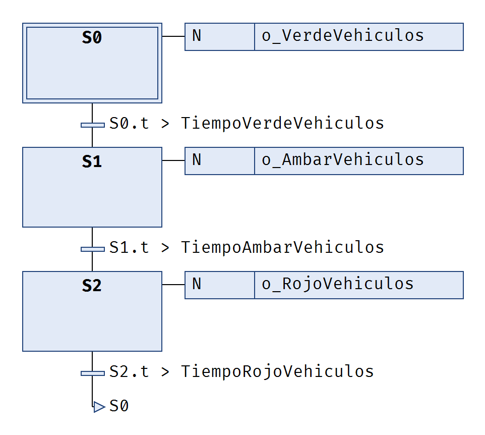
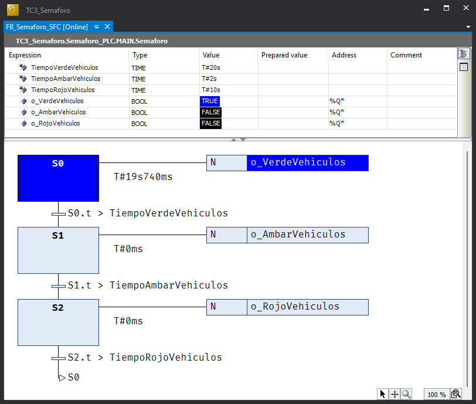

# 🚦 Semáforo (ArduTC)

## 📋 Tarea

Implementar la lógica de control de un semáforo simple de peatones para la regulación del tráfico en una vía de sentido único.

---

## 🎯 Objetivos

- Aprender a editar un bloque funcional (FB) utilizando el lenguaje SFC en TwinCAT 3.
- Aprender a transcribir máquinas de estado espeficicadas con diagramas grafcet utilizando los lenguajes {{SFC}} y {{ST}}.
- Aprender a usar **ArduTC** para utilizar una placa microcontroladora como terminal de E/S de TwinCAT 3.

---

## 📝 Descripción funcional

Inicialmente el semáforo consta únicamente de las luces roja, ámbar y verde para vehículos.

El funcionamiento requerido será la típica secuencia verde -> ámbar -> rojo.

| Parámetro | Valor inicial |
| :---: | :---: |
| $T_{verde}$ | 20 s |
| $T_{ámbar}$ | 3 s |
| $T_{rojo}$ | 10 s |

## ⇄ Entradas y salidas

| Nombre | Tipo | Origen | Descripción |
| :---: | :---: | :---: | :--- |
| `o_VerdeVehiculos` | `BOOL` | Salida | Luz verde para vehículos|
| `o_AmbarVehiculos` | `BOOL` | Salida | Luz ámbar para vehículos |
| `o_RojoVehiculos` | `BOOL` | Salida | Luz roja para vehículos |

---

## 📐 Especificación funcional

La siguente especificación funcional describe el comportamiento del semáforo de peatones utilizando el lenguaje GRAFCET.

- Diagrama grafcet (PDF) 🚧 *Proximamente*

---

## 🧰 Materiales

Para la realización de esta práctica es necesario disponer de los siguientes materiales adicionales.

- Una **placa microcontroladora** compatible con **ArduTC** con **Telemetrix**.
- Un **cable USB**, para conectar la placa microcontroladora al ordenador.
- Un **montaje con tres leds (verde, amarillo, rojo)** conectados a los correspondientes pines de la placa microcontroladora.
- Aplicación **ArduTC** instalada.

---

## 🔨 Guía de implementación

### Proyecto TwinCAT 3 en SFC

A continuación se detallan la secuencia de pasos necesarios para codificar en el lenguaje {{SFC}} la máquina de estados que describe el comportamiento de la lógica de control del semáforo simple especificada con un diagrama grafcet.

1. Abrir la aplicación **TwinCAT XAE**. [➡️](../../contenidos/01_conceptos/01_tc3_proyecto_paso_a_paso.md#abrir-twincat-xae)
2. Crear una **solución de TwinCAT 3** con nombre `TC3_Semaforo`. [➡️](../../contenidos/01_conceptos/01_tc3_proyecto_paso_a_paso.md#crear-un-proyecto-twincat-3)
3. Ocultar las **configuraciones** innecesarias para dejar el explorador de la solución lo más despejada posible.  [➡️](../../contenidos/01_conceptos/01_tc3_proyecto_paso_a_paso.md#ocultar-las-configuraciones-innecesarias)
4. Crear un **proyecto PLC estándar** con el nombre `Semaforo_PLC`. [➡️](../../contenidos/01_conceptos/01_tc3_proyecto_paso_a_paso.md#crear-un-proyecto-plc)
5. Crear un **Bloque Funcional** denominado `FB_Semaforo_SFC`.
6. Declarar los **parámetros y variables** necesarios en `FB_Semaforo_SFC`. [➡️](../../contenidos/01_conceptos/01_tc3_proyecto_paso_a_paso.md#declarar-una-variable)
   
    ```iecst
    FUNCTION_BLOCK FB_Semaforo_SFC
    VAR_INPUT
        TiempoVerdeVehiculos: TIME := T#20S;
        TiempoAmbarVehiculos: TIME := T#2S;
        TiempoRojoVehiculos: TIME := T#10S;
    END_VAR
    VAR_OUTPUT
    END_VAR
    VAR
        o_VerdeVehiculos AT %Q*: BOOL;
        o_AmbarVehiculos AT %Q*: BOOL;
        o_RojoVehiculos AT %Q*: BOOL;
    END_VAR
    ```
7. Escribir el **código** en {{SFC}} en la parte de implementación de `FB_Semaforo_SFC`.

    {width=420px}

8. Declarar una **instancia** `Semaforo` del tipo `FB_Semaforo` en la parte de implementación del programa `MAIN`.

    ```iecst
    PROGRAM MAIN
    VAR
        Semaforo: FB_Semaforo_SFC;
    END_VAR
    ```

9.  Invocar la ejecución de la **instancia** `Semaforo` en `MAIN`.

    ```iecst
    Semaforo();
    ```

10. Construir el proyecto (**Build**) para generar un archivo ejecutable. [➡️](../../contenidos/01_conceptos/01_tc3_proyecto_paso_a_paso.md#construir-el-proyecto)
11. Activar el simulador **UmRT_Default** para disponer de un `runtime` sobre el que ejecutar el código del proyecto.

    !!! warning "Importante"
        Tomar nota de la dirección **AmsNetId** del simulador UmRT_Default que se muestra en la pantalla de la terminal.

12. Seleccionar **UmRT_Default** como sistema destino (***Target System***). [➡️](../../contenidos/01_conceptos/01_tc3_proyecto_paso_a_paso.md#seleccionar-un-sistema-destino)

    !!! warning "Importante"
        Tomar nota del puerto de comunicaciones entre el entorno de programación (**TwinCAT XAE**) y el sistema destino (***Target System***).

13. Activar la licencia temporal del `runtime` del sistema destino si es necesario.
14. Reiniciar el sistema destino en **RUN Mode**.
15. Activar la configuración en el sistema destino.
16. Conectarse (**Login**) al sistema destino para transferir el proyecto. [➡️](../../contenidos/01_conceptos/01_tc3_proyecto_paso_a_paso.md#transferir-un-proyecto)
17. Poner el programa de PLC en ejecución (**Run**). [➡️](../../contenidos/01_conceptos/01_tc3_proyecto_paso_a_paso.md#arrancar-un-proyecto)
18. Observar en la ventana de monitorización de la instancia `Semaforo` de `FB_Semaforo` cómo evoluciona el {{SFC}}.

    {width=600px}

### :material-developer-board: Prueba con ArduTC

Configuremos el proyecto para utilizar una placa microcontrolador como **Arduino UNO** como terminal de E/S utilizando **ArduTC**.

1. Ya tenemos preparado el proyecto TC3
    - Controlador TC3: *runtime* (local o remoto) o simulador (**UmRT_Default**).
    - Configuración del proyecto activada sobre el controlador.
    - Proyecto PLC cargado en el controlador.
    - Proyecto PLC en ejecución en el controlador.
    - Dirección AMS del controlador y puerto de comunicación del proyecto anotados.

    ???info 
        - La dirección AMS del sistema destino también puede encontrase en el panel de explorador de la solución en `SYSTEM > Routes > NetId Management > Target NetId`
        - El puerto de comunicaciones también puede encontrase haciendo **DC** sobre el nombre del proyecto PLC (Semaforo_PLC) en `Project > Port`
  
2. Placa microcontroladora
    - **Telemetrix** instalado en la placa microcontroladora.
    - Montaje con tres led de colores (verde, ámbar y rojo) conectados a los pines correspondientes de la placa.
  
3. Abrir al aplicación **ArduTC**.
4. Cargar los símbolos del proyecto TC3 en **ArduTc**.
5. Seleccionar la placa **microcontroladora**.
6. Vincular las variables de E/S del proyecto TC3 con los pines corespondientes de la placa **microcontroladora**. 
7. Establecer la dirección **AMS Net ID** del sistema destino en **ArduTC**.
8. Establecer el **puerto de comunicaciones** del proyecto TC3 en **ArduTC**.
9. Conectar **ArduTC**.
10. Observar cómo los leds conectados a la placa **microcontroladora** se encienden y apagan conforme a la ejecución del {{SFC}}.

!!! success "¡Enhorabuena! 🎉"
    ¡Has completado con éxito la primera parte de la práctica! Ya has puesto en marcha tu primer proyecto en **TwinCAT 3** que implementa una **máquina de estados** especificada en lenguaje **GRAFCET**, utilizando el lenguaje **Diagrama Funcional Secuencial** ({{SFC}}) de la **norma IEC 61131-3** utilizando una placa **microcontroladora** como terminal de E/S gracias a **ArduTC**.

---

### Proyecto TwinCAT 3 en ST

A continuación se detallan la secuencia de pasos necesarios para codificar en el lenguaje {{ST}} la máquina de estados que describe el comportamiento de la lógica de control del semáforo especificada con un diagrama grafcet. 

1. Desconectarse del sistema destino (**Logout**) para continuar con la edición.
2. Crear un nuevo **Bloque Funcional** denominado **FB_Semaforo_ST** seleccionando el lenguaje de implementación ***Structured Text (ST)***.
3. Declarar los mismos **parámetros y variables** en **FB_Semaforo_ST** que anteriormente en **FB_Semaforo_SFC** pero añadiendo una nueva varaible local para contener la información del estado denominada `Estado` de tipo **Enumeración Implícita**.

    ```iecst
    FUNCTION_BLOCK FB_Semaforo_ST
    VAR_INPUT
        TiempoVerdeVehiculos: TIME := T#20S;
        TiempoAmbarVehiculos: TIME := T#2S;
        TiempoRojoVehiculos: TIME := T#10S;
    END_VAR
    VAR_OUTPUT
    END_VAR
    VAR
        Estado: (E_VERDE, E_AMBAR, E_ROJO);
        
        // Bloques funcionales
        TemporizadorVerde: TON;
        TemporizadorAmbar: TON;
        TemporizadorRojo: TON;
        
        // Variables de Salidas
        o_VerdeVehiculos AT %Q*: BOOL;
        o_AmbarVehiculos AT %Q*: BOOL;
        o_RojoVehiculos AT %Q*: BOOL;
    END_VAR
    ```
    
4. Escribir el **código** en {{ST}}

    ```iecst
    // BLOQUES FUNCIONALES
    TemporizadorVerde(IN := (Estado = E_VERDE), PT := TiempoVerdeVehiculos);
    TemporizadorAmbar(IN := (Estado = E_AMBAR), PT := TiempoAmbarVehiculos);
    TemporizadorRojo(IN := (Estado = E_ROJO), PT := TiempoRojoVehiculos);

    // FUNCION DE ESTADO
    CASE Estado OF
        E_VERDE:
            IF TemporizadorVerde.Q THEN
                Estado := E_AMBAR;
            END_IF;
        E_AMBAR:
            IF TemporizadorAmbar.Q THEN
                Estado := E_ROJO;
            END_IF;
        E_ROJO:
            IF TemporizadorRojo.Q THEN
                Estado := E_VERDE;
            END_IF;
    END_CASE;

    // FUNCION DE SALIDA
    o_VerdeVehiculos := (Estado = E_VERDE);
    o_AmbarVehiculos := (Estado = E_AMBAR);
    o_RojoVehiculos := (Estado = E_ROJO);
    ```

5. Añadir una **instancia** de `FB_Semaforo_ST` también denominada `Semaforo` y comentar la anterior.

    ```iecst
    PROGRAM MAIN
    VAR
        // Semaforo: FB_Semaforo_SFC;
        Semaforo: FB_Semaforo_ST;
    END_VAR
    ```

... continuar con los pasos 11 en adelante del caso anterior incluyendo la prueba con ArduTC.

!!! success "¡Enhorabuena! 🎉"
    ¡Has completado con éxito la segunda parte de la práctica! Ya has puesto en marcha tu primer proyecto en **TwinCAT 3** que implementa una **máquina de estados** especificada en lenguaje **GRAFCET**, utilizando el lenguaje **Texto Estructurado** {{(ST)}} de la **norma IEC 61131-3** utilizando una placa **microcontroladora** como terminal de E/S gracias a **ArduTC**.


---

## 🎯 Ejercicios Propuestos

- Añadir una visualización que permita monitorizar y parametrizar el funcionamiento completo del semáforo.
- Añadir luces para los peatones: roja y verde (fija e intermitente). 
- Añadir la funcionalidad para el acortamiento del tiempo de verde para vehículos (pulse peatón/espere verde).
- Añadir una avisador acústico para invidentes (frecuencia base/rápida).
