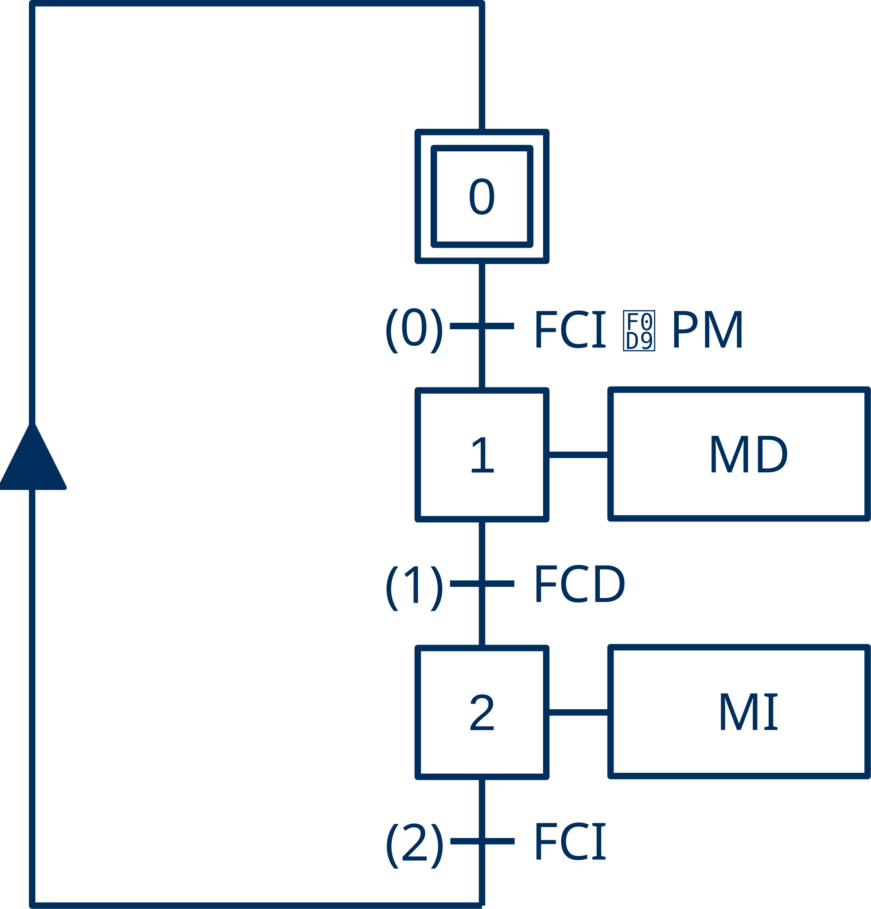
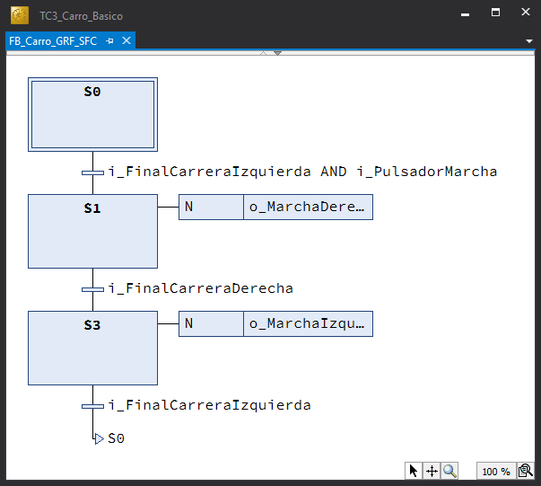

# 🛒 Carro Básico - Guía de Implementación

--8<-- "includes/documento-en-construccion.md"

## 📋 Tarea

Replicar el ejemplo [**«Carro Básico»**](../carro-basico/index.md) para implementar nuestra primera máquina de estado con TwinCAT 3 desde cero.

---

## 🎯 Objetivos

- Implementar una **máquina de estado** en los lengujes {{SFC}}, {{ST}} y {{LD}} a partir de su especicación con **diagramas grafcet** y con **diagramas de relés**.
- Implementar los elementos básicos presentes en cualquier automatismo industrial: **detección de flancos**, **evaluación de lapsos de tiempo**, **contaje de eventos**.

---

## 🔨 Guía de Implementación

El punto de partida son las especificaciones en diagramas de relés y contactos y en diagramas gracet de la lógica de control del carro.

- [Diagrama de relés y contactos (PDF).](./pdf/carro_basico_drc.pdf)
- [Diagrama GRAFCET (PDF).](./pdf/carro_basico_grf.pdf)

A continuación se detallan los pasos necesarios para replicar completamente este proyecto.

!!! tip "Sugerencia"
    Pulsa en ➡️ para obtener más información sobre cómo realizar el paso especificado.

---

### Carro Básico

Transcripción de la lógica de control de carro básico especificada con el lenguaje **GRAFCET** a los lenguajes {{SFC}}, {{ST}} y {{LD}} de la norma IEC 61131-3 con TwinCAT 3.

{ width="200px" }

#### GRAFCET a SFC

1. Abrir la aplicación **TwinCAT XAE**. [➡️](../../procedimientos/workflow/index.md#abrir-twincat-xae)
2. Crear una solución de TwinCAT 3 con nombre `TC3_Carro_Basico`. [➡️](../../procedimientos/workflow/index.md#crear-un-proyecto-twincat-3)
3. Ocultar las configuraciones innecesarias para dejar el explorador de la solución lo más despejado posible. [➡️](../../procedimientos/workflow/index.md#ocultar-configuraciones)
4. Crear un proyecto PLC estándar con el nombre `Carro_Basico_PLC`. [➡️](../../procedimientos/workflow/index.md#crear-un-proyecto-plc)
5. Crear una nueva **Unidad de Organización de Programa (POU)** de tipo **Bloque Funcional**. [➡️](../../procedimientos/workflow/index.md#crear-un-pou)

    !!! warning "Parámetros POU"
        - Nombre ➔ `FB_Carro_GRF_SFC`
        - Type ➔ `Function Block`
        - Implementation Language ➔ `Sequential Function Chart (SFC)`

6. Declarar las **variables de entrada/salida** necesarias en `FB_Carro_SFC` como variables locales (`VAR_LOCAL`). [➡️](../../procedimientos/workflow/index.md#declarar-una-variable)

    ```iecst
    FUNCTION_BLOCK FB_Carro_GRF_SFC
    // Transcripción del grafcet (GRF -> SFC)
    VAR_INPUT
    END_VAR
    VAR_OUTPUT
    END_VAR
    VAR
        // Entradas
        i_PulsadorMarcha AT %I*: BOOL;
        i_FinalCarreraIzquierda AT %I*: BOOL := TRUE;
        i_FinalCarreraDerecha AT %I*: BOOL;

        // Salidas
        o_MarchaIzquierda AT %Q*: BOOL;
        o_MarchaDerecha AT %Q*: BOOL;
        o_LamparaMarcha AT %Q*: BOOL;
    END_VAR
    ```

    !!! info "Variables de Entrada y Salida"
        - **Ocultamiento**: las variables de entrada y salida se declaran como **locales** (`VAR`) para ocultarlas, para protegerlas, para que no sean accesibles desde fuera del bloque funcional.
        - **Direccionamiento**: se declaran con el modificador `AT` para situarlas en la **Imagen de Entrada** (`%I`) o en la **Imagen de Salida** (`%Q`) según corresponda. No se especifica la posición de memoria (`*`) para dejar que TwinCAT se encargue de asignarle la dirección. Cuando se construya el proyecto las instancias correspondientes a estas variables estarán disponibles en la sección I/O para ser vinculadas con las señales presentes en los canales de entrada y salida.
        - **Valor Inicial**: La variable `i_FinalCarreraIzquierda` se inicia a `TRUE`. Aunque sea totalmente innecesario e incluso contradictorio, ya que las variables de entrada tomarán en el primer ciclo el valor que le corresponda según la señal de entrada a la que estén vinculadas. Establecer el valor inicial de algunas variables de entrada puede ser conveniente, desde un punto de vista práctico, cuando se ejecuta el código sin hardware (UmRT_Default), ya que así, cada vez que se reinicie la ejecución no hay que escribir uno a uno el valor de las variables que forman parte de la condición inicial.

7. Escribir el código SFC correspondiente al carro básico

    { width="400px" }

    !!! info "Código SFC"
        - En la transición S0-S1, `i_FinalCarreraIzquierda` es la **Condicion Inicial** y `i_PulsadorMarcha` es el evento que dispara la transición.
        - La **Condición Inicial** es la condición material (estado de los sensores) que se debe cumplir para iniciar la secuencia de funcionamiento con seguridad.

8. Declarar en `MAIN` una instancia `Carro` de `FB_Carro_GRF_SFC`.

    ```iecst
    PROGRAM MAIN
    VAR
        Carro: FB_Carro_GRF_SFC;
    END_VAR
    ```

9. Escribir en `MAIN` el código, una sola línea con la invocación a la instancia `Carro`.

    ```iecst
    Carro();
    ```

10. Construir el proyecto (**Build**) para generar un archivo ejecutable. [➡️](../../procedimientos/workflow/index.md#construir-el-proyecto)
11. Activar el simulador `UmRT_Default` para disponer de un runtime sobre el que ejecutar el código del proyecto.
12. Seleccionar `UmRT_Default` como sistema destino (**Target System**). [➡️](../../procedimientos/workflow/index.md#seleccionar-sistema-destino)
13. Activar la licencia temporal del runtime del sistema destino si es necesario. [➡️](../../procedimientos/workflow/index.md#activar-licencia)
14. Reiniciar el sistema destino en **RUN Mode**.
15. Activar la configuración en el sistema destino.
16. Conectarse (**Login**) al sistema destino para transferir el proyecto. [➡️](../../procedimientos/workflow/index.md#transferir-el-proyecto)
17. Poner el programa de PLC en ejecución (**Run**). [➡️](../../procedimientos/workflow/index.md#arrancar-el-proyecto)
18. Probar el programa forzando las variables de entrada
19. Crear una visualización mínima `V_Carro` que permita la prueba. Debe disponer de un elemento gráfico para modificar el valor de cada sensor y de un elemento gráfico para mostrar el valor de cada actuador.

    { width="400px" }

20. Probar el programa desde la visualización accionando las entradas.

#### GRAFCET a ST

1. Añadir al proyecto un nuevo bloque funcional (`FB`) denominado `FB_Carro_GRF_ST` en lenguaje {{ST}}.
2. Copiar el bloque de declaración de variables locales (`VAR`) del FB anterior (`FB_Carro_GRF_SFC`), añadiendo una variable entera `Estado` para contener el valor del estado actual.

    ```iecst
    FUNCTION_BLOCK FB_Carro_GRF_ST
    // Transcripción del grafcet (GRF -> ST)
    VAR_INPUT
    END_VAR
    VAR_OUTPUT
    END_VAR
    VAR
        Estado: UINT;

        // Entradas
        i_PulsadorMarcha AT %I*: BOOL;
        i_FinalCarreraIzquierda AT %I*: BOOL := TRUE;
        i_FinalCarreraDerecha AT %I*: BOOL;

        // Salidas
        o_MarchaIzquierda AT %Q*: BOOL;
        o_MarchaDerecha AT %Q*: BOOL;
        o_LamparaMarcha AT %Q*: BOOL;
    END_VAR
    ```

3. Escribir el código {{ST}} correspondiente al carro básico.

    ```iecst
    // FUNCION DE ESTADO
    CASE Estado OF
        0: // Reposo
            IF i_FinalCarreraIzquierda AND i_PulsadorMarcha THEN
                Estado := 1;
            END_IF;
        1: // Marcha Derecha
            IF i_FinalCarreraDerecha THEN
                Estado := 2;
            END_IF;
        2: // Marcha Izquierda
            IF i_FinalCarreraIzquierda THEN
                Estado := 0;
            END_IF;
    END_CASE;

    // FUNCION DE SALIDA
    o_MarchaDerecha := (Estado = 1);
    o_MarchaIzquierda := (Estado = 2);
    ```

    !!! info "Código ST"
        - La estructura de selección múltiple CASE, permite evaluar elegantemente la función de transición entre estados.
        - Las salidas se calculan, tal y como se especifica en el diagrama grafcet, a partir del estado (**Salidas Continuas**).

4. Añadir a MAIN la declaración de una nueva instancia Carro de FB_Carro_GRF_ST y comentar la anterior.

!!! info "Código MAIN"
    Al compartir ambos bloques funcionales las mismas variables de entrada y salida:

    - No es necesario volver a activar la configuración.
    - Las rutas de los enlaces de los objetos gráficos con las variables son los mismos.

<!---

    - Parámetros de entrada
        - Las variables **ManiobrasTotales** y **TiempoEspera** se declaran como parámetros de entrada para que sean modificables desde fuera del FB.
        - **ManiobrasTotales** (PV) es el valor prefijado de viajes (maniobras) que debe realizar el carro. Por convención se le asigna un valor inicial distinto de 0 (1).
        - **TiempoEspera** (TE) indica la duración del tiempo que el carro debe esperar en la derecha antes de regresar. Por convención, se ajusta su valor inicial a 2 segundos (T#2S)
        -
  --->
