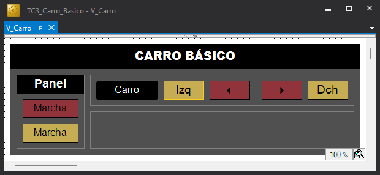
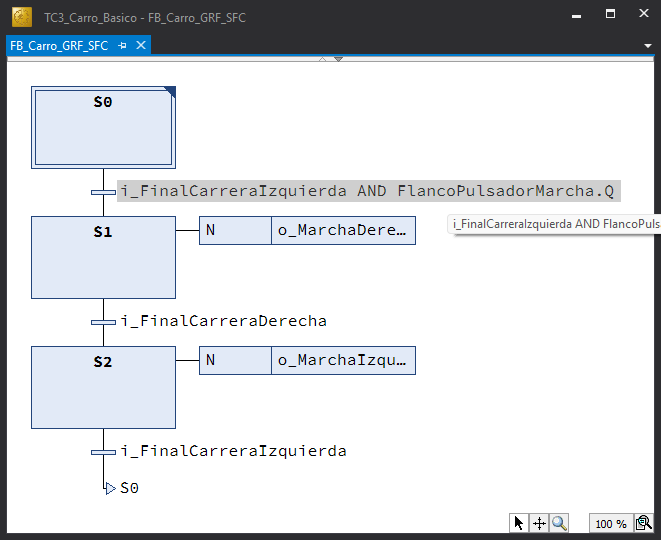
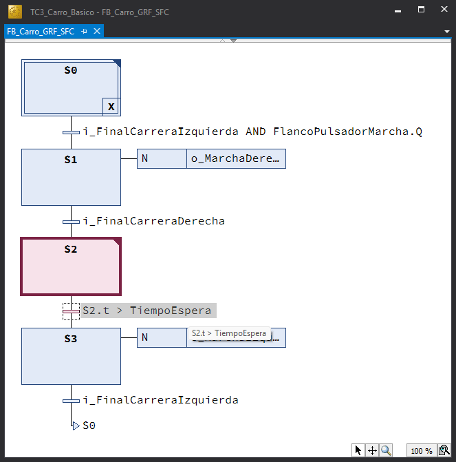
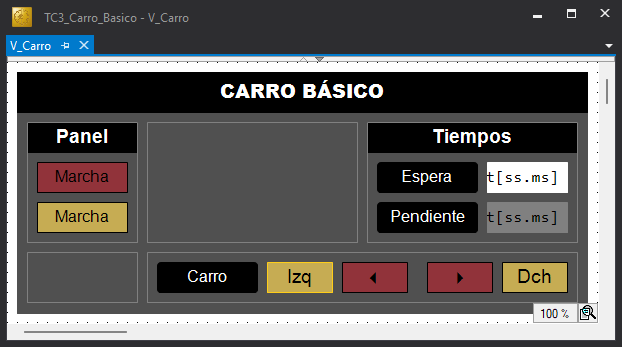

# :fontawesome-solid-screwdriver-wrench: Carro Básico - Guía de Implementación

--8<-- "snippets/avisos.md:documento-en-construccion"

## :fontawesome-solid-circle-info: Introducción

La máquina de estados que representa el comportamiento (lógica de control) de un automatismo industrial puede representarse utilizando diversos «lenguajes» de especificación. Tradicionales como los diagramas de relés y contactos o más actuales como el lenguaje GRAFCET.

El comportamiento especificado, que en el fondo no es más que una máquina de estados, finalmente debe codificarse en un determinado lenguaje de programación para ser procesado por un PLC.

Este ejemplo muestra cómo:

- Implementar con precisión una **máquina de estados**, especificada en **GRAFCET**, utilizando los lenguajes {{SFC}}, {{ST}} y {{LD}} de la norma **IEC 61131-3**.
- Transcribir con fiabilidad la lógica de control de un **diagrama de relés y contactos** al lenguaje {{LD}} de la norma **IEC 61131-3**.
- Utilizar los elementos básicos presentes en cualquier automatismo industrial: **detección de flancos**, **evaluación de lapsos de tiempo**, **contaje de eventos**.

---

## :fontawesome-solid-list-check: Guía de Implementación

Esta guía muestra paso a paso como replicar el ejemplo [**«Carro Básico»**](../carro-basico/index.md) para implementar una primera máquina de estados con TwinCAT 3 desde cero.

El punto de partida son las especificaciones en diagramas de relés y contactos y en diagramas gracet de la lógica de control del carro.

- [Diagrama de relés y contactos (PDF).](./pdf/carro_basico_drc.pdf)
- [Diagrama GRAFCET (PDF).](./pdf/carro_basico_grf.pdf)

A continuación se detallan los pasos necesarios para replicar completamente este proyecto.

!!! tip "Sugerencia"
    Pulsa en ➡️ para obtener más información sobre cómo realizar el paso especificado.

---

### Carro Básico

Transcripción de la lógica de control de carro básico especificada con el lenguaje **GRAFCET** a los lenguajes {{SFC}}, {{ST}} y {{LD}} de la norma IEC 61131-3 con TwinCAT 3.

{ width="200px" }

A continuación se muestra la tabla de entradas/salidas. Por conveniencia, en el diagrama *grafcet* se utilizan nombres cortos (etiquetas).

| Etiqueta | Origen | Tipo| Variable | Descripción |
|:---:|:---:|:---:|---|---|
| PM | Entrada| BOOL | i_PulsadorMarcha | Pulsador de Marcha |
| FCI | Entrada| BOOL | i_FinalCarreraIzquierda | Final de Carrera izquierda |
| FCD | Entrada| BOOL | i_FinalCarreraDerecha | Final de Carrera Derecha |
| MD | Salida| BOOL | o_MarchaDerecha | Marcha Derecha |
| MI | Salida| BOOL | o_MarchaIzquierda | Marcha Izquierda |

#### Carro Básico (GRAFCET a SFC)

1. Abrir la aplicación **TwinCAT XAE**. [➡️](../../procedimientos/workflow/index.md#abrir-twincat-xae)
2. Crear una solución de TwinCAT 3 con nombre `TC3_Carro_Basico`. [➡️](../../procedimientos/workflow/index.md#crear-un-proyecto-twincat-3)
3. Ocultar las configuraciones innecesarias para dejar el explorador de la solución lo más despejado posible. [➡️](../../procedimientos/workflow/index.md#ocultar-configuraciones)
4. Crear un proyecto PLC estándar con el nombre `Carro_Basico_PLC`. [➡️](../../procedimientos/workflow/index.md#crear-un-proyecto-plc)
5. Crear una nueva **Unidad de Organización de Programa (POU)** de tipo **Bloque Funcional**. [➡️](../../procedimientos/workflow/index.md#crear-una-pou)

    !!! warning "Parámetros POU"
        - Nombre ➔ `FB_Carro_GRF_SFC`
        - Type ➔ `Function Block`
        - Implementation Language ➔ `Sequential Function Chart (SFC)`

6. Declarar todas las **variables de entrada/salida** necesarias en `FB_Carro_SFC` como variables locales (`VAR_LOCAL`). [➡️](../../procedimientos/workflow/index.md#declarar-una-variable)

    ```iecst
    FUNCTION_BLOCK FB_Carro_GRF_SFC
    // Transcripción del grafcet (GRF -> SFC)
    VAR_INPUT
    END_VAR
    VAR_OUTPUT
    END_VAR
    VAR
        // Entradas
        i_PulsadorMarcha AT %I*: BOOL;
        i_FinalCarreraIzquierda AT %I*: BOOL := TRUE;
        i_FinalCarreraDerecha AT %I*: BOOL;

        // Salidas
        o_MarchaIzquierda AT %Q*: BOOL;
        o_MarchaDerecha AT %Q*: BOOL;
        o_LamparaMarcha AT %Q*: BOOL;
    END_VAR
    ```

    !!! info "Variables de Entrada y Salida"
        - **Ocultamiento**: las variables de entrada y salida se declaran como **locales** (`VAR`) para ocultarlas, para protegerlas, para que no sean accesibles desde fuera del bloque funcional.
        - **Direccionamiento**: se declaran con el modificador `AT` para situarlas, según corresponda, en la **Imagen de Entrada** (`%I`) o en la **Imagen de Salida** (`%Q`). No se especifica la posición de memoria (`*`) para dejar que TwinCAT se encargue de asignarle la dirección. Cuando se construya el proyecto las instancias correspondientes a estas variables estarán disponibles en la sección `I/O` para ser vinculadas con las señales presentes en los canales de entrada y salida.
        - **Valor Inicial**: La variable `i_FinalCarreraIzquierda` se inicia a `TRUE`. Aunque sea totalmente innecesario e incluso contradictorio, ya que las variables de entrada tomarán en el primer ciclo el valor que le corresponda según la señal de entrada a la que estén vinculadas. Establecer el valor inicial de algunas variables de entrada puede ser conveniente, desde un punto de vista práctico, cuando se ejecuta el código sin *hardware* (UmRT_Default), ya que así, cada vez que se reinicie la ejecución no hay que escribir uno a uno el valor de las variables que forman parte de la condición inicial.

7. Escribir el código SFC correspondiente al carro básico

    { width="400px" }

    !!! info "Código SFC"
        - En la transición S0-S1, `i_FinalCarreraIzquierda` es la **Condicion Inicial** y `i_PulsadorMarcha` es el evento que dispara la transición.
        - La **Condición Inicial** es la condición material (estado de los sensores) que se debe cumplir para iniciar la secuencia de funcionamiento con seguridad.

8. Declarar en `MAIN` una instancia `Carro` de `FB_Carro_GRF_SFC`.

   ```iecst
   PROGRAM MAIN
   VAR
       Carro: FB_Carro_GRF_SFC;
   END_VAR
   ```

9. Escribir en `MAIN` el código, una sola línea con la invocación a la instancia `Carro`.

   ```iecst
   Carro();
   ```

10. Construir el proyecto (**Build**) para generar un archivo ejecutable. [➡️](../../procedimientos/workflow/index.md#construir-el-proyecto)
11. Activar el simulador `UmRT_Default` para disponer de un runtime sobre el que ejecutar el código del proyecto. [➡️](../../procedimientos/workflow/index.md#activar-simulador)
12. Seleccionar `UmRT_Default` como sistema destino (**Target System**). [➡️](../../procedimientos/workflow/index.md#seleccionar-sistema-destino)
13. Activar la licencia temporal del runtime del sistema destino si es necesario. [➡️](../../procedimientos/workflow/index.md#activar-licencia)
14. Activar la configuración en el sistema destino.  [➡️](../../procedimientos/workflow/index.md#activar-la-configuracion)
15. Conectarse (**Login**) al sistema destino para transferir el proyecto. [➡️](../../procedimientos/workflow/index.md#transferir-el-proyecto)
16. Poner el programa de PLC en ejecución (**Run**). [➡️](../../procedimientos/workflow/index.md#arrancar-el-proyecto)
17. Probar el programa forzando las variables de entrada en el modo. [➡️](../../procedimientos/workflow/index.md#forzar-variables)
18. Crear una visualización mínima `V_Carro` que permita la prueba. Debe disponer de un elemento gráfico para modificar el valor de cada sensor y de un elemento gráfico para mostrar el valor de cada actuador.

    { width="400px" }

    ??? info "Visualización"
        - La visualización debe disponer al menos de:
            -  Un elemento gráfico para modificar el valor de cada sensor.
            -  Un elemento gráfico para mostrar el valor de cada actuador.
        - Sin embargo, resulta conveniente, que tanto los objetos gráficos destinados a los sensores como a los actuadores permitan leer y escribir las señales correspondientes. De esta forma se facilitará la prueba cuando se ejecute con el simulador (UmRt_Default) sin *hardware* asociado y se facilitará el modo manual cuando se ejecute sobre un controlador con *hardware* asociado.

19. Probar el programa desde la visualización accionando las entradas.

#### Carro Básico (GRAFCET a ST)

1. Añadir al proyecto un nuevo bloque funcional (`FB`) al proyecto `Carro_Basico_PLC`. [➡️](../../procedimientos/workflow/index.md#crear-una-pou)

    !!! warning "Parámetros POU"
        - Nombre ➔ `FB_Carro_GRF_ST`
        - Type ➔ `Function Block`
        - Implementation Language ➔ `Structured Text`

2. Copiar el bloque de declaración de variables locales (`VAR`) del FB anterior (`FB_Carro_GRF_SFC`), añadiendo una variable entera `Estado` para contener el valor del estado actual.

    ```iecst {hl_lines="8"}
    FUNCTION_BLOCK FB_Carro_GRF_ST
    // Transcripción del grafcet (GRF -> ST)
    VAR_INPUT
    END_VAR
    VAR_OUTPUT
    END_VAR
    VAR
        Estado: UINT;

        // Entradas
        i_PulsadorMarcha AT %I*: BOOL;
        i_FinalCarreraIzquierda AT %I*: BOOL := TRUE;
        i_FinalCarreraDerecha AT %I*: BOOL;

        // Salidas
        o_MarchaIzquierda AT %Q*: BOOL;
        o_MarchaDerecha AT %Q*: BOOL;
        o_LamparaMarcha AT %Q*: BOOL;
    END_VAR
    ```

3. Escribir el código {{ST}} correspondiente al carro básico.

    ```iecst
    // FUNCION DE ESTADO
    CASE Estado OF
        0: // Reposo
            IF i_FinalCarreraIzquierda AND i_PulsadorMarcha THEN
                Estado := 1;
            END_IF;
        1: // Marcha Derecha
            IF i_FinalCarreraDerecha THEN
                Estado := 2;
            END_IF;
        2: // Marcha Izquierda
            IF i_FinalCarreraIzquierda THEN
                Estado := 0;
            END_IF;
    END_CASE;

    // FUNCION DE SALIDA
    o_MarchaDerecha := (Estado = 1);
    o_MarchaIzquierda := (Estado = 2);
    ```

    ??? info "Implementación FB_Carro_GRF_ST"
        - La estructura de selección múltiple `CASE`, permite evaluar elegantemente la función de transición entre estados expresada en el diagrama grafcet. Así, dependiendo del estado en el que se encuentre el sistemas ([0, 1, 2]) y los eventos de entrada (`i_FinalCarreraDerecha`, `i_FinalCarreraIzquierda`,... ) se calcula el nuevo estado asignando un nuevo valor a la variable Estado.
        - Las salidas se calculan, tal y como se especifica en el diagrama grafcet, a partir del estado (**Salidas Continuas**).

4. Añadir a `MAIN` la declaración de una nueva instancia `Carro` de `FB_Carro_GRF_ST` y comentar la anterior.

    ```iecst {hl_lines="4"}
    PROGRAM MAIN
    VAR
        // Carro: FB_Carro_GRF_SFC;
        Carro: FB_Carro_GRF_ST;
    END_VAR
    ```

    ??? info "Implementación MAIN"
        Al compartir ambos bloques funcionales las mismas variables de entrada y salida:

        - No es necesario volver a activar la configuración.
        - Las rutas de los enlaces de los objetos gráficos con las variables son los mismos.

5. Repetir los pasos 10 a 16 de la sección anterior.
6. Probar el programa desde la visualización accionando las entradas.
7. Cambiar la declaración de la variable Estación a tipo enumerado implícito/local.

    ```iecst {hl_lines="8"}
    FUNCTION_BLOCK FB_Carro_GRF_ST
    // Transcripción del grafcet (GRF -> ST)
    VAR_INPUT
    END_VAR
    VAR_OUTPUT
    END_VAR
    VAR
        Estado: (E_REPOSO, E_MARCHA_DERECHA, E_MARCHA_IZQUIERDA);

        // Entradas
        i_PulsadorMarcha AT %I*: BOOL;
        i_FinalCarreraIzquierda AT %I*: BOOL := TRUE;
        i_FinalCarreraDerecha AT %I*: BOOL;

        // Salidas
        o_MarchaIzquierda AT %Q*: BOOL;
        o_MarchaDerecha AT %Q*: BOOL;
        o_LamparaMarcha AT %Q*: BOOL;
    END_VAR
    ```

8. Modificar la implementación sustituyendo los valores numéricos del estado por las etiquetas del tipo enumerado.

    ```iecst
    // FUNCION DE ESTADO
    CASE Estado OF
        E_REPOSO:
            IF i_FinalCarreraIzquierda AND i_PulsadorMarcha THEN
                Estado := E_MARCHA_DERECHA;
            END_IF;
        E_MARCHA_DERECHA:
            IF i_FinalCarreraDerecha THEN
                Estado := E_MARCHA_IZQUIERDA;
            END_IF;
        E_MARCHA_IZQUIERDA: // Marcha Izquierda
            IF i_FinalCarreraIzquierda THEN
                Estado := E_REPOSO;
            END_IF;
    END_CASE;

    // FUNCION DE SALIDA
    o_MarchaDerecha := (Estado = E_MARCHA_DERECHA);
    o_MarchaIzquierda := (Estado = E_MARCHA_IZQUIERDA);
    ```

    ??? Info "Enumerados"
        - Puede observarse la evidente mejora semántica que produce la utilización de enumerados. No es lo mismo referirse a los distintos estados con un simple número (que no dice nada) que con una etiqueta descriptiva.
        - La utilización de enumerados hace innecesairo el uso de comentarios para aclarar el significado de los estados.

#### Carro Básico (GRAFCET a LD)

--8<-- "snippets/avisos.md:seccion-en-construccion"

#### Carro Básico (DRC a LD)

--8<-- "snippets/avisos.md:seccion-en-construccion"

---

### Carro Pulsado

Para iniciar la marcha el sistema requiere que se accione el pulsador de marcha. Por lo que se añade la detección del flanco positivo del pulsador de marcha, que en el leguaje GRAFCET se representa con el símbolo `↑`.

{ width="200px" }

#### Carro Pulsado (GRAFCET a SFC)

1. Añadir en `FB_Carro_GRF_SFC` la declaración de una instancia del bloque funcional `R_TRIG` de la librería estándar (`Tc2_Standard`) para la detección del flanco positivo del pulsador de marcha.

    ```iecst {hl_lines="8-9"}
    FUNCTION_BLOCK FB_Carro_GRF_SFC
    // Transcripción del grafcet (GRF -> SFC)
    VAR_INPUT
    END_VAR
    VAR_OUTPUT
    END_VAR
    VAR
        // Bloques Funcionales
        FlancoPulsadorMarcha: R_TRIG;

        // Entradas
        i_PulsadorMarcha AT %I*: BOOL;
        i_FinalCarreraIzquierda AT %I*: BOOL := TRUE;
        i_FinalCarreraDerecha AT %I*: BOOL;

        // Salidas
        o_MarchaIzquierda AT %Q*: BOOL;
        o_MarchaDerecha AT %Q*: BOOL;
        o_LamparaMarcha AT %Q*: BOOL;
    END_VAR
    ```

2. Añadir a `FB_Carro_GRF_SFC` una acción `a_FlancoPulsadorMarcha_Evaluar` (ST), en el que se invoque la ejecución del detector de flanco `FlancoPulsadorMarcha`.

    ```iesst
    FlancoPulsadorMarcha(CLK := i_PulsadorMarcha);
    ```

3. Incluir la acción `a_FlancoPulsadorMarcha_Evaluar` como acción principal (`Main action`) en la etapa inicial (`S0`), para que se ejecute continuamente (una vez por ciclo) mientras el sistema esté en la etapa inicial.
4. Sustituir `i_PulsadorMarcha` por `FlancoPulsadorMarcha.Q`, en la condición de la transición de salida de la etapa inicial.

    { width="400px" }

5. Modificar, nuevamente, el programa principal para que la instancia que se invoque ejecute el código de `FB_Carro_GRF_SFC`, dejando sin comentar la acción correspondiente.

    ```iecst {hl_lines="3"}
    PROGRAM MAIN
    VAR
        Carro: FB_Carro_GRF_SFC;
        // Carro: FB_Carro_GRF_ST;
        // Carro: FB_Carro_GRF_LD;
    END_VAR
    ```

6. Poner el programa en ejecución y comprobar que no basta para iniciar la marcha con que el pulsador de marcha esté activado, sino que es necesario que se realice una acción de impulso.

#### Carro Pulsado (GRAFCET a ST)

1. Añadir en `FB_Carro_GRF_ST` la declaración de una instancia del bloque funcional `R_TRIG` de la librería estándar (`Tc2_Standard`) para la detección del flanco positivo del pulsador de marcha.

    ```iecst {hl_lines="10-11"}
    FUNCTION_BLOCK FB_Carro_GRF_ST
    // Transcripción del grafcet (GRF -> ST)
    VAR_INPUT
    END_VAR
    VAR_OUTPUT
    END_VAR
    VAR
        Estado: (E_REPOSO, E_MARCHA_DERECHA, E_MARCHA_IZQUIERDA);

        // Bloques Funcionales
        FlancoPulsadorMarcha: R_TRIG;

        // Entradas
        i_PulsadorMarcha AT %I*: BOOL;
        i_FinalCarreraIzquierda AT %I*: BOOL := TRUE;
        i_FinalCarreraDerecha AT %I*: BOOL;

        // Salidas
        o_MarchaIzquierda AT %Q*: BOOL;
        o_MarchaDerecha AT %Q*: BOOL;
        o_LamparaMarcha AT %Q*: BOOL;
    END_VAR
    ```

2. Modifica en la parte de implementación de `FB_Carro_GRF_ST` el código:
    - Añadir la instrucción correspondiente a la invocación del detector de flanco `FlancoPulsadorMarcha(CLK := i_PulsadorMarcha)`.
    - Sustituir en la expresión de la condición de transición de la etapa `E_REPOSO` ➔ `E_MARCHA_DERECHA`, `PulsadorMarcha` por la salida de la instancia del bloque funcional que detecta los flancos positivos en la variable (`FlancoPulsadorMarcha.Q`).

    ```iecst {hl_lines="4-5 7"}
    // FUNCION DE ESTADO
    CASE Estado OF
        E_REPOSO:
            // Acción principal
            FlancoPulsadorMarcha(CLK := i_PulsadorMarcha);

            IF i_FinalCarreraIzquierda AND FlancoPulsadorMarcha.Q THEN
                Estado := E_MARCHA_DERECHA;
            END_IF;
        E_MARCHA_DERECHA:
            IF i_FinalCarreraDerecha THEN
                Estado := E_MARCHA_IZQUIERDA;
            END_IF;
        E_MARCHA_IZQUIERDA: // Marcha Izquierda
            IF i_FinalCarreraIzquierda THEN
                Estado := E_REPOSO;
            END_IF;
    END_CASE;

    // FUNCION DE SALIDA
    o_MarchaDerecha := (Estado = E_MARCHA_DERECHA);
    o_MarchaIzquierda := (Estado = E_MARCHA_IZQUIERDA);
    ```

3. Modificar, una vez más, el programa principal `MAIN` para que la instancia que se invoque ejecute el código de `FB_Carro_GRF_ST`, dejando sin comentar la acción correspondiente.

    ```iecst {hl_lines="4"}
    PROGRAM MAIN
    VAR
        // Carro: FB_Carro_GRF_SFC;
        Carro: FB_Carro_GRF_ST;
        // Carro: FB_Carro_GRF_LD;
    END_VAR
    ```

4. Poner el programa en ejecución y comprobar que no basta para iniciar la marcha con que el pulsador de marcha esté activado, sino que es necesario que se realice una acción de impulso.

#### Carro Pulsado (GRAFCET a LD)

--8<-- "snippets/avisos.md:seccion-en-construccion"

#### Carro Pulsado (DRC a LD)

--8<-- "snippets/avisos.md:seccion-en-construccion"

---

### Carro Temporizado

Antes de iniciar el camino de regreso el carro debe esperar en la derecha un determinado tiempo. En GRAFCET, para temporizar el tiempo de espera (`TE`) en la etapa 2, se puede utilizar una condición de transición dependiente del tiempo simplificada (`TE/X2`).

{ width="200px" }

#### Carro Temporizado (GRAFCET a SFC)

1. Añadir en `FB_Carro_GRF_SFC` la declaración del parámetro de entrada `TiempoEspera` de tipo `TIME` en el bloque de declaración `VAR_INPUT`. Esto permitirá que este parámetro pueda ser modificado desde fuera del bloque funcional. Eventualmente, puede indicarse un valor inicial en su defecto (`T#2S`). Y un parámetro de salida `TiempoPendiente` en el bloque de declaración `VAR_OUTPUT` para informar del tiempo de espera pendiente.

    ```iecst {hl_lines="4 7"}
    FUNCTION_BLOCK FB_Carro_GRF_SFC
    // Transcripción del grafcet (GRF -> SFC)
    VAR_INPUT
        TiempoEspera: TIME := T#2S;
    END_VAR
    VAR_OUTPUT
        TiempoPendiente: TIME;
    END_VAR
    VAR
        // Bloques Funcionales
        FlancoPulsadorMarcha: R_TRIG;

        // Entradas
        i_PulsadorMarcha AT %I*: BOOL;
        i_FinalCarreraIzquierda AT %I*: BOOL := TRUE;
        i_FinalCarreraDerecha AT %I*: BOOL;

        // Salidas
        o_MarchaIzquierda AT %Q*: BOOL;
        o_MarchaDerecha AT %Q*: BOOL;
        o_LamparaMarcha AT %Q*: BOOL;
    END_VAR
    ```

2. Añadir una nueva etapa para representar el estado de espera e incluir en la transición de salida la condición `S2.t > TiempoEspera`, equivalente a la condición de tiempo del diagrama grafcet `TE/X2`.

    { width="400px" }

3. Añadir a FB_Carro_GRF_SFC una acción denominda `a_TiempoPendiente_Calcular` ({{ST}}), para calcular el tiempo de espera pendiente.

    ```iecst
    IF TiempoEspera >= S2.t THEN
        TiempoPendiente := TiempoEspera - S2.t;
    ELSE
        TiempoPendiente := T#0S;
    END_IF;
    ```

    ??? Info "Programación Defensiva"
        La condición defensiva `TiempoEspera >= S2.t` **previene un desbordamiento negativo (*underflow*) en la resta**, asegurando que el cálculo solo se realice cuando el resultado sea mayor o igual a cero. Además, la estructura `ELSE` garantiza el **determinismo del PLC** al forzar explícitamente la variable a `T#0S`, evitando que `TiempoPendiente` retenga valores obsoletos de ciclos anteriores si la condición no se cumple. La **Programación Defensiva** usada en su justa medida se considera una buena práctica de programación que favorece el **Código Limpio**.

4. Incluir la acción `a_TiempoPendiente_Calcular` como acción principal (**Main action**) en la etapa de espera (`S2`).
5. Incluir en la visualización `V_Carro` un objeto gráfico que permita introducir el tiempo de espera deseado y otro que informe del tiempo pendiente.

    { width="400px" }

6. Proceder como en la sección anterior probar el programa desde la visualización.

#### Carro Temporizado (GRAFCET a ST)

1. Añadir en `FB_Carro_GRF_ST` la declaración:
    - Un parámetro de entrada `TiempoEspera` de tipo `TIME` en el bloque de declaración `VAR_INPUT`. Esto permitirá que este parámetro pueda ser modificado desde fuera del bloque funcional. Eventualmente, puede indicarse un valor inicial en su defecto (`T#2S`).
    - Un parámetro de salida `TiempoPendiente` en el bloque de declaración `VAR_OUTPUT` para informar del tiempo de espera pendiente.
    - Una nueva etiqueta `E_ESPERA` correspondiente al estado de espera.
    - Una instancia `TemporizadorEspera` del bloque funcional **Temporizador de Retardo a la Conexión** (`TON`) de la libreria estándar para temporizar la espera.

    ```iecst {hl_lines="4 7 10 14"}
    FUNCTION_BLOCK FB_Carro_GRF_ST
    // Transcripción del grafcet (GRF -> ST)
    VAR_INPUT
        TiempoEspera: TIME := T#2S;
    END_VAR
    VAR_OUTPUT
        TiempoPendiente: TIME;
    END_VAR
    VAR
        Estado: (E_REPOSO, E_MARCHA_DERECHA, E_ESPERA, E_MARCHA_IZQUIERDA);

        // Bloques Funcionales
        FlancoPulsadorMarcha: R_TRIG;
        TemporizadorEspera: TON;

        // Entradas
        i_PulsadorMarcha AT %I*: BOOL;
        i_FinalCarreraIzquierda AT %I*: BOOL := TRUE;
        i_FinalCarreraDerecha AT %I*: BOOL;

        // Salidas
        o_MarchaIzquierda AT %Q*: BOOL;
        o_MarchaDerecha AT %Q*: BOOL;
        o_LamparaMarcha AT %Q*: BOOL;
    END_VAR
    ```

2. Modificar en la parte de implementación de `FB_Carro_GRF_ST` el código:
    - Añadir la llamada a TemporizadorEspera.
    - Modificar el estado futuro (E_MARCHA_IZQUIERDA ➔ E_ESPERA) de E_MARCHA_DERECHA
    - Incluir el fragmento de código correspondiente al estado E_ESPERA.

    ```iecst {hl_lines="2 15 17-25"}
    // BLOQUES FUNCIONALES
    TemporizadorEspera(IN := (Estado = E_ESPERA), PT := TiempoEspera);

    // FUNCION DE ESTADO
    CASE Estado OF
        E_REPOSO:
            // Acción principal
            FlancoPulsadorMarcha(CLK := i_PulsadorMarcha);

            IF i_FinalCarreraIzquierda AND FlancoPulsadorMarcha.Q THEN
                Estado := E_MARCHA_DERECHA;
            END_IF;
        E_MARCHA_DERECHA:
            IF i_FinalCarreraDerecha THEN
                Estado := E_ESPERA;
            END_IF;
        E_ESPERA:
            // Acción principal
            IF (TiempoEspera >= TemporizadorEspera.ET) THEN
                TiempoPendiente := TiempoEspera - TemporizadorEspera.ET;
            END_IF;

            IF TemporizadorEspera.Q  THEN
                Estado := E_MARCHA_IZQUIERDA;
            END_IF;
        E_MARCHA_IZQUIERDA:
            IF i_FinalCarreraIzquierda THEN
                Estado := E_REPOSO;
            END_IF;
    END_CASE;

    // FUNCION DE SALIDA
    o_MarchaDerecha := (Estado = E_MARCHA_DERECHA);
    o_MarchaIzquierda := (Estado = E_MARCHA_IZQUIERDA);
    ```

3. Proceder como en la sección anterior probar el programa desde la visualización.

---

#### Carro Temporizado (GRAFCET a LD)

--8<-- "snippets/avisos.md:seccion-en-construccion"

#### Carro Temporizado (DRC a LD)

--8<-- "snippets/avisos.md:seccion-en-construccion"

---

### Carro Computado

Con el carro computado se introduce el concepto de trabajo por lotes. En el trabajo por lotes el sistema hace una tarea por cada activación del pulsador de marcha sin intervención del operario, por lo que es necesario llevar la cuenta de los viajes (maniobras) que realiza el carro. Para llevar esta cuenta en GRAFCET se acostumbra a distribuir esta funcionalidad entre la estructura y la interpretación.

- En la estructura se introduce una nueva etapa y una rama alternativa con la que evaluar si se ha terminado la tarea.
- En la interpretación se incluyen dos acciones memorizadas, una para iniciar el contador de viajes pendientes y otra para actualizar el contador con cada maniobra finalizada.

    { width="400px" }

??? info "Contadores"
    Por razones históricas, en automatización se suele utilizar **cuentas regresivas**. En los antiguos sistemas electromecánicos y de electrónica discreta, comprobar si un contador había finalizado su tarea era drásticamente más simple y económico si se comparaba con el **cero absoluto**. Esta comparación requiere únicamente un contacto físico o una sola compuerta lógica (`NOR`), independientemente del valor de la cuenta.
    Esta lógica de diseño se heredada para optimizar el rendimiento en los procesadores de los PLC modernos, los cuales activan un indicador de estado (*Zero Flag*) al alcanzar el cero, evitando instrucciones de comparación adicionales y ofreciendo un control intrínsecamente más seguro ante desbordamientos.

#### Carro Computado (GRAFCET a SFC)

#### Carro Computado (GRAFCET a ST)

#### Carro Computado (GRAFCET a LD)

--8<-- "snippets/avisos.md:seccion-en-construccion"

#### Carro Computado (DRC a LD)

--8<-- "snippets/avisos.md:seccion-en-construccion"

---

<!---

    - Parámetros de entrada
        - Las variables **ManiobrasTotales** y **TiempoEspera** se declaran como parámetros de entrada para que sean modificables desde fuera del FB.
        - **ManiobrasTotales** (PV) es el valor prefijado de viajes (maniobras) que debe realizar el carro. Por convención se le asigna un valor inicial distinto de 0 (1).
  --->
