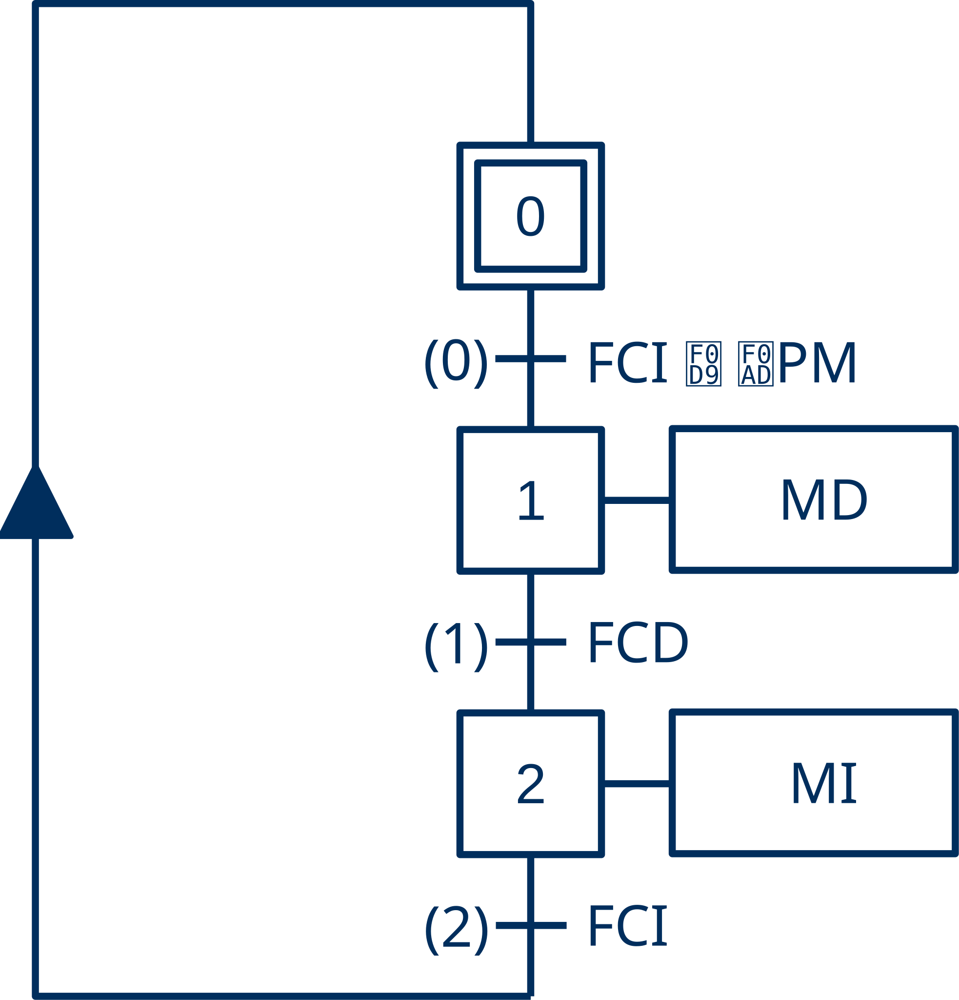
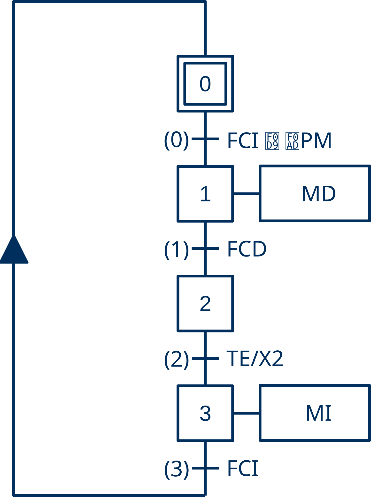
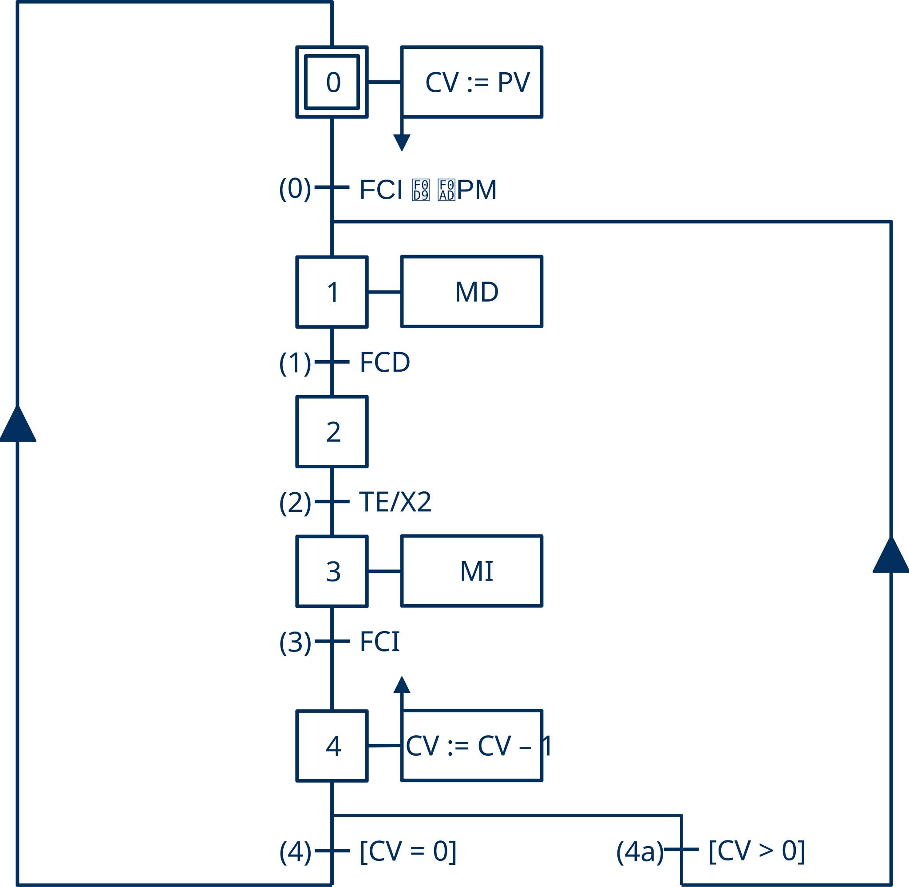

# :fontawesome-solid-screwdriver-wrench: Carro Básico - Guía de Implementación

--8<-- "snippets/avisos.md:documento-en-construccion"

## :fontawesome-solid-circle-info: Introducción

Las **máquinas de estados** que representan el comportamiento (lógica de control) de un automatismo industrial puede representarse utilizando diversos «lenguajes» de especificación. Tradicionales como los **diagramas de relés y contactos** o más actuales como el lenguaje **GRAFCET**.

El comportamiento especificado en estos diagramas, finalmente debe codificarse en un determinado lenguaje de programación para ser procesado por un PLC.

En esta guía se muestra como replicar paso a paso el [**«Carro Básico»**](../carro-basico/index.md) en todas sus modalidades (básico, pulsado, temporizado, computado y señalizado), para lo que será necersario:

- Especificar una **máquina de estados** con el lenguaje **GRAFCET**.
- Especificar una **máquina de estados** con **diagramas de relés y contactos**.
- Implementar un **GRAFCET**, utilizando los lenguajes {{SFC}}, {{ST}} y {{LD}} de la norma **IEC 61131-3**.
- Implementar un **diagrama de relés y contactos**, utiliando el lenguaje {{LD}} de la norma **IEC 61131-3**.
- Utilizar los elementos básicos presentes en casi cualquier automatismo industrial: **detección de flancos**, **evaluación de lapsos de tiempo**, **contaje de eventos**.

!!! tip "Sugerencia"
    Pulsa en ➡️ para obtener más información sobre cómo realizar el paso especificado.
---

## :fontawesome-solid-list-check: Especificación con GRAFCET

### Carro Básico

El carro básico se desplaza longitudinalmente entre los extermos de una vía.

{ width="200px" }

- Inicialmente el carro se encuentra detenido en la izquerda.
- Cuando se acciona el pulsador, se pone en marcha hacia la derecha.
- Cuando alcanza el extermo derecho, invierte el sentido de la marcha.
- Cuando alcanza el extremo izquierdo, se detiene.

??? info "Tabla de Variables"

    | Etiqueta | Origen | Tipo| Variable | Descripción |
    |:---:|:---:|:---:|---|---|
    | PM | Entrada| Binaria | i_PulsadorMarcha | Pulsador de Marcha |
    | FCI | Entrada| Binaria | i_FinalCarreraIzquierda | Final de Carrera izquierda |
    | FCD | Entrada| Binaria | i_FinalCarreraDerecha | Final de Carrera Derecha |
    | MD | Salida| Binaria | o_MarchaDerecha | Marcha Derecha |
    | MI | Salida| Binaria | o_MarchaIzquierda | Marcha Izquierda |

??? warning "Nomenclatura"
    - Por conveniencia, en el diagrama *grafcet* se utilizan nombres cortos (etiquetas).
    - Sin embargo, para obtener un código limpio los identificadores de las variables tienen una carga semántica clara que revela su propósito sin necesidad de comentario adicional.

### Carro Pulsado

El carro pulsado inicia su viaje de ida y vuelta, únicamente, cuando estando en su posición inicial se acciona el pulsador de marcha.

{ width="200px" }

- Se añade la detección del flanco positivo del pulsador de marcha, que se representa en GRAFCET con el símbolo `↑`.

### Carro Temporizado

El carro temporizado se detiene durante un determinado tiempo ($T_{espera}$) sobre el final de carrera derecha antes de iniciar el camino de regreso hacia su posición inicial.

{ width="200px" }

- La expresión `(TE)/X2` es el símbolo **GRAFCET** (condición de transición dependiente del tiempo simplificada) utilizado para indicar que se esperará en la etapa `2` la cantidad de tiempo indicada por `TE`.

### Carro Computado

El carro computado realiza un determinado número de viajes consecutivos de ida y vuelta (tarea) cada vez que, estando en su posición inicial, se acciona el pulsador de marcha.

??? info "Procesamiento por lotes"
    Con el carro computado se introduce el concepto de trabajo por lotes. En el trabajo por lotes el sistema hace una tarea por cada activación del pulsador de marcha sin intervención del operario, por lo que es necesario llevar la cuenta de los viajes (maniobras) que realiza el carro.

{ width="400px" }

Para llevar esta cuenta en GRAFCET se acostumbra a distribuir esta funcionalidad entre la estructura y la interpretación.

- En la estructura se introduce una nueva etapa (`4`) y una rama alternativa (`4a`) con la que evaluar si se la tareas ha terminado.
- En la interpretación se incluyen dos acciones memorizadas, una asociada a la activación de la etapa inicial (`S0`) para iniciar el contador de viajes pendientes y otra asociada a la entrada de la etapa final (`S4`) para actualizar el contador con cada maniobra finalizada.

??? info "Contadores"
    Por razones históricas, en automatización se suele utilizar **cuentas regresivas**. En los antiguos sistemas electromecánicos y de electrónica discreta, comprobar si un contador había finalizado su tarea era drásticamente más simple y económico si se comparaba con el **cero absoluto**. Esta comparación requiere únicamente un contacto físico o una sola compuerta lógica (`NOR`), independientemente del valor de la cuenta.
    Esta lógica de diseño se heredada para optimizar el rendimiento en los procesadores de los PLC modernos, los cuales activan un indicador de estado (*Zero Flag*) al alcanzar el cero, evitando instrucciones de comparación adicionales y ofreciendo un control intrínsecamente más seguro ante desbordamientos.

---

## Implementación por tipo de transcripción

### GRAFCET a SFC

--8<-- "docs/contenidos/ejemplos/carro-basico/includes/grafcet-a-sfc.md"

### GRAFCET a ST

--8<-- "docs/contenidos/ejemplos/carro-basico/includes/grafcet-a-st.md"

### GRAFCET a LD

--8<-- "docs/contenidos/ejemplos/carro-basico/includes/grafcet-a-ld.md"

---

## :fontawesome-solid-bolt: Especificación con Diagramas de Relés

### Diagramas de relés a LD

--8<-- "docs/contenidos/ejemplos/carro-basico/includes/reles-a-ld.md"
