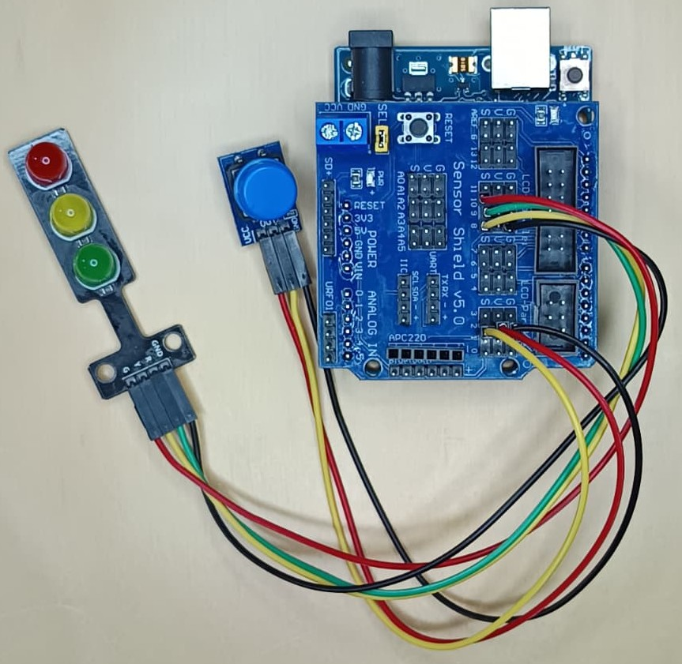
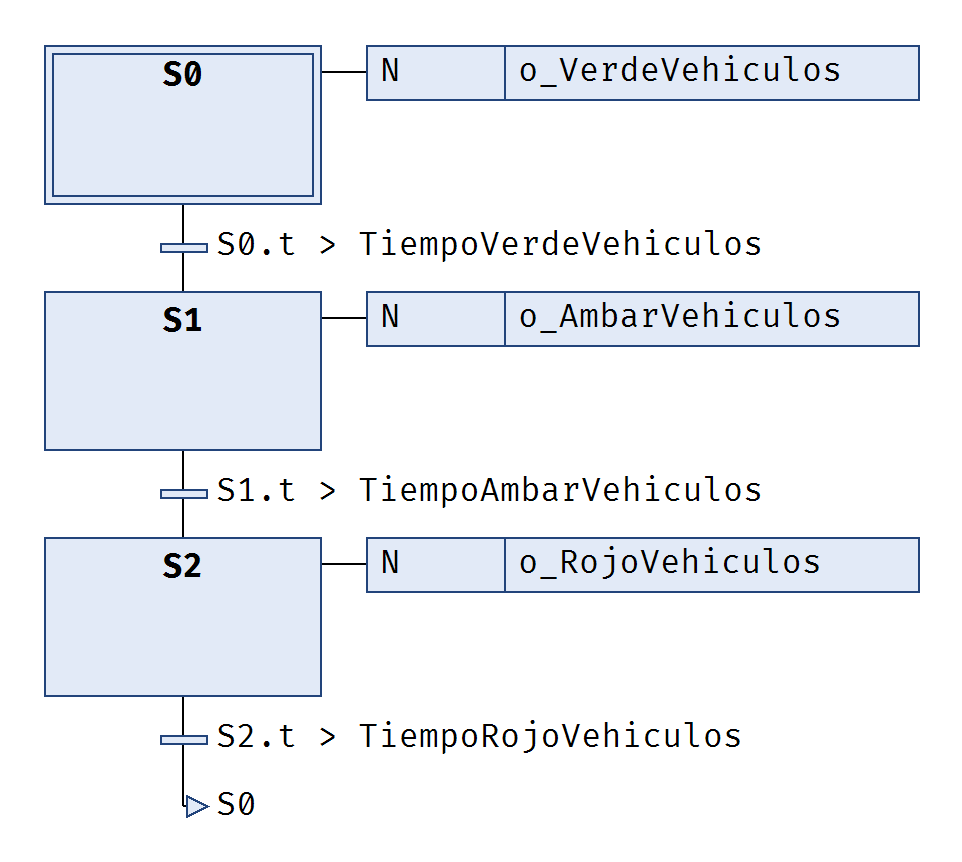
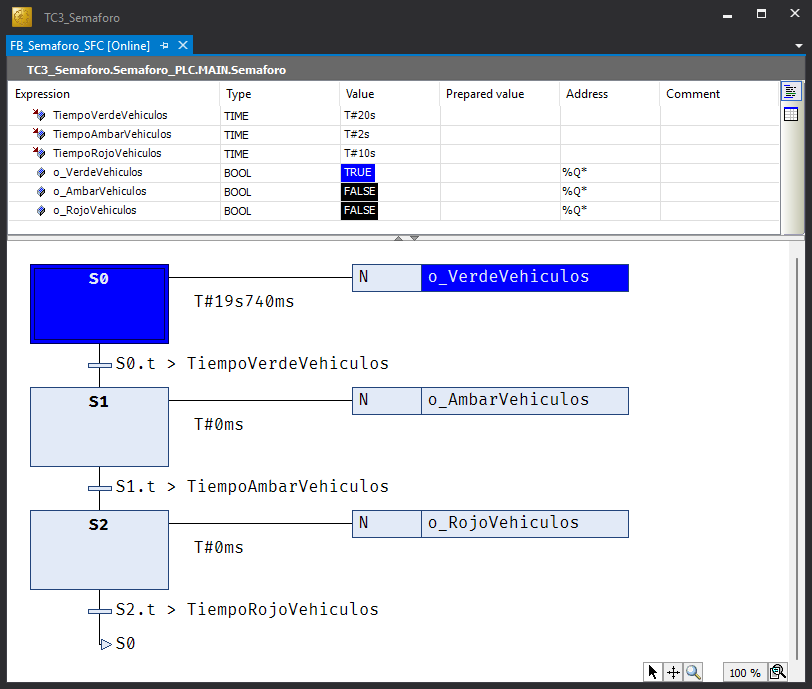

# :fontawesome-solid-traffic-light: Semáforo

## :fontawesome-solid-clipboard-list: Tarea

Implementar la lógica de control de un semáforo simple de peatones para la regulación del tráfico en una vía de sentido único.

---

## :fontawesome-solid-bullseye: Objetivos

- Aprender a transcribir máquinas de estado especificadas con diagramas GRAFCET utilizando los lenguajes {{SFC}}, {{ST}} y {{LD}}.
- Aprender a editar un **bloque funcional (FB)** utilizando el lenguaje {{SFC}} en **TwinCAT 3**.
- Aprender a usar **ArduTC** para utilizar una placa microcontroladora como terminal de E/S de **TwinCAT 3**.

---

## :fontawesome-solid-file-lines: Descripción Funcional

Inicialmente el semáforo consta únicamente de las luces roja, ámbar y verde para vehículos.

El funcionamiento requerido será la secuencia típica verde -> ámbar -> rojo.

| Parámetro | Valor inicial |
| :---: | :---: |
| $T_{verde}$ | 20 s |
| $T_{ámbar}$ | 3 s |
| $T_{rojo}$ | 10 s |

## :fontawesome-solid-arrows-left-right: Entradas y Salidas

| Nombre | Tipo | Origen | Descripción |
| :---: | :---: | :---: | :--- |
| `o_VerdeVehiculos` | `BOOL` | Salida | Luz verde para vehículos |
| `o_AmbarVehiculos` | `BOOL` | Salida | Luz ámbar para vehículos |
| `o_RojoVehiculos` | `BOOL` | Salida | Luz roja para vehículos |

---

## :fontawesome-solid-diagram-project: Especificación Funcional

La siguiente especificación funcional describe el comportamiento del semáforo utilizando el lenguaje GRAFCET.

--8<-- "snippets/avisos.md:seccion-en-construccion"

---

## :fontawesome-solid-toolbox: Materiales

Para la realización de esta práctica es necesario disponer de los siguientes materiales adicionales.

- Una **placa microcontroladora** compatible con **ArduTC** y **Telemetrix**.
- Un **cable USB**, para conectar la placa microcontroladora al ordenador.
- Una placa de pruebas o una **Sensor Shield V5** (o equivalente).
- Un **montaje con tres leds (verde, amarillo, rojo)** y un **pulsador** conectados a los correspondientes pines de la placa microcontroladora.
- Aplicación **ArduTC** instalada.

{ width="300px" }

<figcaption>Figura 1: Montaje con Arduino UNO y una Sensor Shield V5.</figcaption>
---

## :fontawesome-solid-screwdriver-wrench: Guía de Implementación

### Proyecto TwinCAT 3 en SFC

A continuación, se detalla la secuencia de pasos necesarios para codificar, en el lenguaje {{SFC}}, la máquina de estados que describe el comportamiento de la lógica de control del semáforo simple especificada con un diagrama GRAFCET.

1. Abrir la aplicación **TwinCAT XAE**. [➡️](../../procedimientos/workflow/index.md#abrir-twincat-xae)
2. Crear un **proyecto (solución) TwinCAT 3** con nombre `TC3_Semaforo`. [➡️](../../procedimientos/workflow/index.md#crear-un-proyecto-twincat-3)
3. Ocultar las **configuraciones** innecesarias para dejar el explorador de la solución lo más despejada posible. [➡️](../../procedimientos/workflow/index.md#ocultar-configuraciones)
4. Crear un **proyecto PLC estándar** con el nombre `Semaforo_PLC`. [➡️](../../procedimientos/workflow/index.md#crear-un-proyecto-plc)
5. Crear una nueva **Unidad de Organización de Programa (POU)** de tipo **Bloque Funcional**. [➡️](../../procedimientos/workflow/index.md#crear-una-pou)

    !!! warning "Parámetros POU"
        - Nombre ➔ `FB_Semaforo_SFC`
        - **Type** ➔ **Function Block**
        - **Implementation Language** ➔ **Sequential Function Chart (SFC)**

6. Declarar los **parámetros y variables** necesarios en `FB_Semaforo_SFC`. [➡️](../../procedimientos/workflow/index.md#declarar-una-variable)

    ```iecst
    FUNCTION_BLOCK FB_Semaforo_SFC
    VAR_INPUT
        TiempoVerdeVehiculos: TIME := T#20S;
        TiempoAmbarVehiculos: TIME := T#2S;
        TiempoRojoVehiculos: TIME := T#10S;
    END_VAR
    VAR_OUTPUT
    END_VAR
    VAR
        o_VerdeVehiculos AT %Q*: BOOL;
        o_AmbarVehiculos AT %Q*: BOOL;
        o_RojoVehiculos AT %Q*: BOOL;
    END_VAR
    ```

7. Escribir el **código** en {{SFC}} en la parte de implementación de `FB_Semaforo_SFC`.

    { width="420px" }

8. Declarar una **instancia** `Semaforo` del tipo `FB_Semaforo_SFC` en la parte de declaración del programa `MAIN`.

    ```iecst
    PROGRAM MAIN
    VAR
        Semaforo: FB_Semaforo_SFC;
    END_VAR
    ```

9. Invocar la ejecución de la **instancia** `Semaforo` en la parte de implementación de `MAIN`.

    ```iecst
    Semaforo();
    ```

10. Construir el proyecto (**Build**) para generar un archivo ejecutable. [➡️](../../procedimientos/workflow/index.md#construir-el-proyecto)
11. Activar el simulador `UmRT_Default` para disponer de un runtime sobre el que ejecutar el código del proyecto. [➡️](../../procedimientos/workflow/index.md#activar-simulador)

    !!! warning "Importante"
        Tomar nota de la dirección **AmsNetId** del simulador `UmRT_Default` que se muestra en la pantalla de la terminal (por ejemplo, `192.168.4.1.1.1`).

12. Seleccionar `UmRT_Default` como sistema destino (**Target System**). [➡️](../../procedimientos/workflow/index.md#seleccionar-sistema-destino)

    !!! warning "Importante"
        Tomar nota del puerto de comunicaciones entre el entorno de programación (**TwinCAT XAE**) y el sistema destino (**Target System**).

13. Activar la licencia temporal del `runtime` del sistema destino si es necesario.  [➡️](../../procedimientos/workflow/index.md#activar-licencia)
14. Activar la configuración (**Activate Configuration**) y confirmar el reinicio del sistema destino en modo ejecución (**Run Mode**). [➡️](../../procedimientos/workflow/index.md#activar-la-configuracion)
15. Conectarse (**Login**) al sistema destino para transferir el proyecto. [➡️](../../procedimientos/workflow/index.md#transferir-el-proyecto)
16. Poner el programa de PLC en ejecución (**Run**). [➡️](../../procedimientos/workflow/index.md#arrancar-el-proyecto)
17. Observar en la ventana de monitorización de la instancia `Semaforo` de `FB_Semaforo_SFC` cómo evoluciona el {{SFC}}.

    { width="600px" }

### Prueba con ArduTC

Configuremos el proyecto para utilizar una placa microcontroladora, como **Arduino UNO**, como terminal de E/S mediante **ArduTC**.

1. **TwinCAT 3**

    En TwinCAT 3 ya tenemos preparado el proyecto.

    - Sistema destino: runtime (local o remoto) o simulador (`UmRT_Default`).
    - Configuración del proyecto activada sobre el sistema destino.
    - Proyecto PLC cargado en el *runtime* del sistema destino.
    - Proyecto PLC en ejecución en el *runtime* del sistema destino.

2. **Placa microcontroladora**

    Como terminal de entrada/salida necesitamos:

    - Una **placa microcontroladora** compatible con **ArduTC**.
    - **Telemetrix** instalado en la **placa microcontroladora**.
    - Montaje con tres LED de colores (verde, ámbar y rojo) conectados a los pines correspondientes de la **placa microcontroladora**.

3. Abrir la aplicación **ArduTC**.
4. Cargar los símbolos del proyecto TC3 en **ArduTC**. [➡️](../../fundamentos/ardutc/index.md#cargar-simbolos)
5. Seleccionar la **placa microcontroladora**.  [➡️](../../fundamentos/ardutc/index.md#seleccionar-placa-microcontroladora)
6. Vincular las variables de E/S del proyecto TC3 con los pines correspondientes de la **placa microcontroladora**. [➡️](../../fundamentos/ardutc/index.md#vincular-variables)
7. Configurar la comunicación con TwinCAT. [➡️](../../fundamentos/ardutc/index.md#configurar-comunicaciones)
8. Conectar el proyecto TwinCAT con la placa microcontroladora. [➡️](../../fundamentos/ardutc/index.md#conectar)
9. Observar cómo los LED conectados a la **placa microcontroladora** se encienden y apagan conforme se ejecuta el {{SFC}}.

!!! success "¡Enhorabuena! 🎉"
    ¡Has completado con éxito la primera parte de la práctica! Ya has puesto en marcha tu primer proyecto en **TwinCAT 3** que implementa una **máquina de estados** especificada en lenguaje **GRAFCET**, utilizando el lenguaje **Diagrama Funcional Secuencial** ({{SFC}}) de la **norma IEC 61131-3** y una placa **microcontroladora** como terminal de E/S gracias a **ArduTC**.

---

### Proyecto TwinCAT 3 en ST

A continuación, se detalla la secuencia de pasos necesarios para codificar en el lenguaje {{ST}} la máquina de estados que describe el comportamiento de la lógica de control del semáforo especificada con un diagrama GRAFCET.

1. Desconectarse del sistema destino (**Logout**) para continuar con la edición.
2. Crear un nuevo **Bloque Funcional** denominado `FB_Semaforo_ST` seleccionando el lenguaje de implementación **Structured Text (ST)**.
3. Declarar los mismos **parámetros y variables** en `FB_Semaforo_ST` que en `FB_Semaforo_SFC`, pero añadiendo una variable local para contener el estado, denominada `Estado`, de tipo **enumeración implícita**.

    ```iecst
    FUNCTION_BLOCK FB_Semaforo_ST
    VAR_INPUT
        TiempoVerdeVehiculos: TIME := T#20S;
        TiempoAmbarVehiculos: TIME := T#2S;
        TiempoRojoVehiculos: TIME := T#10S;
    END_VAR
    VAR_OUTPUT
    END_VAR
    VAR
        Estado: (E_VERDE, E_AMBAR, E_ROJO);

        // Bloques funcionales
        TemporizadorVerde: TON;
        TemporizadorAmbar: TON;
        TemporizadorRojo: TON;

        // Variables de Salidas
        o_VerdeVehiculos AT %Q*: BOOL;
        o_AmbarVehiculos AT %Q*: BOOL;
        o_RojoVehiculos AT %Q*: BOOL;
    END_VAR
    ```

4. Escribir el **código** en {{ST}}.

    ```iecst
    // BLOQUES FUNCIONALES
    TemporizadorVerde(IN := (Estado = E_VERDE), PT := TiempoVerdeVehiculos);
    TemporizadorAmbar(IN := (Estado = E_AMBAR), PT := TiempoAmbarVehiculos);
    TemporizadorRojo(IN := (Estado = E_ROJO), PT := TiempoRojoVehiculos);

    // FUNCION DE ESTADO
    CASE Estado OF
        E_VERDE:
            IF TemporizadorVerde.Q THEN
                Estado := E_AMBAR;
            END_IF;
        E_AMBAR:
            IF TemporizadorAmbar.Q THEN
                Estado := E_ROJO;
            END_IF;
        E_ROJO:
            IF TemporizadorRojo.Q THEN
                Estado := E_VERDE;
            END_IF;
    END_CASE;

    // FUNCION DE SALIDA
    o_VerdeVehiculos := (Estado = E_VERDE);
    o_AmbarVehiculos := (Estado = E_AMBAR);
    o_RojoVehiculos := (Estado = E_ROJO);
    ```

5. Añadir una **instancia** de `FB_Semaforo_ST` también denominada `Semaforo` y comentar la anterior en `MAIN`.

    ```iecst
    PROGRAM MAIN
    VAR
        // Semaforo: FB_Semaforo_SFC;
        Semaforo: FB_Semaforo_ST;
    END_VAR
    ```

... Continuar con los pasos 10 en adelante del caso anterior, incluida la prueba con **ArduTC**.

!!! success "¡Enhorabuena! 🎉"
    ¡Has completado con éxito la segunda parte de la práctica! Ya has puesto en marcha un proyecto en **TwinCAT 3** que implementa una **máquina de estados** especificada en lenguaje **GRAFCET**, utilizando el lenguaje **Texto Estructurado** ({{ST}}) de la **norma IEC 61131-3** y una placa **microcontroladora** como terminal de E/S gracias a **ArduTC**.

---

## :fontawesome-solid-puzzle-piece: Ejercicios Propuestos

1.  Añadir una visualización que permita monitorizar y parametrizar el funcionamiento completo del semáforo.
2.  Añadir luces para los peatones: roja y verde (fija e intermitente).
3.  Añadir la funcionalidad para acortar el tiempo de verde para vehículos (pulse «peatón» y espere al verde).
4.  Añadir un avisador acústico para personas con discapacidad visual (frecuencia base/rápida).

---
