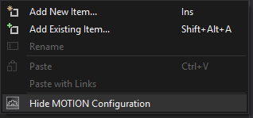
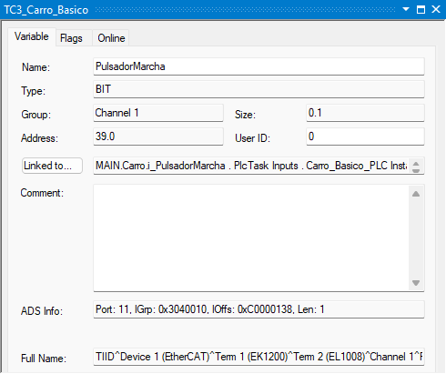

# 🏗️ TwinCAT 3 - Flujo de Trabajo

## Abrir TwinCAT XAE

- Buscar en el menú de inicio de Windows la aplicación `TwinCAT XAE Shell`.

{width=400px}

- También accesible desde la barra de tareas (junto al reloj de Windows).
    - :material-mouse-right-click: hacer clic con el botón derecho sobre el icono de TwinCAT y seleccionando la opción **TwinCAT XAE (TcXAEShell)**.

{width=300px}

Tras cargar la aplicación se muestra la pantalla inicial de la aplicación.

{width=700px}

## Crear un proyecto TwinCAT 3

### Seleccionar ***TwinCAT XAE Project (XML format)***

- En el menú de la aplicación: File > New > Project
- En la página de inicio de la aplicación: Open > NewProject > New TwinCAT Project...

 {width=500px}

??? info "Parámetros"
    - Name = nombre del proyecto TwinCAT.
    - Location = carpeta donde se alojará la solución.
    - Solution name = nombre de la solución (normalmente, el mismo que el nombre del proyecto).
    - Create directory for solution = **SI**/NO (creará la solución dentro de una carpeta con el nombre de la solución).
    - Create new Git repository = SI/NO (inicia el control de versiones con Git).

 Se mostrará la nueva solución «vacía».

 {width=700px}

### Ocultar las configuraciones innecesarias

Para despejar el panel de exploración de la solución, ocultar las configuraciones innecesarias.

- :material-mouse-right-click: sobre la configuración seleccionada y seleccionar **Hide \*\*\* Configuration**.

{width=300px}

!!! note "Recomendación"
    - Ocultar las configuraciones que no se van a utilizar: `MOTION`, `SAFETY`, `C++`, `VISION`, `ANALYTICS`.
    - Mantener las configuraciones `SYSTEM`, `PLC` e `I/O`.

{width=300px}

## Crear un proyecto PLC

1. Para crear un nuevo proyecto PLC, dentro de un proyecto TC.

    - :material-mouse-right-click: sobre el nodo `PLC` y seleccionar ***Add New Item***.

    {width=300px}

2. En la ventana emergente seleccionar ***Standard PLC Project***, darle un nombre al proyecto PLC y pulsar ***Add***.

    {width=500px}

    ??? info "Proyecto Estándar"
        Al selecionar un proyecto PLC estándar se aplica una plantilla predeterminada que incluye:

        - Una tarea tiempo real `PlcTask` con un tiempo de ciclo de 10 ms.
        - Un programa `MAIN` vinculado a la tarea `PlcTask`.
        - Un conjunto de librerías básicas: Tc2_Standard, Tc2_System y Tc3_Module.
        - Un conjunto estructurado de carpetas (DUTs, GVLs, POUs, VISUs).

    Tras la creación, se muestra el nuevo proyecto PLC en el panel del explorador de la solución.

    {width=400px}

    ??? info "Descripción"
        - Project = código fuente estructurado bajo la norma IEC 61131-3.
        - Instance = instancias de las variables de E/S del proyecto para la vinculación con los canales de E/S del sistema.

    Y si se despliega su contenido, se muestra la estructura de carpetas y nodos que contiene.

    {width=400px}

    ??? info "Descripción"
        - External Types = declaración de tipos de datos complejos e interfaces que provienen de bibliotecas externas.
        - References = listado de bibliotecas vinculadas al proyecto.
        - DUTs (*Data Unit Types*) = declaración de los tipos de datos de usuario.
        - GVLs (*Global Variable Lists*) = listas de variables globales.
        - POUs (*Program Organization Units*) = conjunto de módulos que componen el proyecto.
        - VISUs = visualizaciones, interfaces gráficas.
        - PlcTask (PlcTask) = llamadas a los programas de ejecución cíclica.

### Crear un nuevo POU

1. Para añadir un nuevo POU.

    - :material-mouse-right-click: sobre la carpeta `POU` y seleccionar **Add** y **POU...**.

    {width=400px}

2. Cumplimentar los datos correspondientes en la ventana emergente **Add POU**.

    {width=300px}

    ??? info "Descripción"
        - Name = nombre del POU.
        - Type = tipo de POU (programa, bloque funcional o función).
        - Implementation language = lenguaje en el que se codificará el POU (CFC, FBD, IL, LD, SFC, ST, SC)

3. Se mostrará el nuevo POU «vacío».

    {width=600px}

## Implementar un POU

Al desplegar la carpeta `POUs` se muestra la lista de todos los módulos de programación (programas, bloques funcionales y funciones) que componen el proyecto.

{width=400px}

Pulsando sobre cualquiera de ellos podemos acceder a su contenido.

{width=600px}

El contenido de un POU se muestra separado:

- En la ventana superior denominada `Parte de Declaración` se encuentra el **Encabezado del POU** y los **Bloques de Declaración**.
- En la ventana inferior denominada `Parte de Implementación` se muestra el código del POU en el lenguaje seleccionado.

### Declarar una variable

Para crear una variable escribir su declaración siguiendo la siguiente sintaxis:

```text
Identificador [AT %Localización]: Type [:= ValorInicial];
```

1. **Identificador** (obligatorio). Es el nombre único de la variable dentro de su ámbito (scope).
2. **Localización** (opcional). La localización o **Ubicación Directa** establece la zona y la posición de memoria en la que se situará la variable.
    - Modificador de localización `AT`.
    - Dirección.

        ```text
        %[Área] [Tamaño] [Dirección]

        - `%`: prefijo de ubicación.
        - Área: `I` para entradas, `Q` para salidas y `M` para memoria interna (o de marcas).
        - Dirección:
            - Absoluta:

                ```text
                [Area][Tamaño][Dirección]
                ```

                - Tamaño [X/B/W/D/L]: prefijo que indica el tamaño de la variable (Bit/Byte/Palabra/Doble/Larga).
                - Dirección [palabra.bit]: posición de la variable en el área de memoria.

                ??? info "Ejemplo"
                    ```iecst
                    Pulsador AT %IX0.0: BOOL;
                    ```

            - Inespecificada: utilizando el carácter comodín `*`

                ??? info "Ejemplo"
                    ```iecst
                    Pulsador AT %*: BOOL;
                    ```

3. **Separador de tipo:** (obligatorio). Separa el nombre de la variable de su tipo.

4. **Tipo de dato**: Especifica principalmente el tamaño y el rango de la variable. Puede ser un tipo elemental (BOOL, INT, REAL, TIME,...), complejo (STRUCT, ENUM, ARRAY,...) o de usuario.
5. **Valor inicial**: Especifica el valor de la variable al iniciar el runtime. Si no se especifica tomará el valor predeterminado para ese tipo de variable.
6. **Delimitador ;** (obligatorio). Terminador de instrucción.  

### Ámbito de una variable

El bloque de declaración determina el ámbito y el alcance de la variable especificando quién y cómo puede acceder a la variable o parámetro.

   1.  `VAR ... END_VAR`: variables locales, internas al POU. Únicamente accesibles dentro del POU en el que se declaran.
   2.  `VAR_INPUT ... END_VAR`: parámetros de entrada. Pueden ser escritos desde el exterior.
   3.  `VAR_OUTPUT ... END_VAR`: parámetros de salida. Pueden ser leídos desde el exterior.
   4.  `VAR_IN_OUT ... END_VAR`: parámetros de entrada/salida por referencia. Punteros a variables externas que pueden leerse y escribirse dentro del POU.
   5.  `VAR_GLOBAL ... END_VAR`: variables globales (GVL). Accesibles desde cualquier POU del proyecto.
   6.  `VAR_STAT ... END_VAR`: variables estáticas. Variables locales que conservan su valor entre ciclos de ejecución.
   7.  `VAR_PERSISTENT ... END_VAR`: variables persistentes. Variables que conservan su valor incluso tras la pérdida de alimentación.

## Desplegar un proyecto

El proceso de despliegue abarca la secuencia desde la validación del código fuente hasta la ejecución en tiempo real sobre el runtime  del sistema destino (*Target*).

### Seleccionar un sistema destino

> El sistema destino (**Target System**) es el *runtime* de tiempo real sobre el que se ejecuta el código máquina del programa.

- Hay tres tipos de sistemas destino seleccionables:
    - **Local Target**: presente en el mismo ordenador en el que se está desarrollando el programa.
    - **Remote Target**: equipo físico remoto conectado por EtherCAT.
    - **UmRT_Default**: *runtime* que se ejecuta en modo usuario sin capacidades de tiempo real.
- Para seleccionarlo basta con elegirlo de la lista de runtimes disponibles en la barra de herramientas de TwinCAT.

{width=300px}

#### Activar Licencia

- TwinCAT pone a disposición de aprendices y desarrolladores licencias de pruebas (*trial licenses*) que se solicitan cuando se intenta utilizar determinados servicios o funcionalidades.

    {width=400px}

- Para activarlas se debe introducir el código de seguridad cuando sea solicitado.

    {width=400px}

#### Crear una Ruta

> En TwinCAT una ruta (route) es una conexión lógica entre dos entornos TwinCAT. Habitualmente se establece una ruta entre el entorno de ingeniería (TwinCAT XAE) en el que se desarrolla el proyecto y el runtime o entorno de ejecución (TwinCAT XAR) en el que se ejecuta el proyecto.

Una ruta sirve básicamente para establecer una relación de confianza entre ambos dispositivos (entorno de desarrollo y entorno de ejecución), para permitir, entre otras cosas, la transferencia de código y monitorización de vararibles.

- Seleccionar en la lista de sistemas destino la opción ***Choose Target System...***.

     {width=300px}

- En la ventana emergente ***Choose Target System...***, pulsar el botón `Search (Ethernet)...` para buscar sistemas TwinCAT en la red.
  
    {width=400px}

- Pulsar Aceptar si aparece el aviso TcXaeShell indicando que para buscar sistemas remotos debe hacerse desde el sistema local.
  
    {width=400px}

- En la ventana emergente ***Select Adapter(s)***, seleccionar los dispositivos de red a través de los cuales se va a realizar la búsqueda y pulsar OK.

    {width=400px}

- Si la ventana emergente **Add Remote Route** aparece reducida, seleccionar `Advanced Settings` para que aparezcan todas las opciones...

    {width=400px}

- ... con todas las opciones disponibles, <span class="fondo-amarillo">**importante**</span> seleccionar la opción `IP Address` y posteriormente pulsar el botón `Broadcast Search...`

    {width=400px}

- ... se actualizará la lista de dispositivos TwinCAT encontrados, seleccionar el sistema destino deseado y pulsar `Add Route...`

    {width=400px}

- A continuación se mostrará la ventana ***Add Remote Route*** para conectar con el sistema destino. Desmarcar la casilla `Secure ADS` si no se exige una conexión segura.
  
    {width=400px}

- Introducir las credenciales de usuario y contraseña del |dispositivo seleccionado.

    ??? Info "credenciales"
        Con los ajustes de fábrica el usuario es `Administrator` y la contraseña `1`.

    {width=400px}

- Si la ruta se crea exitosamente, aparecerá una `x` en el campo ***Connected*** junto al nombre del sistema destino (CX-840BD9) en la ventana ***Add Remote Dialog***.

    {width=400px}

- Tras cerrar la ventana ***Add Remote Dialog***, pulsando el botón `Close`, podremos finalmente seleccionar el nuevo sistema destino (CX-840BD9) que aparecerá en la lista de disposivos, marcándolo y pulsando el botón `OK`.

    {width=400px}

- Pulsar `Sí` en la ventana emergente ***TxcXaeShell*** que aparece ofreciendo la posibilidad de cambiar la configuración para que el compilador genere código compatible con el nuevo sistema destino, si la plataforma (procesador) del sistema destino (TwinCAT RT (x86)) es distinto del sistema actual (TwinCAT RT (x64)).

    {width=400px}

!!! success "Resultado de la operación"
    Finalmente, nuevo sistema destino (CX-840BD9) y la versión de la plataforma (TwinCAT RT (x86)) aparecerán actualizados en la barra de botones de la aplicación.

    {width=600px}

### Configurar Entrada/Salida

> Configurar la Entrada/Salida es el proceso mediante el cual se buscan los dispositivos y terminales presentes en el bus EtherCAT, se localizan, se verifican y se nominan los canales de entrada y salida, se vinculan las variables con los canales de entrada y salida y, finalmente se activa esta configuración en el sistema destino.

#### Buscar Dispositivos

- Poner el sistema en modo configuración. Pulsando sobre el botón {: style="border:none; background:transparent; box-shadow:none; vertical-align:middle; margin-right:0px; padding:0;"} de la barra de botones de TwinCAT o seleccionado la opción de menú `TwinCAT > Restart TwinCAT (Config Mode)`.
- Buscar dispositivos seleccionando `I/O > Devices` en el explorador de la solución y pulsando el botón {: style="border:none; background:transparent; box-shadow:none; vertical-align:middle; margin-right:0px; padding:0;"} de la barra de botones de TwinCAT o pulsando botón derecho sobre `Device` y seleccionando la opción `Scan` o seleccionando la opción de menú `TwinCAT > Scan`.

    {width=300px}

    !!! success "Resultado de la operación"
        Tras unos instantes se mostrará la lista de dispositivos encontrados.

        {width=400}

- Seleccionar los dispositivos deseados (al menos seleccionar el dispositivo `EhterCAT`) y pulsar `OK`.

    !!! success "Resultado de la operación"
        Los nuevos dispositivos aparecerán bajo el apartado `I/O > Devices` del Explorador de la Solución.

        {width=400}

- Autorizar, en la ventana emergente, la búsqueda de terminales (*boxes*).

    {width=400}

    !!! success "Resultado de la operación"
        Tras unos instantes, los nuevos terminales aparecerán bajo el dispositivo correspondiente.

        {width=400}

- Activar el modo Free Run, pulsando `Sí`.
  
    {width=400}

    ??? Info "Free Run"
        El modo Free Run es una función especial que permite leer el estado de las entradas y forzar o escribir valores en las salidas físicas sin necesidad de tener un programa (PLC) cargado o ejecutándose.

- Deshabilitar los dispositivos que no se vayan a utilizar pulsando con el botón derecho y seleccionando disable.

    {width=400}

    !!! success "Resultado de la operación"
        Los dispositivo deshabilitados quedan marcados.

        {width=400}

#### Identificar Entradas

!!! goal "Objetivo"
    Lo que se pretende en este paso es localizar, en la sección de entrada/salida (**I/O**) del árbol del Explorador de la Solución, los canales en los que están conectadas físicamente las señales de entrada, verificar su funcionamiento y ponerles un nombre, para posteriormente facilitar su vinculación a sus correspondientes variables del proyecto PLC.

- Hacer doble clic sobre el primer **canal** del primer **terminal** de entrada (`EL1008`) situado bajo **acoplador de bus virtual** `EK1200`.

    {width=400}

    ??? Info "Cabeceras de Bus"
        Una cabecera de bus, en el entorno Beckhoff, es cualqueir dispositivo, módulo físico o interfaz virtual, que actúa como punto de entrada, alimentación o pasarela de comunicación para un conjunto de terminales de entrada/salida subordinados.

        - **Acopladores**: cabeceras de bus físicas como el `EK1100`, que extiende el bus más alla del controlador.
        - **Cabeceras virtuales**: representan la interfaz con el bus interno del controlador (`EK1200`).
        - **Interfaces de Bus**: cambian las características del bus, como el `BK1250`, que permite la conexión de módulos con **bus K** en un bus **EtherCAT**.
        - **Maestros de Red**: cabeceras de buses de otros protocolos, como el `KL6211`, que actúa como maestro de bus **ASi**.

- Seleccionar la pestaña Online.

    {width=400}

- Localizar, consultando la tabla de entrada/salida en la descripción funcional del sistema el dispositivo conectado a ese canal (por ejemplo, el pulsador de marcha). Activarlo y verificar en la pantalla que cambia de valor la señal mostrada.

    {width=400}

- Si se reflejan los cambios en la pantalla, queda verificada la correspondiencia entre el canal y el dispositivo. Y se procede a nominar el canal con el nombre del dispositivo en el campo ***Name*** de la pestaña ***Variable***.

    {width=400}

!!! note "🔄 Repetir"
    Repitir este mismo proceso de identificación para todos los canales de entrada digitales y analógicos del sistema con dispositivos conectados.

!!! success "Resultado de la operación"
    Todos los canales de entrada del sistema nominados.

    {width=400}    

#### Identificar Salidas

!!! goal "Objetivo"
    Lo que se pretende en este paso es localizar, en la sección de entrada/salida (**I/O**) del árbol del Explorador de la Solución, los canales en los que están conectadas físicamente las señales de salida, verificar su funcionamiento y ponerles un nombre, para posteriormente facilitar su vinculación a sus correspondientes variables del proyecto PLC.

- Hacer doble clic sobre el primer **canal** del primer **terminal** de salida (`EL2004`) situado bajo **acoplador de bus virtual** `EK1200`.

    {width=400}

- Seleccionar la pestaña Online.

    {width=400}

- Localizar, consultando la tabla de entrada/salida en la descripción funcional del sistema el dispositivo conectado a ese canal (por ejemplo, el lámpara de marcha). Activarla desde TwinCAT pulsado `1` en la pantalla ***Set Value Dialog*** que aparece tras pulsar sobre ***Write***...

    {width=400}

- ...y verificar que el dispositivo físico conectado cambia de valor cuando cambia el valor de la señal mostrada en la pantalla.

    {width=400}

- Si se reflejan los cambios en el dispositivo, queda verificada la correspondiencia entre el canal y el dispositivo. Y se procede a nominar el canal con el nombre del dispositivo en el campo ***Name*** de la pestaña ***Variable***.

    {width=400}

!!! note "🔄 Repetir"
    Repetir este mismo proceso de identificación para todos los canales de salida digitales y analógicos del sistema con dispositivos conectados.

!!! success "Resultado de la operación"
    Todos los canales de salida del sistema nominados.

    {width=400}    

#### Vincular variables

!!! goal "Objetivo"
    El proceso de vinculación (***linking***) en TwinCAT consiste fundamentalmente en conectar variables lógicas declaradas en el código PLC (*software*) en los espacios de entrada y salida con los canales físicos de los módulos de E/S (***I/O Terminals***) configurados en la sección `I/O` del **Explorador de Proyecto** (*hardware*).

!!! tip
    Aunque la vinculación de variables puede hacerse desde las instancias de las variables de entrada salida hacia los canales de entrada/salida o viceversa, suele ser mucho más sencillo y rápido hacerlo desde los canales.

##### Desde el canal

- Pulsar el botón derecho sobre un canal de entrada o salida y seleccionar `Change Link...` o con la ventana correspondiente al canal abierta hacer doble clic sobre el canal en la sección `I/O` o pulsando `Linked to...` en la pestaña **Variable** de la ventana del canal.

    {width=400px}

- Seleccionar la variable deseada en la ventana ***Attach Variable*** y pulsar `OK`.

     {width=400px}

!!! success "Resultado de la operación"
    El resultado de la vinculación aparece junto al botón `Linked to...` en la ventana del canal y cambia el símbolo asociado al canal y a la instancia de la variable {: style="border:none; background:transparent; box-shadow:none; vertical-align:middle; margin-right:0px; padding:0;"}.

    {width=400px}

!!! note "🔄 Repetir"
    Repetir este mismo proceso de vinculación para todas las señales de entrada/salida.

##### Desde la instancia

- Pulsar el botón derecho sobre una instancia de una variable de entrada o salida y seleccionar `Change Link...` o con la ventana correspondiente a la instancia abierta hacer doble clic sobre la variable en el apartado `Instance` o pulsando `Linked to...` en la pestaña **Variable** de la ventana de la instancia.

    {width=400px}

- Seleccionar el canal deseado en la ventana ***Attach Variable*** y pulsar `OK`.

     {width=400px}

!!! success "Resultado de la operación"
    El resultado de la vinculación aparece junto al botón `Linked to...` en la ventana de la instancia y cambia el símbolo asociado a la instancia de la variable y al canal {: style="border:none; background:transparent; box-shadow:none; vertical-align:middle; margin-right:0px; padding:0;"}.

    {width=400px}

!!! note "🔄 Repetir"
    Repetir este mismo proceso de vinculación para todas las señales de entrada/salida.

### Monitorizar variables

--8<-- "includes/paso-incompleto.md"

### Forzar variables

--8<-- "includes/paso-incompleto.md"

#### Activar el Simulador

Para activar el simulador (**UmRT_Default**) ejecutar el *script* denominado `Start.bat` que se encuentra normalmente en esta ruta 'C:\TwinCAT\3.1\Runtimes\UmRT_Default\Start.bat'.

- ++win+r++ > `C:\TwinCAT\3.1\Runtimes\UmRT_Default\Start.bat` > ++enter++

    {width=400px}

- Se abrirá una ventana de terminal que debe permanecer abierta mientras usemos el simulador

    {width=600px}

- Entre otros datos en la ventana de terminal del simulador aparecen los comandos del simulador y su dirección `AmsNetId`

    | Comando | Descripción |
    | :---: | :--- |
    | c | Poner TwinCAT en modo Configuración (**C**onfig) |
    | r | Poner TwincAT en modo Ejecución (**R**un) |
    | s | Informa del estado actual de TwinCAT (**S**tatus) |
    | x | Salir del simulador UmRT_Default (E**x**it) |

### Construir el Proyecto

Construir una solución o un proyecto (**Build**):

- **Análisis Sintáctico y Estático:** El compilador analiza el código fuente (ST, SFC, etc.) verificando la sintaxis, compatibilidad de tipos de datos y reglas de la norma IEC 61131-3.
- **Generación de Código Máquina:** Traduce las POUs a instrucciones binarias optimizadas para la arquitectura del procesador del sistema destino (x86/x64).
- **Ámbito de Compilación:** Se puede construir o reconstruir la solución completa o solo uno de los proyectos de la solución.
- **Modo de Ejecución:** Desde el menú principal: `Build` > `Build Solution` (o `Build <Nombre_Proyecto>`), o mediante el atajo de teclado `Ctrl + Shift + B`.

{width=300px}

- El resultado (mensajes, avisos y errores) de la construcción se muestra en el panel de errores (*Error List*).

### Activar la Configuración

Activar la configuración (**Activate Configuration**):

- **Carga de Hardware y Mapeo:** Transfiere al Kernel de tiempo real la configuración física de dispositivos, terminales,..., la asignación de tareas (*Tasks*) y las tablas de enrutamiento de E/S (`AT %I*`/`AT %Q*`).
- **Instanciación en el Kernel:** Reinicia el Kernel de TwinCAT en el sistema destino para aplicar los cambios de infraestructura e instanciar los servicios de memoria RAM necesarios.
- **Cambio de Estado:** Conmuta el sistema operativo de tiempo real a modo **RUN** (indicado por el icono de TwinCAT en verde en la barra de tareas).
- **Modo de Ejecución:** Desde el menú principal `TwinCAT` > `Activate Configuration`, o pulsando el icono en la barra de herramientas de TwinCAT.

{width=300px}

??? info "Boot Project"
    El ***Boot Project*** (Proyecto de Arranque) es la copia compilada ejecutable del proyecto que se guarda en el almacenamiento no volátil (disco/memoria flash) del sistema destino. Su función es permitir que el runtime de TwinCAT cargue y arranque el programa del PLC de forma automática al encender o reiniciar el equipo, sin necesidad de conectarse desde el entorno de desarrollo (XAE).

!!! warning "Importante"
    - **NO** activar la generación del proyecto de arranque (***Boot Project***) durante la fase de desarrollo del proyecto.
    - Si el código del proyecto de arranque contiene un fallo grave de ejecución (como un bucle infinito en ST, una división por cero o un puntero nulo/inválido) y el Boot Project está activo, el runtime intentará ejecutar ese código defectuoso inmediatamente al arrancar. Esto provocará un colapso (crash) o bloqueo en bucle del runtime de tiempo real en cada reinicio.

- Si no se dispone de una licencia permanente, cada 7 días habrá que reactivar la licencia de prueba ... [➡️](#activar-licencia)
- Finalmente, es necesario confirmar el reinicio del sistema destino en modo ejecución.

{width=300px}

### Transferir un Proyecto

Transferir un proyecto PLC (**Login**):

- **Conexión vía ADS:** Se establece la sesión de comunicación con la instancia del PLC a través del puerto de sistema ADS (por defecto, **Puerto ADS 851**).
- **Transferencia de Binarios:** Se descarga el código compilado (*Bytecode*) a la memoria RAM asignada a la instancia del PLC en el controlador.
- **Generación de Boot Project:** Eventualmente se crea el proyecto de arranque (*Create Boot Project*) en el almacenamiento no volátil del sistema destino para garantizar que el programa se cargue automáticamente tras una pérdida de alimentación.
- **Modo de Ejecución:** Pulsando el botón `Login` (`Alt + F8`) en la barra de herramientas de TwinCAT PLC.

{width=300px}

??? info
    - La primera vez que se realice **Login** sobre un nuevo sistema destino, TwinCAT solicitará la creación del puerto para las comunicaciones entre el entorno de programación (**XAE**) y el sistema de ejecución (**XAR**) del sistema destino.
    - Si el código presente en el sistema destino difiere significativamente del código que se pretende enviar se solicita autorización para realizar un *Online Change* (cambio en caliente) o una descarga completa (*Cold/Origin Reset Download*).

### Arrancar un Proyecto

Arrancar o poner en ejecución un proyecto (**Start**):

- **Inicio del Bucle de Tiempo Real:** Inicia la ejecución del ciclo básico de funcionamiento (*Task Scan*) asignado en la `PlcTask`.
- **Procesamiento de Entradas/Salidas:** Se activa el ciclo determinista: lectura de la imagen de proceso de entradas (`%I*`), ejecución de las POUs (`MAIN`) y actualización de las salidas (`%Q*`).
- **Modo de Ejecución:** Pulsando el botón `Start` (`F5`) o desde el menú `PLC` > `Login` > `Start`.
- Tras pasar a modo ejecución, en el entorno de programación, el código se muestra en modo **Monitorización *Online***.

    {width=600px}

    ??? info
        El **Modo *Online*** o de **Monitorización *Online*** es el estado de conexión directa e interactiva entre el entorno de desarrollo (**TwinCAT XAE**) y el motor de tiempo real en ejecución (**TwinCAT XAR**/*Target System*).
        Esta herramienta de supervisión y depuración en tiempo real de TwinCAT 3 permite:

    - Visualizar directamente sobre el código fuente (ST, SFC, etc.) los valores actualizados que de las variables en la memoria RAM del controlador durante cada ciclo de escaneo (*Task Scan*).
    - Modificar mediante el forzado las variables en tiempo de ejecución.

---

<!--
## Codificar en Texto Estructurado
Codificar un SFC -> documento aparte
De grafcet a SFC, a ST, a LD
Explicación del ciclo básico y de las imágenes de entrada y salida (AT), el programa no lee directamente, sino que trabaja con una copia
Stop ejecución, reiniciar sistema reset cold y reset origin
Forzado
Mostrar punto de declaración de una variable
Mostrar todas las apariciones de una variable
Buscar un controlador remoto
Configurar la entrada/salida
Vincular entradas/salidas
Crear una visualización paso a paso -> esto mejor en otro archivo
Depurar errores

align=center en imágenes
incluir títulos explícitos en los bloques info
dirección AMS 
puerto de comunicaciones

Instancia FB 

-->